# **Thêm sửa xoá hoá đơn**

Dưới đây là những hướng dẫn thao tác cơ bản trên phần mềm hóa đơn điện tử M-Invoice ở phiên bản 2.0 vô cùng mạch lạc và dễ hiểu.

=== "Thêm"

    ## **Hướng dẫn lập và phát hành hóa đơn**

    ???+ Note "Ghi chú"

        Khi sử dụng phần mềm hóa đơn, NSD sẽ cần lập và phát hành hóa đơn. M-invoice sẽ giới thiệu với NSD tính năng lập và phát hành hóa đơn trên hệ thống

    
Hướng dẫn lập và phát hành hóa đơn

    <iframe style="width: 43rem; height: 380px" src="https://www.youtube.com/embed/A9jnumj5bEE?si=_wWv6DBbSvNFzd5W" title="YouTube video player" frameborder="0" allow="accelerometer; autoplay; clipboard-write; encrypted-media; gyroscope; picture-in-picture; web-share" referrerpolicy="strict-origin-when-cross-origin" allowfullscreen></iframe>

    **Hướng dẫn sử dụng bằng hình ảnh nếu Quý khách không xem được video**

    ### Bước 1: Truy cập vào phần lập hoá đơn

    Truy cập vào trang hóa đơn điện tử M-invoice chọn phần **Hoá đơn đầu ra**

    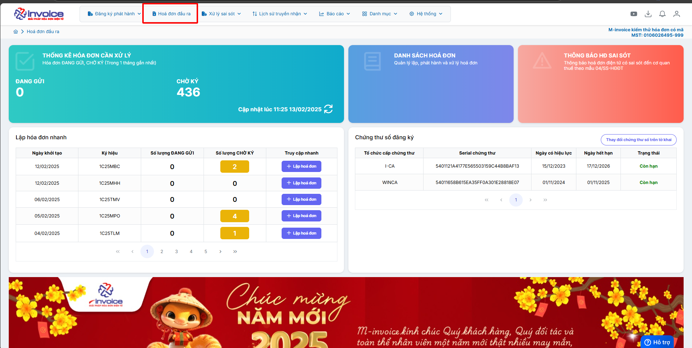

    Chọn ký hiệu hóa đơn quý khách đang muốn sử dụng

    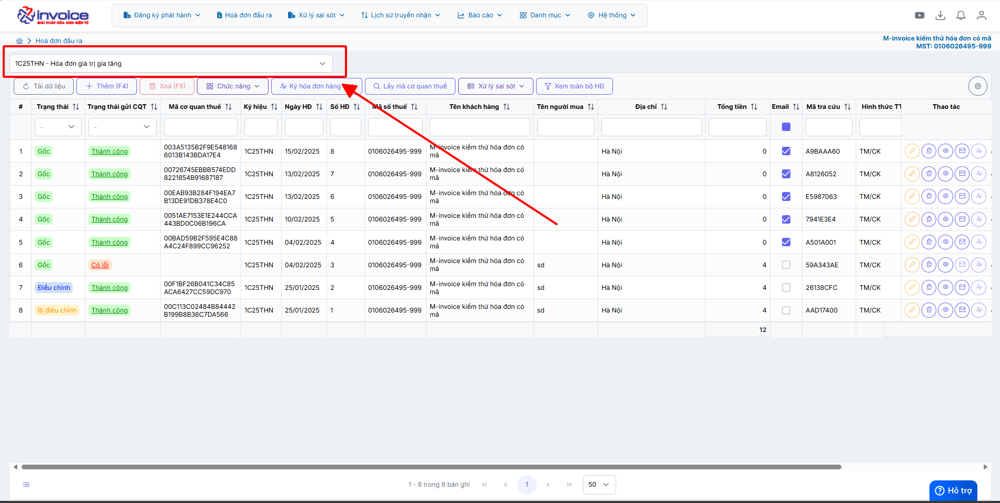

    

    ### Bước 2: Nhập chi tiết hoá đơn

    Ở trên giao diện **Hoá đơn đầu ra** chọn **Thêm (F4)**

    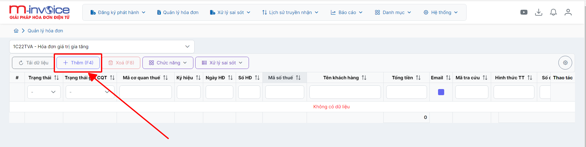

    Phần giao diện lập hóa đơn sẽ có giao diện như sau.

    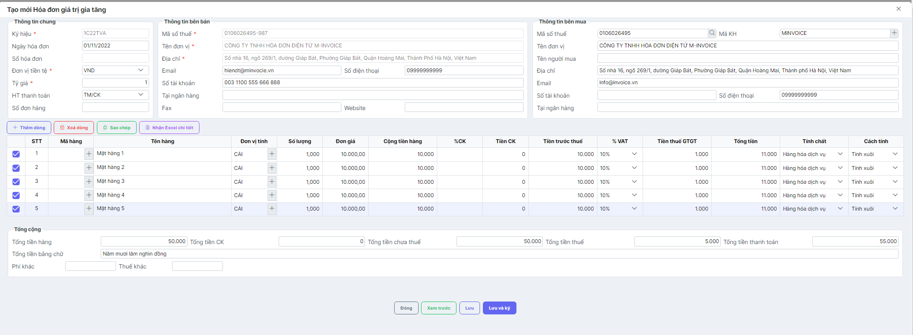

    **Phần 1**: Phần đầu phiếu hóa đơn bao gồm các thông tin

    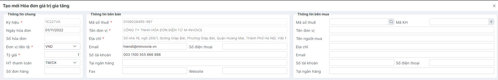

    ???+ note "Phần thông tin chung"

        + **Ký hiệu**: Do quý khách đã chọn lúc đầu

        + **Ngày hóa đơn** : Ngày xuất của hóa đơn (Có thể sửa lại nếu hình thức là sinh số trước và hóa đơn chưa ký)

        + **Đơn vị tiền tệ** : nếu xuất tiền Việt chon VND còn nếu xuất ngoại tệ chọn phần ngoại tệ tương ứng

        + **Tỷ giá** : tiền Việt để tỷ giá là 1, còn ngoại tệ để tỷ giá tương ứng

        + **HT thanh toán** : Chọn hình thức thanh toàn phù hợp

    ???+ note "Thông tin bên bán"

        Quý khách có thể sửa được mặc định của những thông tin này ở phần
        Hệ thông --> Quản lý doanh nghiệp >> Thông tin doanh nghiệp [Hướng dẫn sửa](thayDoiThongTin.md#attribute-lists){ data-preview }

    ???+ note "Thông tin người mua"

        + **Mã số thuế** : Quý khách nhập mst của người mua sai đó nhấn tìm kiếm để hệ thống trả ra toàn bộ thông tin khách hàng

        + **Tên đơn vị** : Tên công ty mua hàng

        + **Tên người mua** : Tên người mua hàng

        + **Địa chỉ** : Địa chỉ người mua

        + **Email** : Email của người mua

        + **Số tài khoản, số điện thoại, Tên ngân hàng ..... Vvvvv**

    ???+ note "Chi tiết hoá đơn"

        Nhấn **Thêm dòng** để thêm 1 dòng hàng hóa mới
        Sau đó quý khách điền đầu đủ thông tin như **Tên hàng, Số lượng, Đơn giá, %VAT**
        Sau đó nhấn **Lưu** để lưu thông tin hóa đơn vào
        Quý khách cũng có thể xem trước hóa đơn mình muốn lập bằng nút **Xem trước** trên phần mềm

    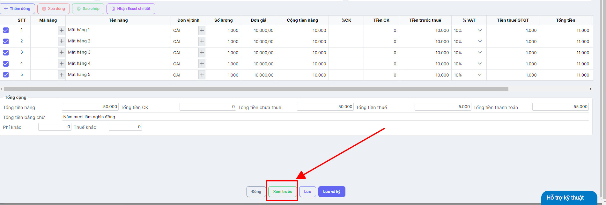

    ### Bước 3: KÝ GỬI CƠ QUAN THUẾ VÀ GỬI MAIL CHO KHÁCH HÀNG

    Quý khách chọn phần **Ký và gửi cơ quan thuế** để ký hóa đơn và gửi hóa đơn lên thuế để được cấp mã

    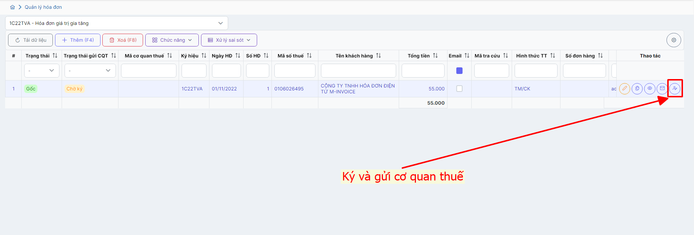

    Để gửi mail cho khách hàng quý khách chọn vào phần **Gửi mail hóa đơn**

    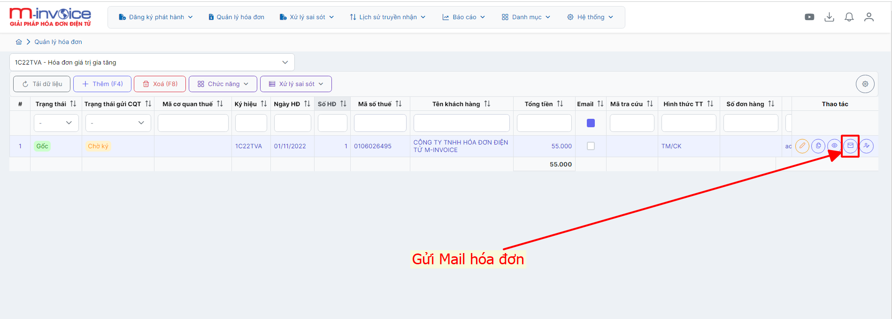

    Để sửa lại hóa đơn (Chỉ có thể sửa được hóa đơn chưa ký gửi) chọn và phần **Chỉnh sửa**, và để **xem in** lại quý khách chọn vào phần Xem in hóa đơn

    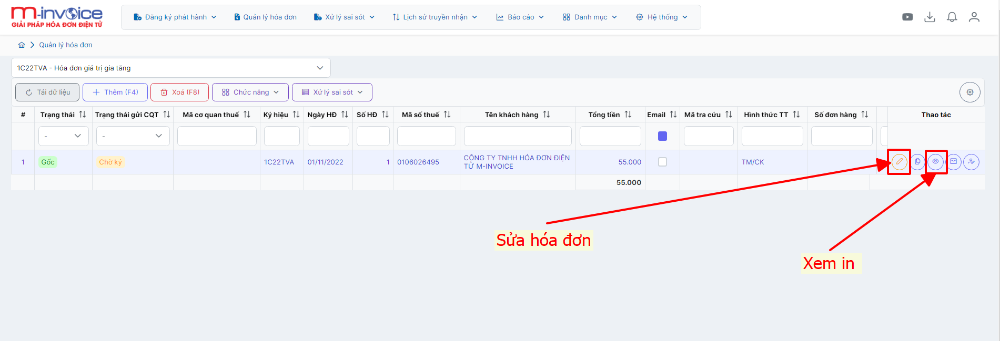

    Như vậy quý khách đã phát hành thành công hóa đơn

=== "Sửa"

    ## **Hướng dẫn sửa hóa đơn Chờ ký**

    ???+ Note "Ghi chú"

        Trong quá trình sử dụng phần mềm hóa đơn điện tử M-invoice, NSD nhiều lúc sẽ tạo sai thông tin của hóa đơn nháp và NSD sẽ muốn sửa lại sao cho đúng với yêu cầu bên phía đối tác. M-invoice xin giới thiệu với khách hàng và người sử dụng tính năng sửa hóa đơn nháp trên phần mềm

    ### Bước 1: Tại màn hình danh sách hóa đơn, chọn hóa đơn chờ ký muốn sửa

    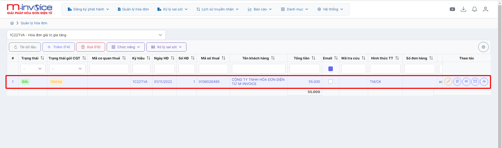

    ### Bước 2: Click button "Sửa"

    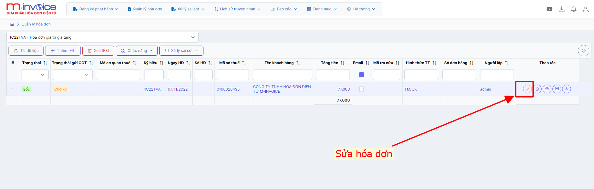

    ### Bước 3: Sửa nội dung hóa đơn và click "Lưu" để lưu lại thông tin

    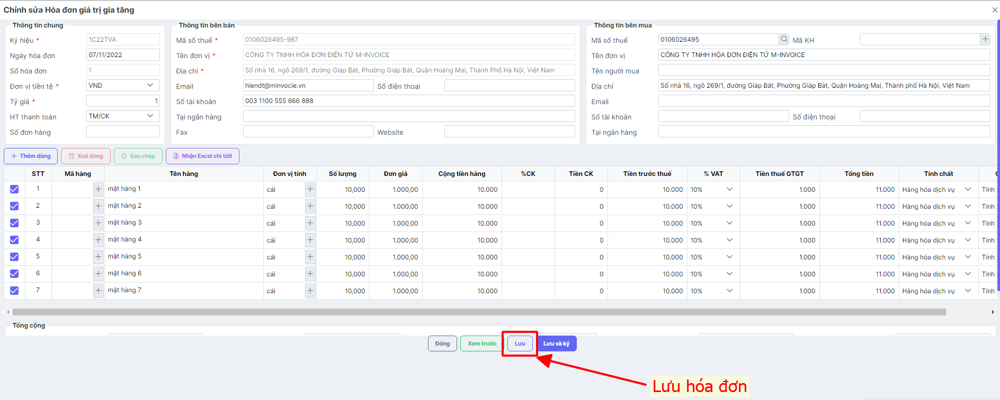

    ### Bước 4: Chọn xem trước để xem in hóa đơn sau khi sửa

    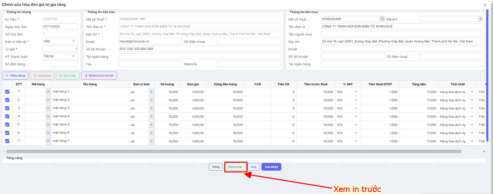

=== "Xoá"

    ## **Hướng dẫn xóa hóa đơn chờ ký**

    ???+ Note "Ghi chú"

        Trong quá trình sử dụng phần mềm hóa đơn điện tử M-invoice, NSD nhiều lúc sẽ tạo nhầm hoặc sai thông tin của hóa đơn nháp và NSD sẽ muốn xóa đi và lập lại tờ hóa đơn mới. M-invoice xin giới thiệu với khách hàng và người sử dụng tính năng xóa hóa đơn nháp trên phần mềm

    ???+ Note "Ghi chú"

        Hóa đơn điện tử M-Invoice cho phép Người sử dụng lập hóa đơn nháp ở trạng thái Chờ ký. Tuy nhiên, Hóa đơn điện tử M-Invoice có 2 hình thức sinh số hóa đơn nên Quý khách hết sức lưu ý khi lựa chọn các hình thức sinh số:

        1. **Hình thức sinh số hóa đơn và ngày hóa đơn ngay sau khi lập hóa đơn (Chưa ký)**. Hình thức này là bản nháp hóa đơn có đầy đủ nội dung. Tuy nhiên, nếu muốn xóa hóa đơn Chờ ký, người sử dụng phải xóa lần lượt từ hóa đơn có số to đến số nhỏ.
        2. **Hình thức sinh số hóa đơn và ngày hóa đơn khi ký (phát hành) hóa đơn**. Hình thức này khi lập hóa đơn có trạng thái hóa đơn là Chờ ký thì chưa có ngày (hoặc có thì là ngày tạo không phải ngày lập hóa đơn) và chưa có số hóa đơn. Số hóa đơn và Ngày hóa đơn được lập xác định khi ký hóa đơn và ngày ký hóa đơn là ngày lập của hóa đơn. Hình thức này cho Phép xóa hóa đơn ở bất kỳ đâu và không cần phải xóa lần lượt.

    ### Bước 1: Tại màn hình danh sách hóa đơn, chọn hóa đơn Chờ ký muốn xóa

    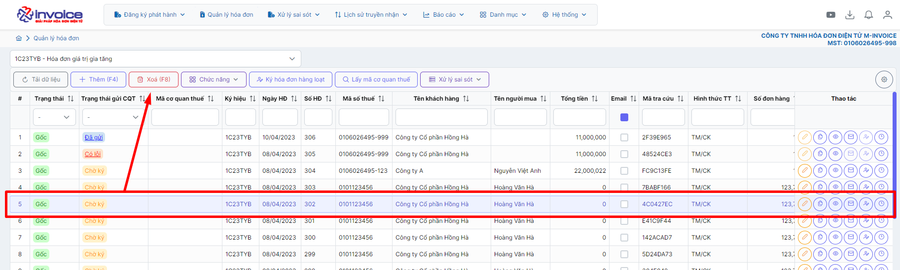

    
Đối với hình thức Sinh số sau, NSD sẽ không xóa được các hóa đơn ở giữa như hình vẽ.

    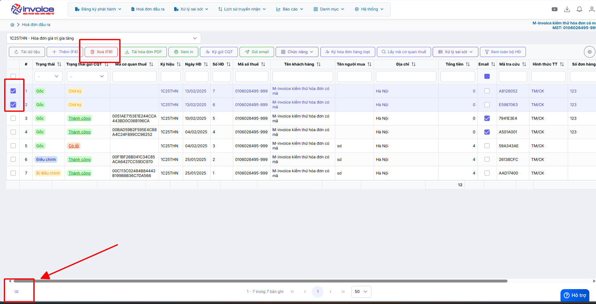

    
Thường hợp muốn xoá nhiều

    ### Bước 2: Click button "Xóa (F8)" hoặc nhấn phím chức năng F8.

    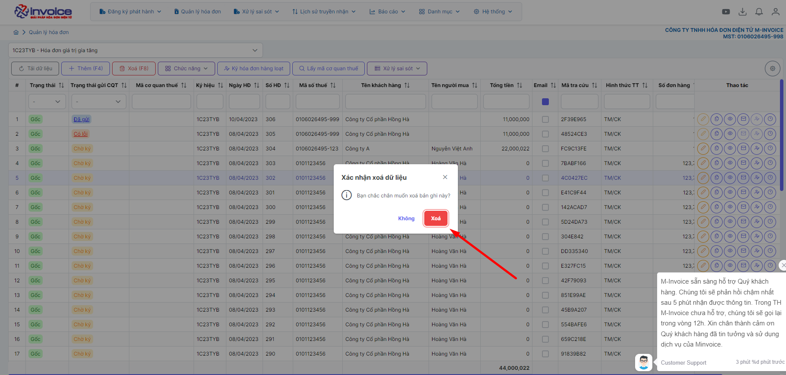

    ### Bước 3: Click "Xóa" để xác nhận xóa hóa đơn.

    Trên đây là hướng dẫn để Người sử dụng có thể xóa hóa đơn đã tạo ra có trạng thái **Chờ Ký**.

???+ info "Xin chân thành cảm ơn quý khách hàng đã tin dùng sản phẩm của M-Invoice"

    Có bất kỳ vướng mắc nào trong quá trình sử dụng hãy liên hệ với M-Invoice tại mục Hỗ trợ kỹ thuật góc phải bên dưới màn hình hoặc gọi tổng đài kỹ thuật của M-Invoice (1900.955.557 Nhánh 1)

Last updated on <strong>Mar 27, 2025</strong> by <strong>Trinh Hoai Nhat</strong>

