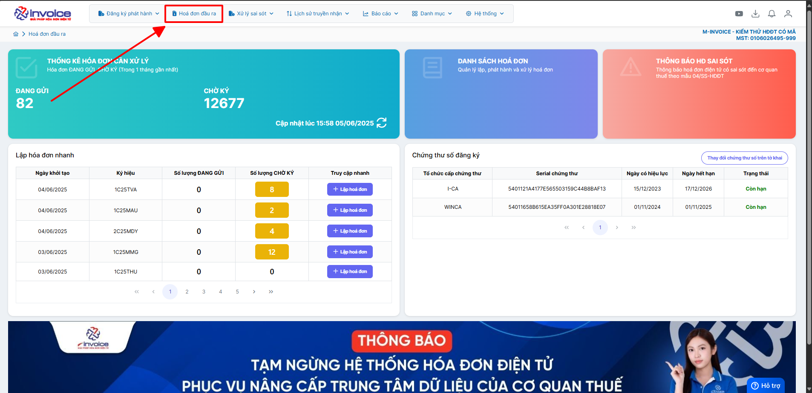
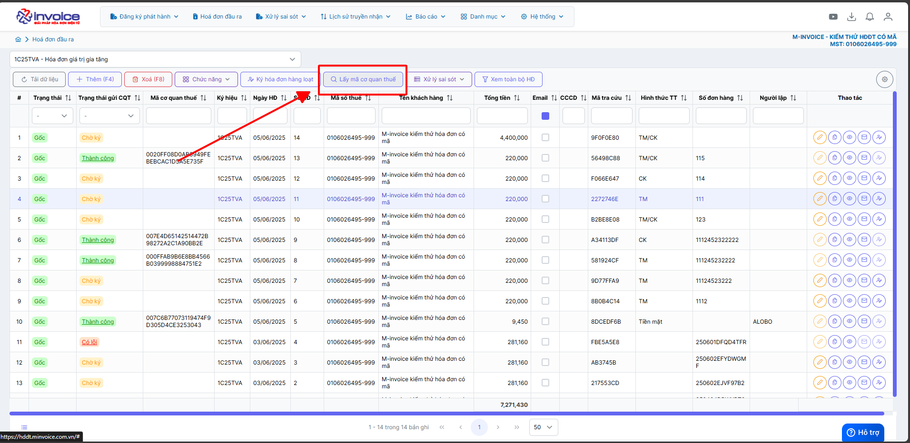
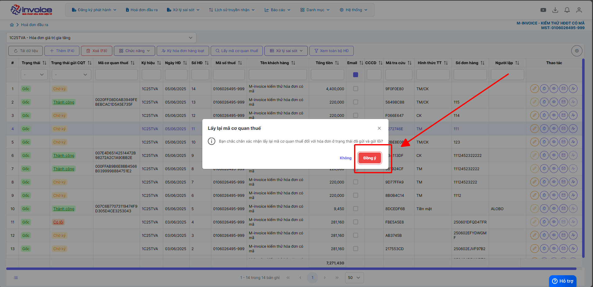
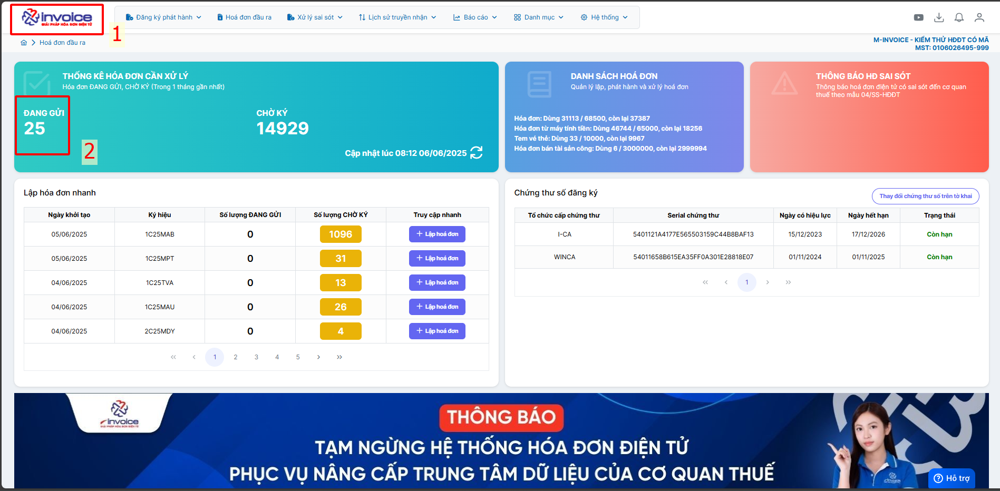
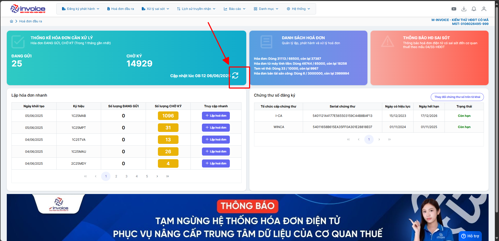

# **Lấy mã cơ quan thuế**

Dưới đây là những hướng dẫn thao tác cơ bản trên phần mềm hóa đơn điện tử M-Invoice ở phiên bản 2.0 vô cùng mạch lạc và dễ hiểu.

## **Hướng dẫn lấy mã cơ quan thuế đối với hóa đơn ở trạng thái đang gửi**

### **Bước 1: Ở giao diện trang chủ -> Hóa đơn đầu ra -> 'LẤY MÃ CƠ QUAN THUẾ'**

**Bấm đồng ý để lấy mã cơ quan thuế ở tất cả các ký hiệu đang sử dụng**

???+ warning "Lưu ý"

    Sau khi thực hiện thao tác  trên Anh chị có thể bấm ra màn hình Dashboard để kiểm tra số lượng đang gửi

**Trường hợp số lượng đang gửi chưa được cập nhật anh chị thao tác theo ảnh hướng dẫn dưới đây để cập nhật**

???+ info "Xin chân thành cảm ơn quý khách hàng đã tin dùng sản phẩm của M-Invoice"

    Có bất kỳ vướng mắc nào trong quá trình sử dụng hãy liên hệ với M-Invoice tại mục Hỗ trợ kỹ thuật góc phải bên dưới màn hình hoặc gọi tổng đài kỹ thuật của M-Invoice (1900.955.557 Nhánh 1)

Last updated on <strong>Jun 6, 2025</strong> by <strong>nhatth</strong>

