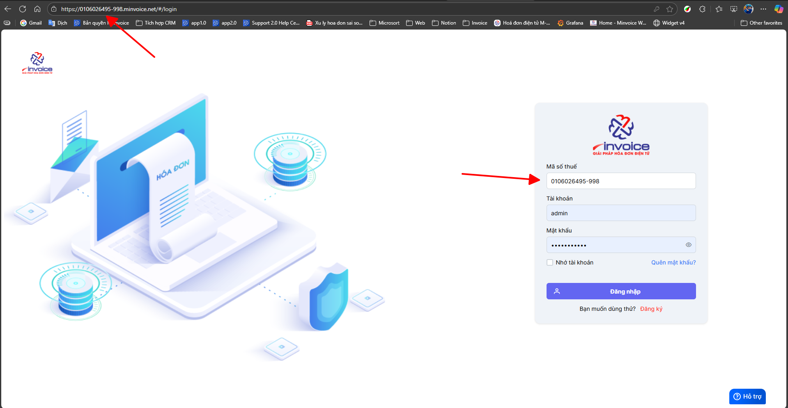
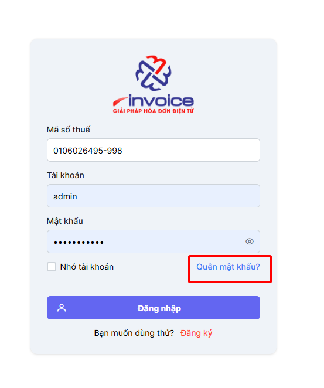
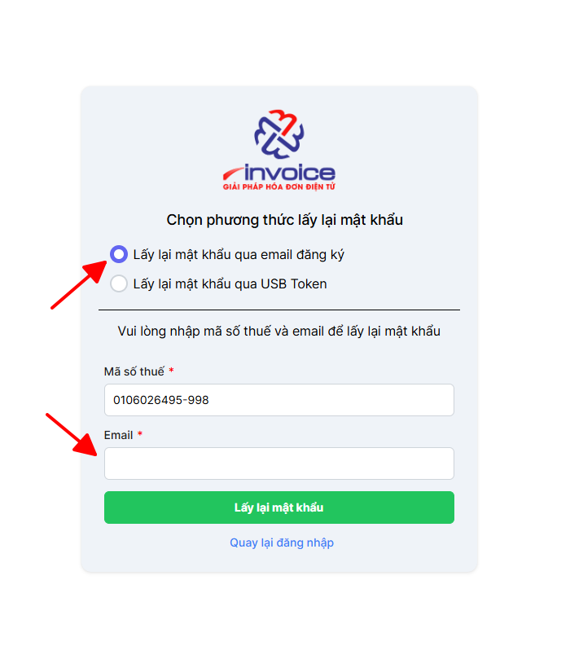
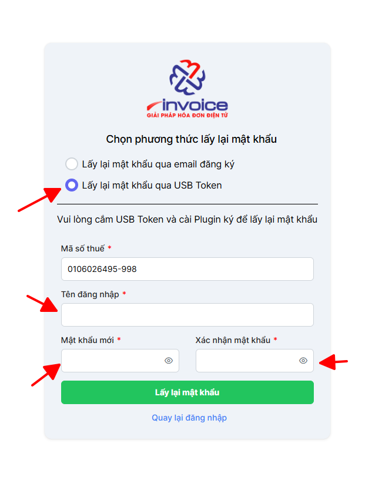

# **Quên mật khẩu - Lấy lại mật khẩu**

???+ Note "Mục đích"

    Giúp người dùng khôi phục quyền truy cập vào hệ thống trong trường hợp họ quên hoặc mất mật khẩu đăng nhập, đảm bảo quá trình đăng nhập diễn ra an toàn, nhanh chóng và thuận tiện mà không cần sự can thiệp trực tiếp từ quản trị viên hệ thống.

    Điều kiện để có thể lấy lại mật khẩu:

    - Email đã được đăng ký trên phần mềm khi mua hóa đơn

    - Chữ ký số đã được add lên phần mềm

### **Bước 1: Đảm bảo đúng đường link đăng nhập và mã số thuế**

Đường link đăng nhập có dạng : MST.minvoice.net

Trong đó MST chính là mã số thuế của doanh nghiệp

hoặc

https://hddt.minvoice.com.vn/

### **Bước 2: Ở màn hình đăng nhập chọn nút quên mật khẩu để lấy lại mật khẩu**

### **Bước 3 : Giao diện quên mật khẩu, bạn có thẻ lấy lại mật khẩu qua 2 cách, 1 là Email , 2 bằng chữ ký số**

#### **1. Lấy lại mật khẩu qua Email**

Bạn nhập đúng địa chỉ Email đã đăng ký với phần mềm, sau đó nhân **Lấy lại mật khẩu**

Sau đó tài khoản và mật khẩu sẽ tự động được gửi vào Email cho bạn

#### **2. Lấy lại mật khẩu qua Chữ ký số**

Bạn nhập tên tài khoản (thường mặc định sẽ là admin), và xác nhận lại 2 lần mật khẩu , sau đó bấm **Lấy**
Để thực hiện chức năng này, bạn bắt buộc phải cài **plugin**, và dùng **đúng chữ ký số đã đăng ký với phần mềm**

🖱️ **Nếu bạn chưa cài Plugin có thể cài plugin qua đường dẫn sau đây:**
📄 [Hướng dẫn tải plugin](../plugin.md#attribute-lists){ data-preview }

#### **3. Trường hợp 2 cách trên không làm được**

- Anh chị cần xác nhận công văn (ký đóng dấu hoặc ký điện tử) và gửi M-invoice để có thể được cấp lại mật khẩu qua mail vì lý do bảo mật thông tin khách hàng. Hãy liên hệ mục hỗ trợ để nhận được mẫu công văn.

!!! info "Xin chân thành cảm ơn Quý khách hàng đã tin dùng sản phẩm của M-Invoice"

    Có bất kỳ vướng mắc nào trong quá trình sử dụng hãy liên hệ với M-Invoice tại mục Hỗ trợ kỹ thuật góc phải bên dưới màn hình hoặc gọi tổng đài kỹ thuật của M-Invoice (1900.955.557 Nhánh 1)

Last updated on <strong>Oct 29, 2025</strong> by <strong>NHATTH</strong>

