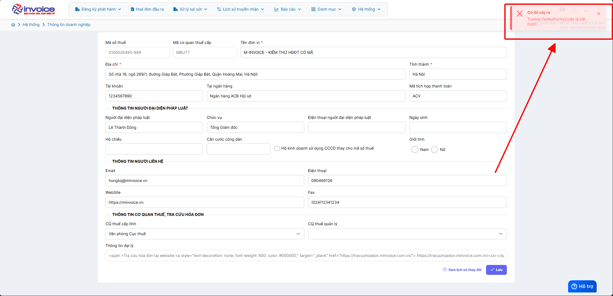
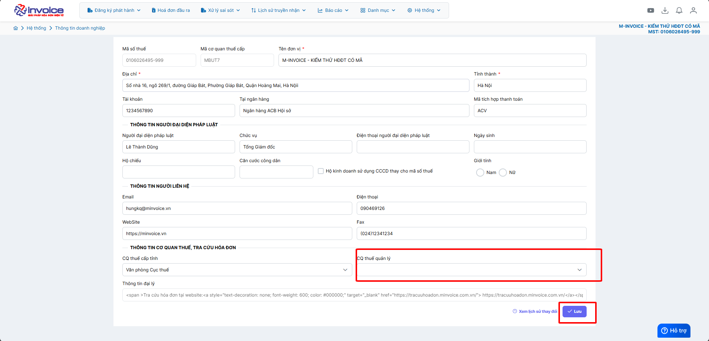
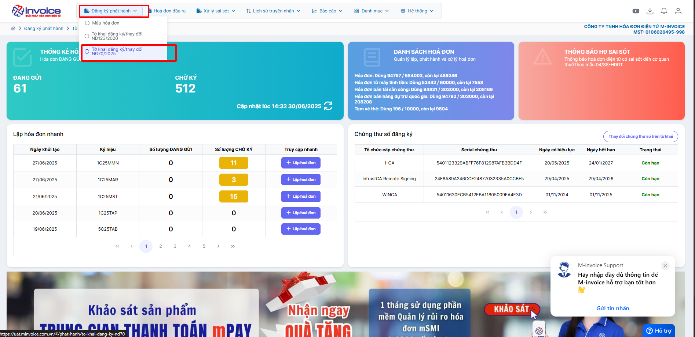
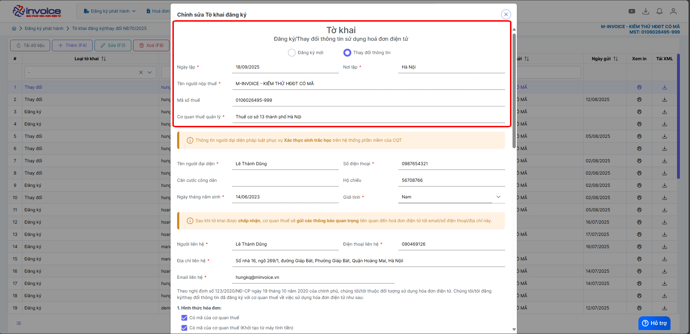
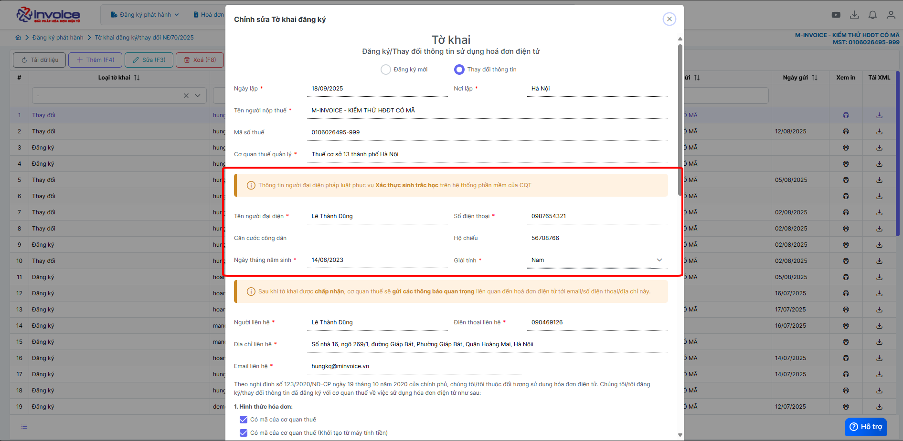
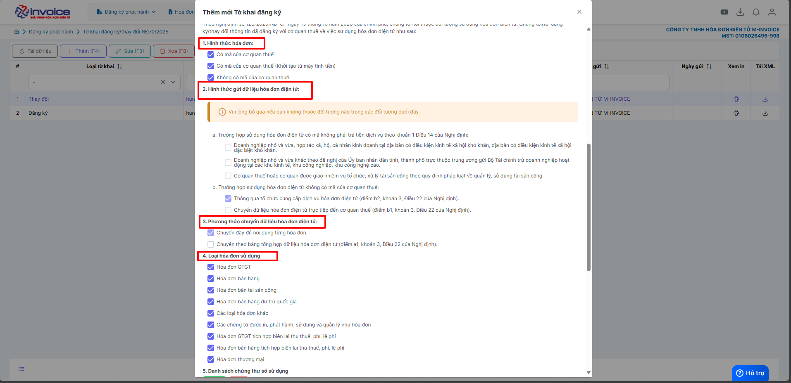
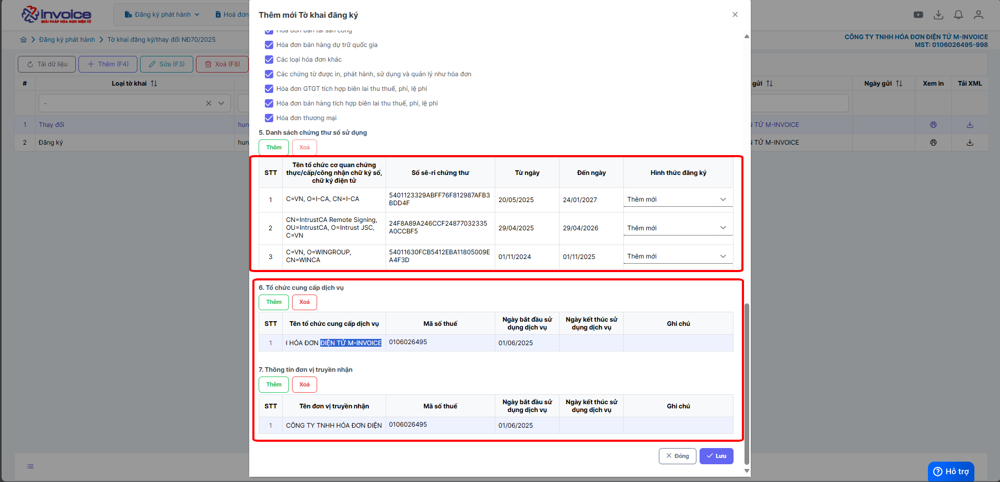
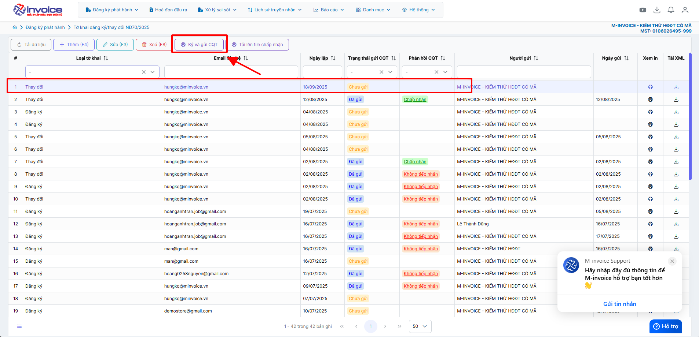

# **Thay đổi địa chỉ doanh nghiệp trên hóa đơn**

  
<strong>📢 Thông báo từ M-Invoice:</strong> 
  M-Invoice xin thông báo đến <strong>Quý khách hàng</strong> đang sử dụng dịch vụ hóa đơn điện tử cần <strong>liên hệ cơ quan Thuế địa phương</strong> để lấy hướng dẫn về <u>địa chỉ mới nhất</u>, sau đó <strong>cập nhật lên hệ thống hóa đơn điện tử M-Invoice</strong> nhằm đảm bảo thông tin <strong>địa chỉ trên hóa đơn khi phát hành được chính xác.</strong>

  
<strong>✅ Chức năng này dùng để làm gì?</strong> 
  Chức năng thay đổi địa chỉ doanh nghiệp giúp cập nhật thông tin mới trên hệ thống quản lý, đảm bảo tính pháp lý và đồng bộ với dữ liệu của cơ quan nhà nước.

  
<strong>✅ Vì sao cần dùng chức năng này?</strong> 
  Vì địa chỉ trụ sở là thông tin pháp lý quan trọng. Nếu không cập nhật kịp thời, doanh nghiệp có thể bị xử phạt, thông tin trên hóa đơn – hợp đồng bị sai lệch, ảnh hưởng đến giao dịch và uy tín doanh nghiệp.

## **Hướng dẫn thay đổi địa chỉ doanh nghiệp trên hóa đơn**

#### Hướng dẫn bằng hình ảnh chi tiết

### **Bước 1: Truy cập hệ thống -> thông tin doanh nghiệp**

Bạn vào phần **Hệ thông --> Quản lý doanh nghiệp --> Thông tin doanh nghiệp**

### **Bước 2: Điền địa chỉ đúng rồi bấm Lưu**

Trường hợp anh chị bị lỗi sau

**Chọn CQT quản lý và bấm lưu**

### **Bước 3 : Làm tờ khai 01**

Anh/Chị vào phần **Đăng ký phát hành >> Tờ khai đăng ký/thay đổi NĐ70/2025 >> Thêm (F4)**

!!! note ""

    Ở phần **Đăng ký/Thay đổi thông tin sử dụng hóa đơn điện tử**

    + Chọn **Thay đổi** thông tin nếu bạn muốn thay đổi địa chỉ, tên doanh nghiệp, hay thêm CKS mới vào phần mềm

???+ note "Thông tin người đại diện pháp luật"

    Ở phần này các bạn điền đẩy đủ các phần như sau

    **Tên người đại diện**: tên giám đốc

    **Đia chỉ liên hệ** : địa chỉ công ty

    **Số điện thoại** : số điện thoại

    **Căn cước công dân**

    **Hộ chiếu**

???+ note "Thông tin người nhận các thông báo quan trọng liên quan đến hóa đơn điện tử (trường sẽ là thông tin của kế toán, kế toán trưởng)"

    Ở phần này các bạn điền đẩy đủ các phần như sau

    **Người liên hệ**: tên kế toán, ...

    **Đia chỉ liên hệ** : địa chỉ cần thay đổi

    **điện thoại liên hệ** : số điện thoại nhận thông báo

    **Email liên hệ**: mail nhận thông báo từ thuế

1,2,3,4,Các bạn tích chọn vào các loại hóa đơn phù hợp với hình thức doanh nghiệp mình sử dụng

5, chọn **Thêm** để thêm cks hay để Add CKS mới thay đổi vào tờ khai **nếu có rồi thì k cần làm bước này**

6, Thông tin tổ chức chức cung cấp dịch vụ và truyền nhận (sẽ mặc định là: CÔNG TY TNHH HÓA ĐƠN ĐIỆN TỬ M-INVOICE)

7, Sau khi add xong CKS, quý khách nhấn Lưu để **lưu** lại dữ liệu tờ khai 01 này

### **Bước 4 : Sau khi hoàn thành, anh chị chọn tờ khai mình vừa lập chọn Ký và gửi CQT**

???+ info "Xin chân thành cảm ơn quý khách hàng đã tin dùng sản phẩm của M-Invoice"

    Có bất kỳ vướng mắc nào trong quá trình sử dụng hãy liên hệ với M-Invoice tại mục Hỗ trợ kỹ thuật góc phải bên dưới màn hình hoặc gọi tổng đài kỹ thuật của M-Invoice (1900.955.557 Nhánh 1)

Last updated on <strong>Jun 30, 2025</strong> by <strong>nhatth</strong>

