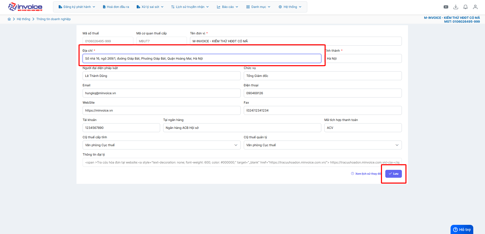

# **Thay đổi địa chỉ doanh nghiệp trên hóa đơn**

  
<strong>✅ Chức năng này dùng để làm gì?</strong> 
  Chức năng thay đổi địa chỉ doanh nghiệp giúp cập nhật thông tin mới trên hệ thống quản lý, đảm bảo tính pháp lý và đồng bộ với dữ liệu của cơ quan nhà nước.

  
<strong>✅ Vì sao cần dùng chức năng này?</strong> 
  Vì địa chỉ trụ sở là thông tin pháp lý quan trọng. Nếu không cập nhật kịp thời, doanh nghiệp có thể bị xử phạt, thông tin trên hóa đơn – hợp đồng bị sai lệch, ảnh hưởng đến giao dịch và uy tín doanh nghiệp.

  
<strong>📢 Thông báo từ M-Invoice:</strong> 
  M-Invoice xin thông báo đến <strong>Quý khách hàng</strong> đang sử dụng dịch vụ hóa đơn điện tử cần <strong>liên hệ cơ quan Thuế địa phương</strong> để lấy hướng dẫn về <u>địa chỉ mới nhất</u>, sau đó <strong>cập nhật lên hệ thống hóa đơn điện tử M-Invoice</strong> nhằm đảm bảo thông tin <strong>địa chỉ trên hóa đơn khi phát hành được chính xác.</strong>

## **Hướng dẫn thay đổi địa chỉ doanh nghiệp trên hóa đơn**

**Thao tác cài đặt và thực hiện như sau**

### **Bước 1: Truy cập hệ thống -> thông tin doanh nghiệp**

Bạn vào phần **Hệ thông --> Quản lý doanh nghiệp --> Thông tin doanh nghiệp**

### **Bước 2: Điền địa chỉ đúng rồi bấm Lưu**

???+ info "Xin chân thành cảm ơn quý khách hàng đã tin dùng sản phẩm của M-Invoice"

    Có bất kỳ vướng mắc nào trong quá trình sử dụng hãy liên hệ với M-Invoice tại mục Hỗ trợ kỹ thuật góc phải bên dưới màn hình hoặc gọi tổng đài kỹ thuật của M-Invoice (1900.955.557 Nhánh 1)

Last updated on <strong>Jun 30, 2025</strong> by <strong>nhatth</strong>

