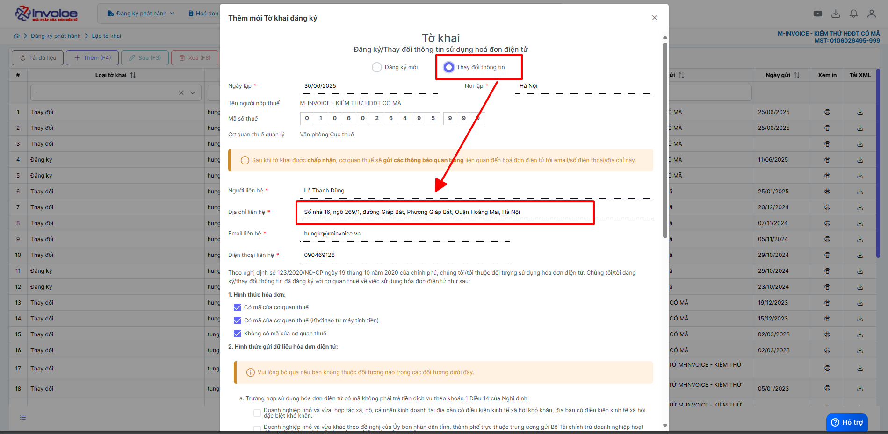
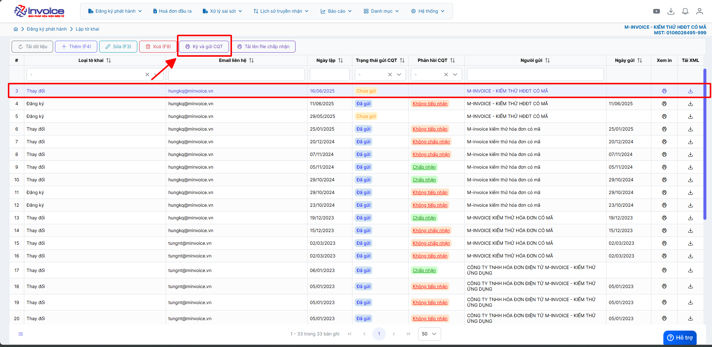

# **Thay đổi thông tin doanh nghiệp**

Dưới đây là những hướng dẫn thao tác cơ bản trên phần mềm hóa đơn điện tử M-Invoice ở phiên bản 2.0 vô cùng mạch lạc và dễ hiểu.

## **Hướng dẫn thay đổi thông tin doanh nghiệp**

???+ Note "Ghi chú"

    Sử dụng để thay đổi thông tin, địa chỉ, tên doanh nghiệp hay cơ quan thuế quản lý của doanh nghiệp ...

???+ Warning "Lưu ý"

    Trường hợp thay đổi địa chỉ, tên doanh nghiệp, cơ quản thuế quản lý thì cần phải nộp tờ khai cho CQT

**Thao tác cài đặt và thực hiện như sau**

### **Bước 1: Thay đổi trên phần mềm M-invoice**

Bạn vào phần **Hệ thông --> Quản lý doanh nghiệp --> Thông tin doanh nghiệp**

Điền các thông tin Quý khách cần thay đổi vào phần mềm sau đó nhấn **Lưu**

### **Bước 2: Làm tờ khai 01 thay đổi thông tin với cơ quan thuế**

Hướng dẫn video làm tờ khai

<iframe style="width: 43rem; height: 380px" src="https://www.youtube.com/embed/QCUDtrKGSFg?si=7q9Qa3huXRSGe6lh" title="YouTube video player" frameborder="0" allow="accelerometer; autoplay; clipboard-write; encrypted-media; gyroscope; picture-in-picture; web-share" referrerpolicy="strict-origin-when-cross-origin" allowfullscreen></iframe>

**Hướng dẫn sử dụng bằng hình ảnh nếu Quý khách không xem được video**

Quý khách truy cập vào **Đăng ký phát hành --> Lập tờ khai**

???+ Warning "Lưu ý"

    Với những quý khách đã có tờ khai đăng ký trước đó, thì hình thức sẽ phải chọn là Thay đổi

Quý khách cần thay đổi ở đâu thì cập nhật thông tin ở đó

Quý khác chọn đúng hình thức hóa đơn của đơn vị mình đang sử dụng
Sau đó ấn **Lưu**

!!! note ""

    Sau đó Quý khách chỉ cần ký và gửi tờ khai thay đổi với cơ quan thuế

    **Tờ khai đăng ký/ thay đổi sẽ thường được bên thuế chấp nhận sau 24H - 48h**

    Như vậy Quý khách đã hoàn thành việc thay đổi thông tin doanh nghiệp trên phần mềm.

???+ info "Xin chân thành cảm ơn quý khách hàng đã tin dùng sản phẩm của M-Invoice"

    Có bất kỳ vướng mắc nào trong quá trình sử dụng hãy liên hệ với M-Invoice tại mục Hỗ trợ kỹ thuật góc phải bên dưới màn hình hoặc gọi tổng đài kỹ thuật của M-Invoice (1900.955.557 Nhánh 1)

Last updated on <strong>Jun 5, 2025</strong> by <strong>nhatth</strong>

