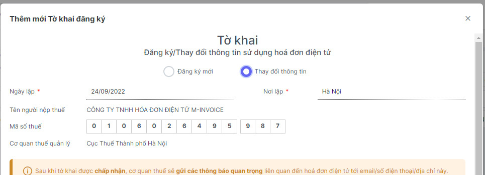

# **Thay đổi CKS hoặc thêm CKS mới vào phần mềm**

Dưới đây là những hướng dẫn thao tác cơ bản trên phần mềm hóa đơn điện tử M-Invoice ở phiên bản 2.0 vô cùng mạch lạc và dễ hiểu.

## **Hướng dẫn thay đổi CKS hoặc thêm CKS mới vào phần mềm**

### **Bước 1: Cắm CKS vào máy tính, kiểm tra xem plugin đã được bật chưa**

!!! note ""

    Click vào biểu tượng **HIDE** (hay dẫu mũi tên chỉ lên) (1) nếu có biểu tượng Plugin của Minvoice như thế plugin đã bật thành công

    Nếu chưa, bạn chỉ cần gõ vào ô tìm kiếm của window ( window + S) tìm kiếm **Minvoice - Plugin Version 2.0** rồi bật  lên là được.

### **Bước 2: Thêm CKS vào phần mềm hóa đơn**

Các bạn vào **Hệ thông --> Đăng ký chữ ký số --> Thêm chứng thư số**

Click vào loại **CKS** phù hợp nhất với mình

Ở thanh Taskbar sẽ hiển thị lên biểu tượng của công cụ **Plugin Minvoice** các bạn chọn vào đó để thêm **CKS** mới của mình

### **Bước 3 : Làm tờ khai 01 thay đổi lên thuế về việc thay đổi CKS hay thông tin doanh nghiệp**

Các bạn vào phần **Đăng ký phát hành >> Lập tờ khai >> Thêm (F4)**

!!! note ""

    Ở phần **Đăng ký/Thay đổi thông tin sử dụng hóa đơn điện tử**

    + Chọn **Đăng ký mới** nếu bạn chưa từng sử dụng hóa đơn theo nghị định 123 (Hóa đơn có mã của CQT)

    + Chọn **Thay đổi** thông tin nếu bạn muốn thay đổi địa chỉ, tên doanh nghiệp, hay thêm CKS mới vào phần mềm

!!! note ""

    Ở phần này các bạn điền đẩy đủ các phần như sau

    **Tên người liên hệ** (giám đốc hay kế toán trưởng)

    **Đia chỉ liên hệ** : Địa chỉ công ty hiện tại hay địa chỉ công ty muốn thay đổi

    **Email liên hệ** : mail của công ty hay mail của kết toán trưởng

    **Điện thoại liên hệ** : SĐT của công ty hay SĐT của kết toán trưởng

1,2,3,4,Các bạn tích chọn vào các loại hóa đơn phù hợp với hình thức doanh nghiệp mình sử dụng

5, chọn **Thêm** để thêm cks hay để Add CKS mới thay đổi vào tờ khai **nếu có rồi thì k cần làm bước này**

6, Sau khi add xong CKS, quý khách nhấn Lưu để **lưu** lại dữ liệu tờ khai 01 này

### **Bước 4 : Sau khi hoàn thành, các bạn chọn tờ khai mình vừa lập chọn Ký và gửi CQT**

Như vậy đã hoàn tất quá trình đăng ký hay thay đổi thông tin hóa đơn sử dụng.

???+ Danger "Chú ý"

    **Các bạn vui lòng chờ đến khi CQT chấp nhận tờ khai thì mới có thể sử dụng được CKS mới**

???+ info "Xin chân thành cảm ơn quý khách hàng đã tin dùng sản phẩm của M-Invoice"

    Có bất kỳ vướng mắc nào trong quá trình sử dụng hãy liên hệ với M-Invoice tại mục Hỗ trợ kỹ thuật góc phải bên dưới màn hình hoặc gọi tổng đài kỹ thuật của M-Invoice (1900.955.557 Nhánh 1)

Last updated on <strong>Jun 5, 2025</strong> by <strong>nhatth</strong>

