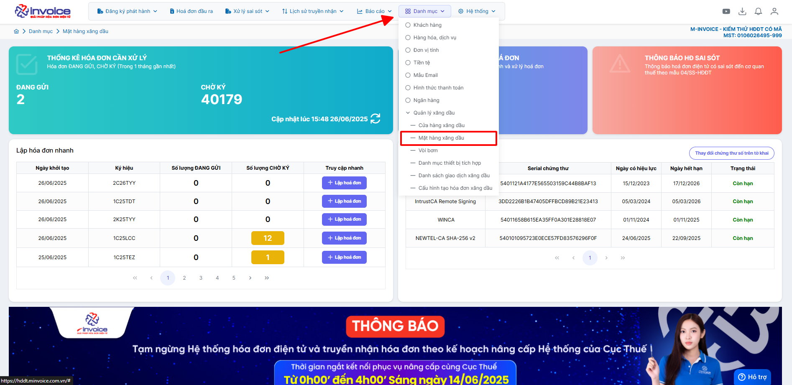
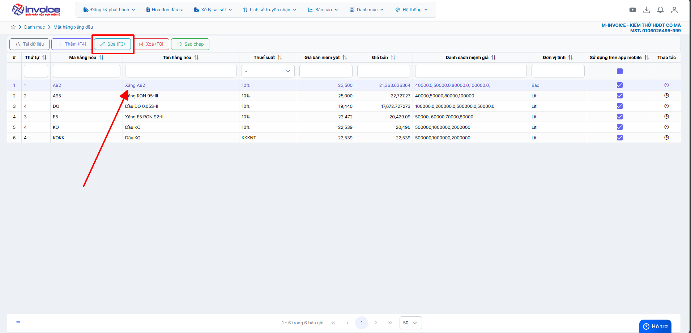
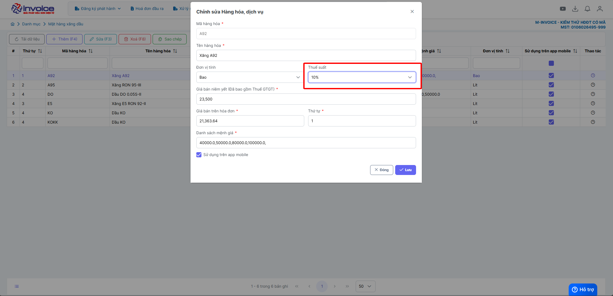
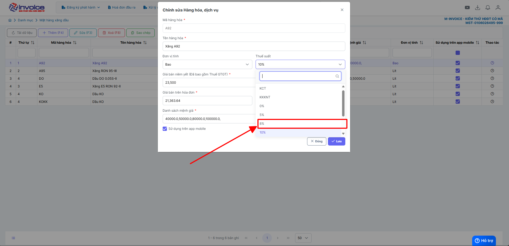
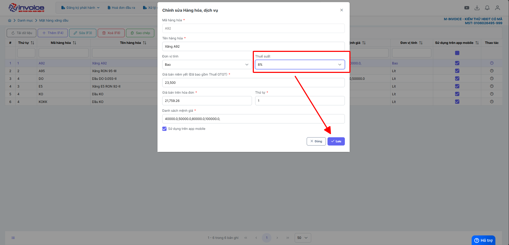
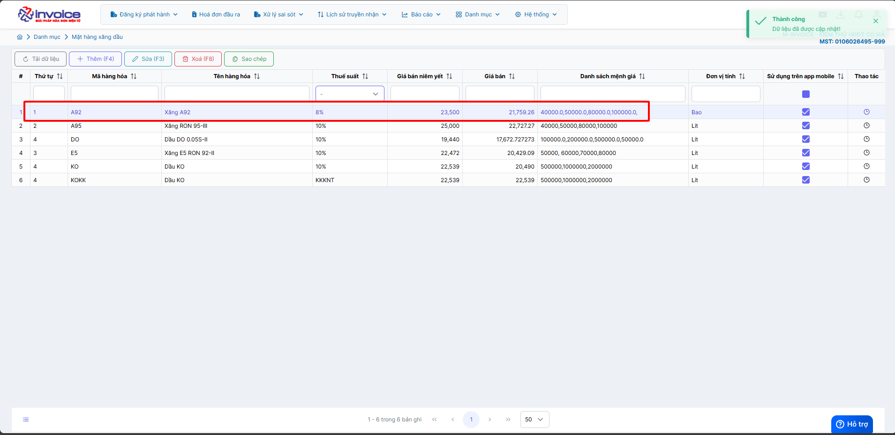

# **🧾 Hướng dẫn cập nhật giảm thuế GTGT đối với mặt hàng xăng**

🎯 **Mục đích:**

✅ **1. Đảm bảo tuân thủ đúng quy định pháp luật hiện hành**  
<small>Giúp doanh nghiệp và người dùng phần mềm áp dụng chính xác chính sách thuế theo nghị quyết của Quốc hội ngày 17/6/2025.  
Tránh áp dụng sai mức thuế GTGT (giảm 8%) đối với mặt hàng không được giảm, cụ thể là mặt hàng xăng, vốn vẫn chịu thuế suất 10% theo quy định.</small>

## **Hướng dẫn áp dụng thuế suất GTGT đối với mặt hàng xăng theo Nghị quyết của Quốc hội ngày 17/6/2025**

???+ Note "Xăng được giảm 2% thuế GTGT từ ngày 01/7/2025 ?"

    Ngày 17/6/2025, Quốc hội thông qua Nghị quyết của Quốc hội về giảm thuế giá trị gia tăng, Nghị quyết có hiệu lực thi hành từ ngày **1/7/2025** đến hết **31/12/2026** [Nghị quyết của Quốc hội về giảm thuế giá trị gia tăng](https://thuvienphapluat.vn/chinh-sach-phap-luat-moi/vn/ho-tro-phap-luat/chinh-sach-moi/87526/xang-co-duoc-giam-2-thue-gtgt-tu-ngay-01-7-2025-khong){:target="\_blank"}

    Trong đó, Nghị quyết đã được thông qua với nhiều chính sách quan trọng cụ thể như việc giảm 2% thuế suất thuế GTGT, áp dụng đối với các nhóm hàng hóa, dịch vụ quy định tại khoản 3 Điều 9 Luật Thuế giá trị gia tăng 2024 (còn 8%), trừ một số nhóm hàng hóa, dịch vụ sau: viễn thông, hoạt động tài chính, ngân hàng, chứng khoán, bảo hiểm, kinh doanh bất động sản, sản phẩm kim loại, sản phẩm khai khoáng (trừ than), sản phẩm hàng hóa và dịch vụ chịu thuế tiêu thụ đặc biệt **(trừ xăng)**.

    Như vậy, theo quy định tại Nghị quyết trên thì xăng nằm trong nhóm được giảm 2% thuế GTGT nên xăng sẽ được giảm 2% thuế GTGT từ ngày **01/7/2025** đến hết **31/12/2026**.

    Như vậy, điểm mới của chính sách giảm thuế GTGT 2% cho 6 tháng cuối năm 2025 và cả năm 2026 là mở rộng đối tượng áp dụng với xăng và nhiều hàng hóa dịch vụ khác.

### **Hướng dẫn thao tác cập nhật giảm thuế GTGT trên phần mềm**

### **Bước 1. Trên màn hình trang chủ bấm chọn Danh mục -> Mặt hàng xăng dầu**

### **Bước 2: Chọn mặt hàng được giảm -> bấm Sửa**

### **Bước 3: Chọn mục thuế suất -> chọn 8% -> bấm Lưu**

### **Bước 3: Cập nhật giảm thuế GTGT thành công**

???+ info "Xin chân thành cảm ơn quý khách hàng đã tin dùng sản phẩm của M-Invoice"

    Có bất kỳ vướng mắc nào trong quá trình sử dụng hãy liên hệ với M-Invoice tại mục Hỗ trợ kỹ thuật góc phải bên dưới màn hình hoặc gọi tổng đài kỹ thuật của M-Invoice (1900.955.557 Nhánh 1)

Last updated on <strong>Jun 26, 2025</strong> by <strong>nhatth</strong>

