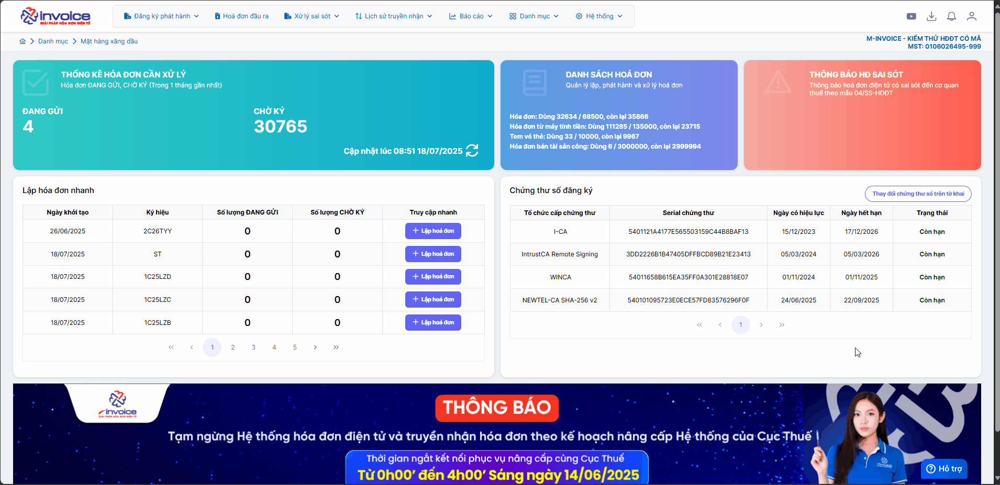
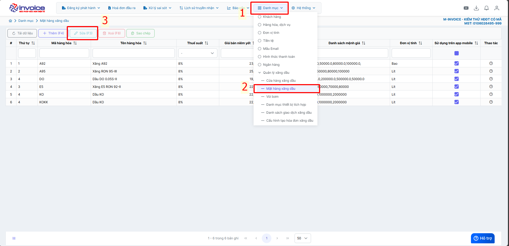
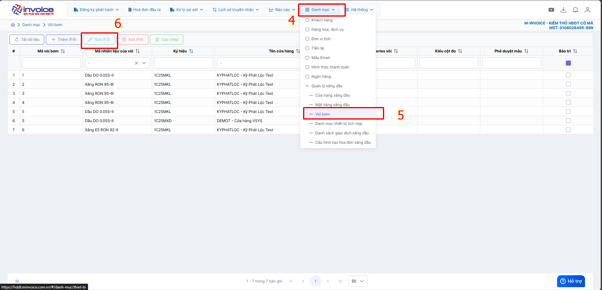

# **🧾 Hướng dẫn đổi tên mặt hàng xăng dầu**

???+ Note "📘 CĂN CỨ PHÁP LÝ"

    – **Nghị định số 123/2020/NĐ-CP** ngày 19/10/2020 của Chính phủ quy định về **hóa đơn, chứng từ**;

    – **Nghị định số 70/2025/NĐ-CP** ngày 20/3/2025 của Chính phủ **sửa đổi, bổ sung một số điều của Nghị định 123**;

    – **Thông tư số 16/2022/TT-BKHCN** ngày 15/12/2022 của Bộ Khoa học và Công nghệ ban hành **Quy chuẩn kỹ thuật quốc gia về xăng, nhiên liệu Điezen và nhiên liệu sinh học**.

    ---

    🎯 **MỤC ĐÍCH THỰC HIỆN**:

    Để đảm bảo việc **ghi nhận tên hàng hóa** khi phát hành:

    **Phải tuân thủ theo đúng quy định của Nghị định 70**, đảm bảo thống nhất, minh bạch và chính xác về mặt hàng xăng dầu.

    ---

## **Hướng dẫn đổi tên mặt hàng xăng dầu trên M-invoice**

#### Hướng dẫn bằng GIF nhanh

#### Hướng dẫn bằng hình ảnh chi tiết

### **Bước 1. Trên màn hình trang chủ bấm chọn Danh mục --> Mặt hàng xăng dầu --> chọn dòng cần sửa --> bấm sửa**

### **Bước 2. Trên màn hình trang chủ bấm chọn Danh mục --> Vòi bơm --> chọn dòng cần sửa --> bấm sửa**

???+ info "Xin chân thành cảm ơn quý khách hàng đã tin dùng sản phẩm của M-Invoice"

    Có bất kỳ vướng mắc nào trong quá trình sử dụng hãy liên hệ với M-Invoice tại mục Hỗ trợ kỹ thuật góc phải bên dưới màn hình hoặc gọi tổng đài kỹ thuật của M-Invoice (1900.955.557 Nhánh 1)

Last updated on <strong>Jul 18, 2025</strong> by <strong>nhatth</strong>

