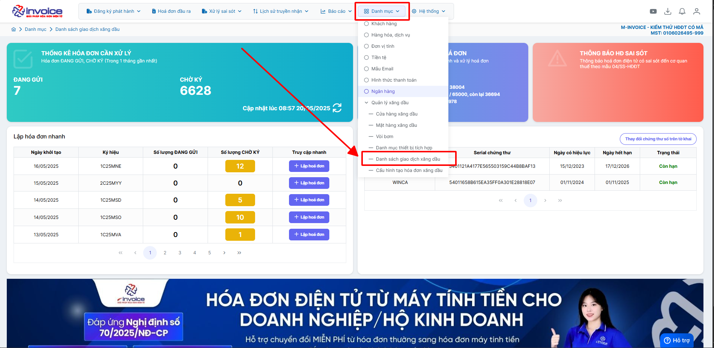
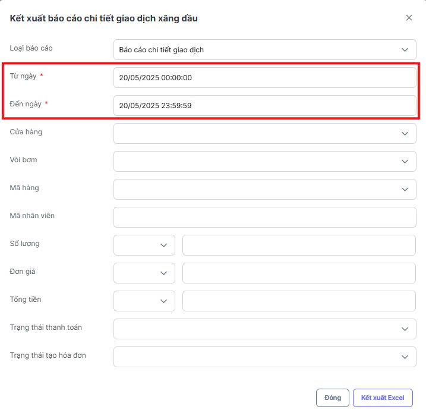

# **Kết xuất báo cáo trên trụ bơm**

Dưới đây là những hướng dẫn thao tác cơ bản trên phần mềm hóa đơn điện tử M-Invoice ở phiên bản 2.0 vô cùng mạch lạc và dễ hiểu.

### **Bước 1: Anh/chị chọn Danh mục --> Danh sách giao dịch xăng dầu**

### **Bước 2: Chọn “Kết xuất báo cáo”**

### **Bước 3 : Anh/Chị chọn loại báo cáo tương ứng**

### **Bước 4 : Anh/chị lọc theo dữ liệu ngày tương ứng**

### **Bước 5 : Chọn “Kết xuất Excel”**

???+ info "Xin chân thành cảm ơn quý khách hàng đã tin dùng sản phẩm của M-Invoice"

    Có bất kỳ vướng mắc nào trong quá trình sử dụng hãy liên hệ với M-Invoice tại mục Hỗ trợ kỹ thuật góc phải bên dưới màn hình hoặc gọi tổng đài kỹ thuật của M-Invoice (1900.955.557 Nhánh 1)

Last updated on <strong>Jun 5, 2025</strong> by <strong>nhatth</strong>

