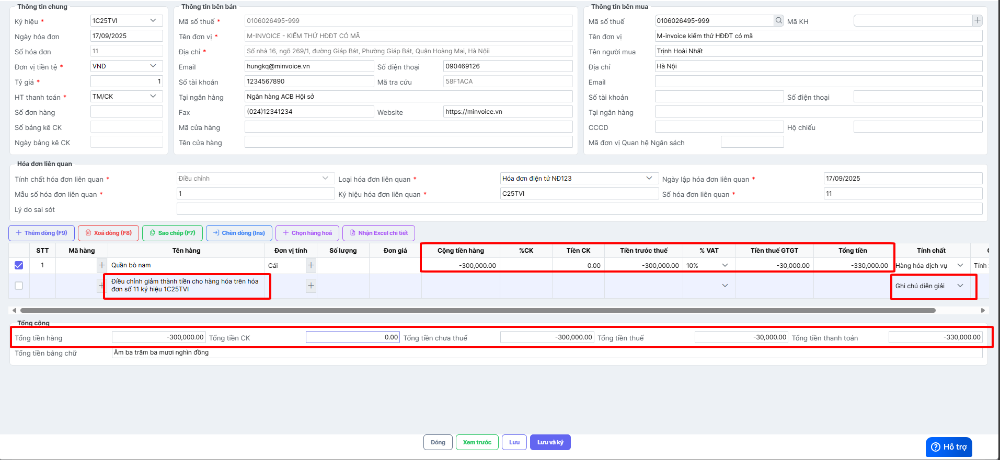
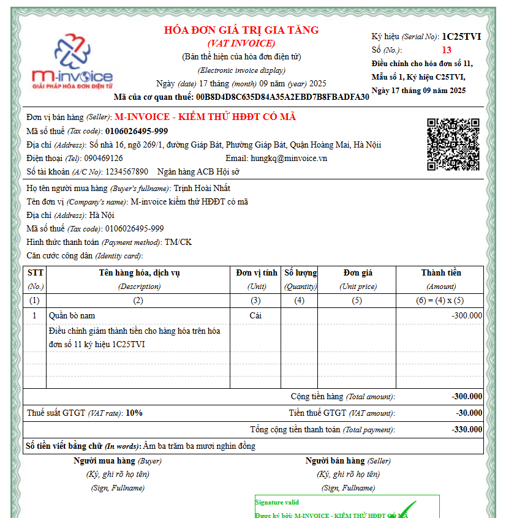
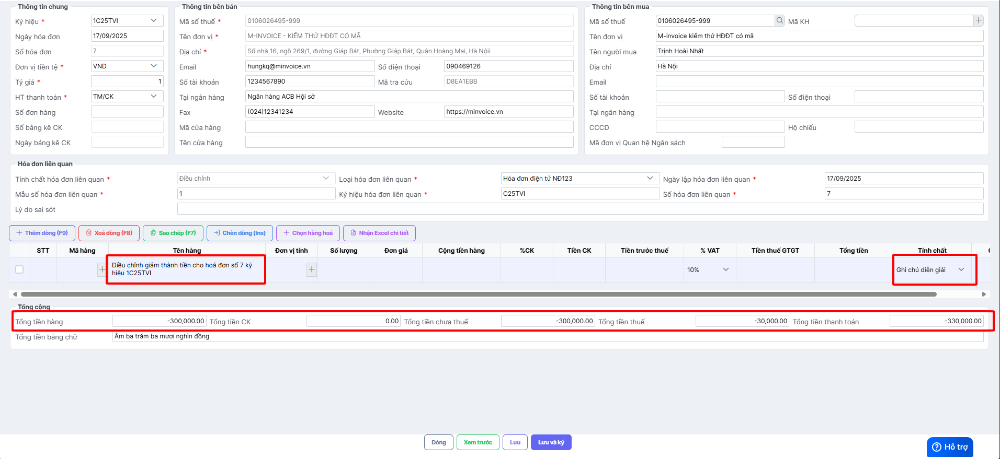
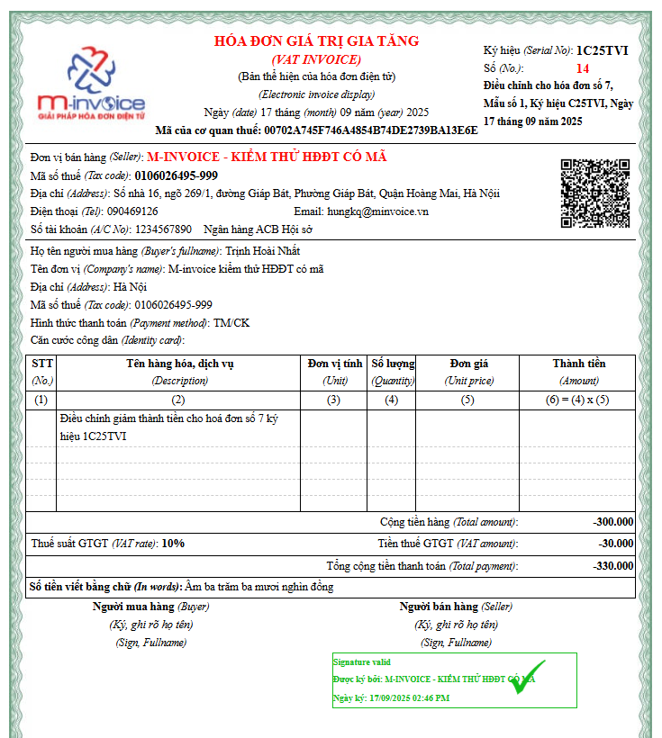

---
hide:
  - toc
---

# **Cách viết thông tin trên hóa đơn điều chỉnh giảm thành tiền (không điều chỉnh số lượng, đơn giá)**

???+ Warning "Lưu ý"

    Cách ghi thông tin dưới đây không có trong quy định của CQT, đơn vị tham khảo ý kiến CQT trước khi thực hiện.

Xem video hướng dẫn (đang cập nhật):

**1. Nội dung**

Hướng dẫn cách ghi thông tin trên hóa đơn điều chỉnh giảm thành tiền.

**2. Các bước thực hiện**

??? Question "Trường hợp 1: Điều chỉnh giảm thành tiền của hàng hóa, dịch vụ bất kỳ trên hóa đơn"

    Trường hợp điều chỉnh giảm thành tiền của hàng hóa, dịch vụ bất kỳ trên hóa đơn, kế toán ghi thông tin trên hóa đơn điều chỉnh như sau:

    - Tại cột **Tính chất**, chọn **Hàng hóa dịch vụ**.
    - Khai báo tên hàng hóa, dịch vụ cần điều chỉnh giảm thành tiền.
    - Khai báo thành tiền chênh lệch: Ghi âm số tiền điều chỉnh
    - Thành tiền tăng=> tiền thuế GTGT tăng=> Tổng tiền thanh toán của hàng hóa tăng. Ghi âm tiền thuế suất thuế GTGT, tổng tiền thanh toán theo số tiền điều chỉnh.
    - Bấm thêm dòng chọn **Tính chất** là **Ghi chú, diễn giải** điền nội dung điều chỉnh vào **Tên hàng hóa**

    

    - Hóa đơn điều chỉnh hiển thị thông tin tương ứng.

    

??? Question "Trường hợp 2: Điều chỉnh giảm thành tiền của toàn hóa đơn"

    Trường hợp điều chỉnh giảm thành tiền của toàn hóa đơn, kế toán ghi thông tin trên hóa đơn điều chỉnh như sau:

    - Tại cột **Tính chất**, chọn **Ghi chú/diễn giải**.
    - Tại cột Tên hàng hóa dịch vụ: Ghi điều chỉnh giảm thành tiền cho hóa đơn…
    - Khai báo thành tiền chênh lệch: Ghi âm số tiền điều chỉnh.
    - Thành tiền tăng=> tiền thuế GTGT tăng=> Tổng tiền thanh toán tăng. Ghi âm tiền thuế suất thuế GTGT, tổng tiền thanh toán theo thành tiền điều chỉnh.
    - Bấm thêm dòng chọn **Tính chất** là **Ghi chú, diễn giải** điền nội dung điều chỉnh vào **Tên hàng hóa**

    

    Hóa đơn điều chỉnh hiển thị thông tin tương ứng.

    

Xem thêm các trường hợp khác [tại đây.](../dieu-chinh-hoa-don#attribute-lists){ data-preview }

???+ info "Xin chân thành cảm ơn quý khách hàng đã tin dùng sản phẩm của M-Invoice"

    Có bất kỳ vướng mắc nào trong quá trình sử dụng hãy liên hệ với M-Invoice tại mục Hỗ trợ kỹ thuật góc phải bên dưới màn hình hoặc gọi tổng đài kỹ thuật của M-Invoice (1900.955.557 Nhánh 1)

Last updated on <strong>Sep 17, 2025</strong> by <strong>nhatth</strong>

