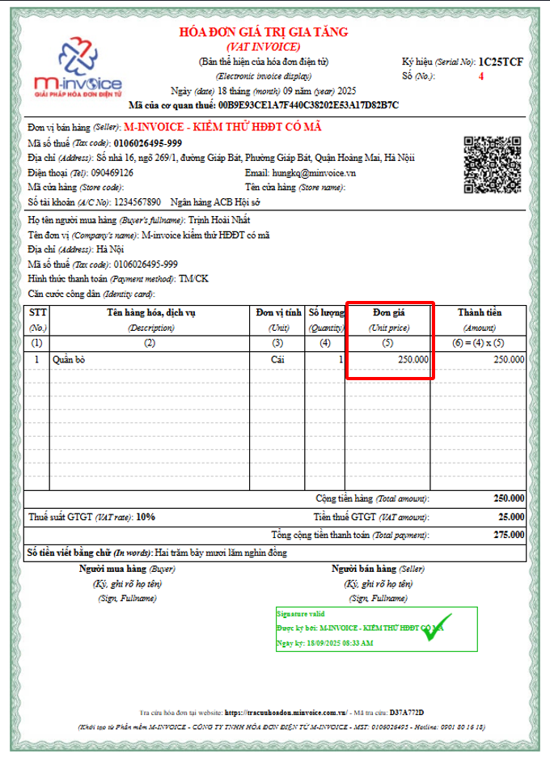
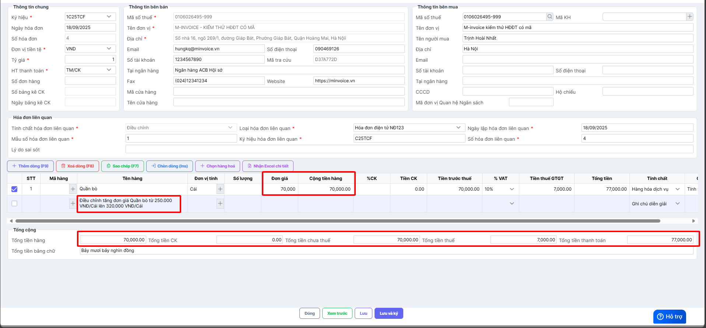
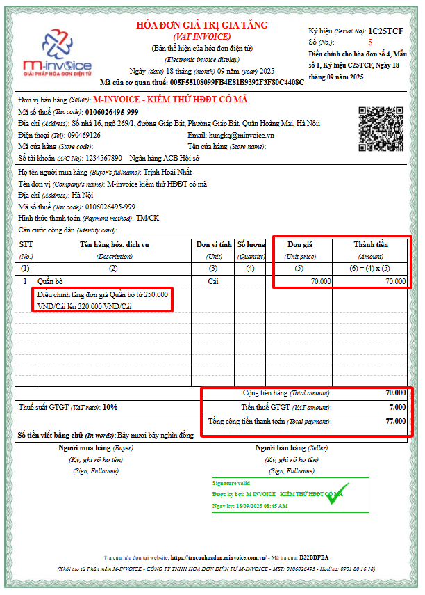

---
hide:
  - toc
---

# **Cách viết thông tin trên hóa đơn điều chỉnh tăng đơn giá hàng hóa**

???+ Warning "Lưu ý"

    Cách ghi thông tin dưới đây không có trong quy định của CQT, đơn vị tham khảo ý kiến CQT trước khi thực hiện.

Xem video hướng dẫn (đang cập nhật):

**- Hóa đơn gốc ghi sai thông tin đơn giá hàng hóa: Đơn giá ghi trên hóa đơn 250.000 VNĐ, đơn giá đúng là 320.000 VNĐ.**

==> Lập hóa đơn điều chỉnh tăng đơn giá bán hàng hóa lên 70.000 VNĐ. Đơn giá tăng dẫn đến thành tiền theo đơn giá tăng, tiền thuế tăng, tổng tiền thanh toán tăng, kế toán lập hóa đơn điều chỉnh khai báo nội dung như sau:

- Khai báo đơn giá tăng và các giá trị liên quan thay đổi khi đơn giá tăng gồm: **Thành tiền, Tổng tiền hàng, Tiền thuế GTGT, Tổng tiền thanh toán.**

**Hóa đơn điều chỉnh tăng đơn giá bán hàng hóa hiển thị các thông tin điều chỉnh tương ứng.**

Xem thêm các trường hợp khác [tại đây.](../dieu-chinh-hoa-don#attribute-lists){ data-preview }

???+ info "Xin chân thành cảm ơn quý khách hàng đã tin dùng sản phẩm của M-Invoice"

    Có bất kỳ vướng mắc nào trong quá trình sử dụng hãy liên hệ với M-Invoice tại mục Hỗ trợ kỹ thuật góc phải bên dưới màn hình hoặc gọi tổng đài kỹ thuật của M-Invoice (1900.955.557 Nhánh 1)

Last updated on <strong>Sep 17, 2025</strong> by <strong>nhatth</strong>

