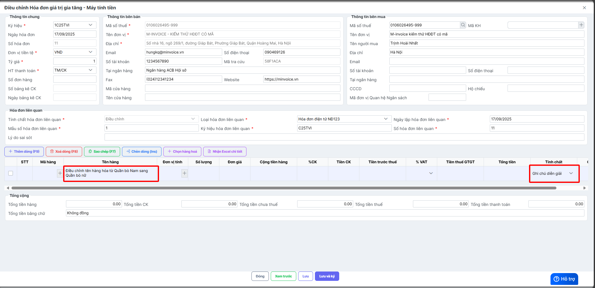
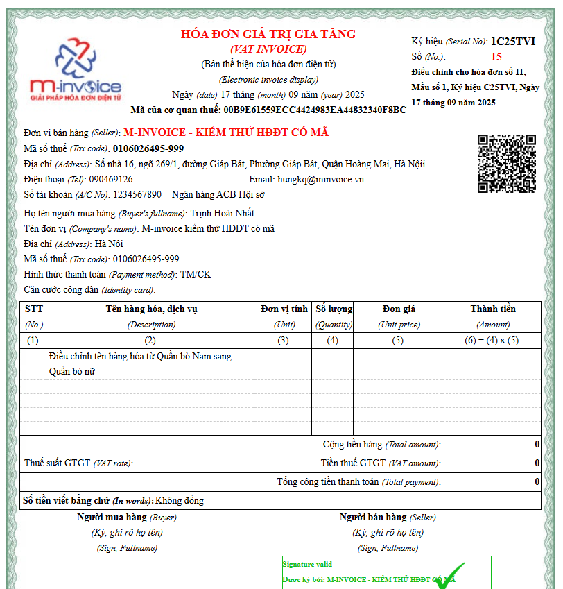

---
hide:
  - toc
---

# **Cách viết thông tin trên hóa đơn điều chỉnh tên hàng hóa**

???+ Warning "Lưu ý"

    Cách ghi thông tin dưới đây không có trong quy định của CQT, đơn vị tham khảo ý kiến CQT trước khi thực hiện.

Xem video hướng dẫn (đang cập nhật):

**Điều chỉnh sai tên hàng**

- Hóa đơn gốc ghi sai tên hàng hóa. Tên hàng hóa trên hóa đơn: Quần bò nam, tên đúng: Quần bò nữ.

=> Lập hóa đơn điều chỉnh tên hàng hóa:

- Chọn **Tính chất** là **Ghi chú/diễn giải.**
- Sau đó nhập nội dung điều chỉnh.

Hóa đơn điều chỉnh tên hàng hóa hiển thị thông tin điều chỉnh tương ứng.

Xem thêm các trường hợp khác [tại đây.](../dieu-chinh-hoa-don#attribute-lists){ data-preview }

???+ info "Xin chân thành cảm ơn quý khách hàng đã tin dùng sản phẩm của M-Invoice"

    Có bất kỳ vướng mắc nào trong quá trình sử dụng hãy liên hệ với M-Invoice tại mục Hỗ trợ kỹ thuật góc phải bên dưới màn hình hoặc gọi tổng đài kỹ thuật của M-Invoice (1900.955.557 Nhánh 1)

Last updated on <strong>Sep 17, 2025</strong> by <strong>nhatth</strong>

