# **Điều chỉnh hoá đơn**

???+ Note "Ghi chú"

    📘 **CĂN CỨ TẠI NGHỊ ĐỊNH 70/2025/NĐ-CP**, SỬA ĐỔI **NGHỊ ĐỊNH 123/2020/NĐ-CP**, QUY ĐỊNH VỀ VIỆC LẬP **HÓA ĐƠN, CHỨNG TỪ** NHƯ SAU:

    ---

    🧾 **Khi người bán phát hiện hóa đơn điện tử đã lập sai** *(bao gồm:)*

    – Hóa đơn điện tử **đã được cấp mã của cơ quan thuế**;

    – Hóa đơn điện tử **không có mã nhưng đã gửi dữ liệu đến cơ quan thuế**;

    → Thì xử lý theo các trường hợp:

    ---

    1. Sai sót nhỏ – **Không làm thay đổi nội dung nghĩa vụ thuế:**

    ✅ **Sai tên người mua**
    → Không cần lập lại hóa đơn.
    → Gửi **Mẫu 04/SS-HĐĐT** cho **Cơ quan thuế** và **thông báo cho bên mua**.

    ✅ **Sai địa chỉ người mua**
    → Không cần lập lại hóa đơn.
    → Gửi **Mẫu 04/SS-HĐĐT** cho **Cơ quan thuế** và **thông báo cho bên mua**.

    ✅ **Sai cả tên và địa chỉ nhưng đúng mã số thuế**
    → Không cần lập lại hóa đơn.
    → Gửi **Mẫu 04/SS-HĐĐT** cho **Cơ quan thuế** và **thông báo cho bên mua**.

    🖱️ **Click vào đây để xem hướng dẫn lập thông báo 04/SS:**
    📄 [Thông báo 04/SS](giai-trinh-mau04ss.md#attribute-lists){ data-preview }

    ---

    ⚠️ 2. Sai sót lớn – **Làm thay đổi nghĩa vụ thuế hoặc thông tin trọng yếu:**

    ❌ **Sai mã số thuế người mua**
    → Phải lập **hóa đơn thay thế**, kèm **biên bản thỏa thuận giữa hai bên**.

    ❌ **Sai thuế suất, số tiền, tiền thuế, đơn giá, thành tiền**
    → Phải lập **hóa đơn điều chỉnh** hoặc **hóa đơn thay thế**, kèm **biên bản thỏa thuận**.

    ❌ **Sai mặt hàng, quy cách, số lượng, đơn vị tính**
    → Phải lập **hóa đơn điều chỉnh** hoặc **hóa đơn thay thế**, kèm **biên bản thỏa thuận**.

    ❌ **Sai mã hàng hóa, mã vạch, thông tin kỹ thuật**
    → Phải lập **hóa đơn điều chỉnh** hoặc **hóa đơn thay thế**, kèm **biên bản thỏa thuận**.

    - 📝 **Anh chị có thể làm điều chỉnh theo hướng dẫn dưới nội dung này ⬇️**

    ---

    🛑 **GHI NHỚ TỪ 01/06/2025**:

    🚫 **Bỏ nghiệp vụ "Hủy hóa đơn".**

    📌 **Trường hợp hóa đơn đã phát hành nhưng giao dịch bị hủy bỏ, hay bị sai thông tin cần hủy bỏ để lập hóa đơn mới**

    - 📝 **Anh chị làm điều chỉnh giảm về 0 (tương đương hủy) theo hướng dẫn sau**

    🖱️ **Click vào đây để xem hướng dẫn:**
    📄 [Hướng dẫn điều chỉnh giảm về 0](dieu-chinh-giam-ve-0.md#attribute-lists){ data-preview }

    ---

## **Hướng dẫn điều chỉnh hóa đơn có sai sót**

???+ Warning "Lưu ý"

    Điều chỉnh hoá đơn(Áp dụng HĐ trong kỳ (nhưng đã kê khai)hoặc qua kỳ kê khai) và chỉ được phép sử dụng nghiệp vụ điều chỉnh hóa đơn với các điều kiện sau:

    1. Hóa đơn cần điều chỉnh đã được gửi CQT thành công hoặc hóa đơn đã có mã CQT cấp
    2. Hóa đơn cần điều chỉnh ở Trạng thái Gốc (Mới) hoặc bị điều chỉnh

    Nếu đã lựa chọn nghiệp vụ điều chỉnh thì không được thay thế hóa đơn điều chỉnh. Từ NGHỊ ĐỊNH 70/2025/NĐ-CP nghiệp vụ này không phải lập kèm 04/SS

**Thao tác cài đặt và thực hiện như sau**

<iframe style="width: 43rem; height: 380px" src="https://www.youtube.com/embed/cUYWKk58Xik?si=CPT8rmPb8QMycFoT" title="YouTube video player" frameborder="0" allow="accelerometer; autoplay; clipboard-write; encrypted-media; gyroscope; picture-in-picture; web-share" referrerpolicy="strict-origin-when-cross-origin" allowfullscreen></iframe>

???+ Tip

    Quý khách lên xem video hướng dẫn làm hoá đơn điều chỉnh nếu có sai sót liên quan đến số lượng, đơn giá và thành tiền

**Hướng dẫn sử dụng bằng hình ảnh nếu Quý khách không xem được video**

??? Abstract "Điều chỉnh giảm thuế suất - Bấm vào đây để xem hướng dẫn"

    #### **Điều chỉnh giảm thuế suất**

    **Bước 1: Chọn hóa đơn cần điều chỉnh --> Xử lý sai sót --> Điều chỉnh**

    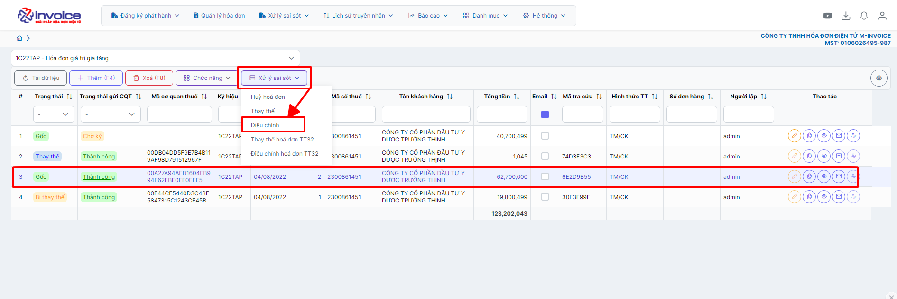

    **Anh chị có thể chọn lại hàng hóa cũ đỡ mất công nhập lại**

    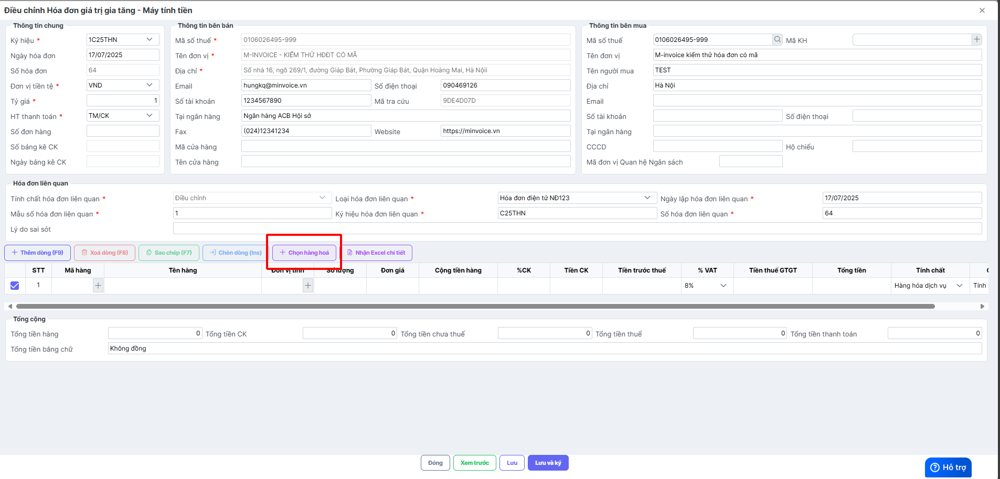

    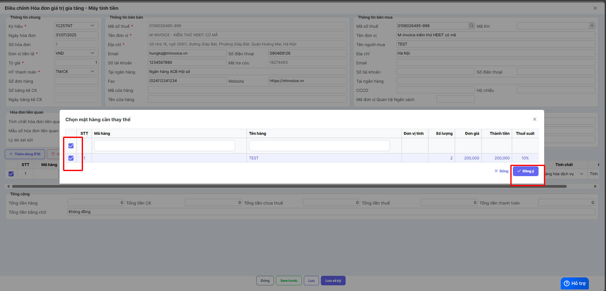

    **Bước 2: Ghi âm hoàn toàn dòng sai thuế suất**

    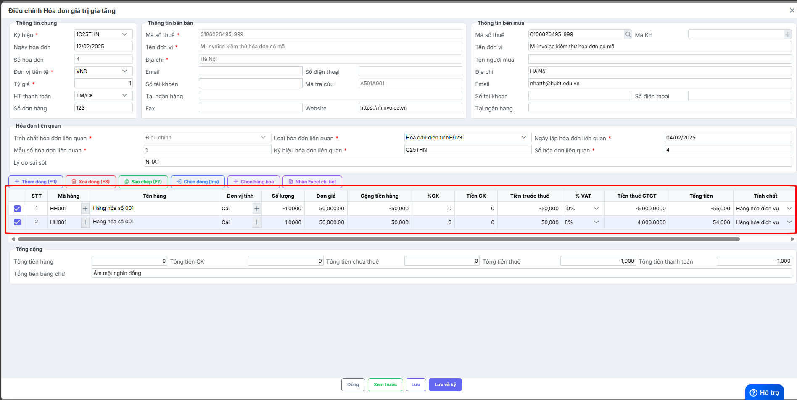

    **Anh chị bấm lưu hóa đơn và ký hóa đơn này**

    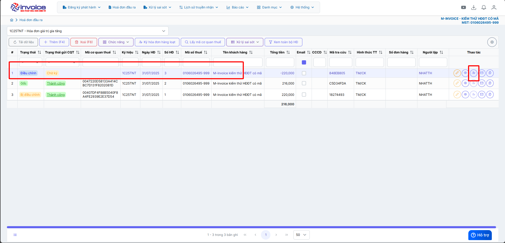

    **Bước 3: Làm 1 hóa đơn điều chỉnh tiếp và điền đúng giá trị và thuế suất đúng**

    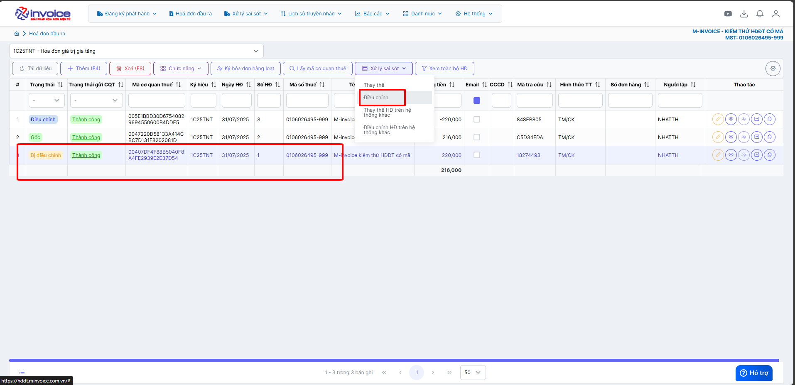

    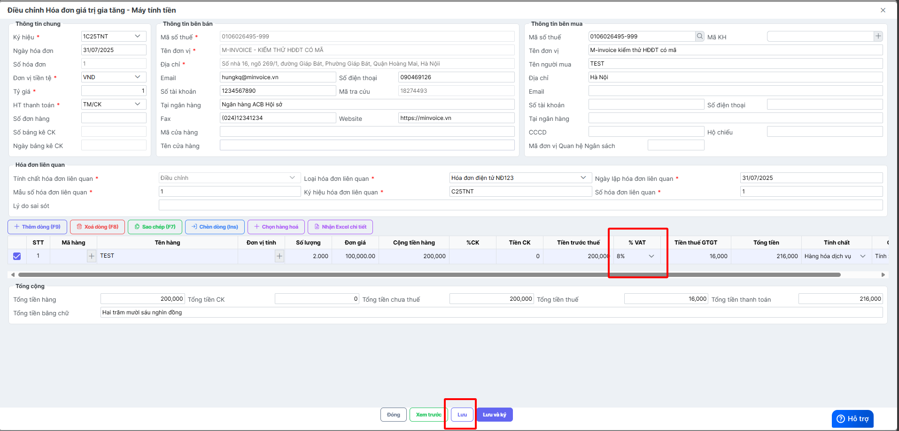

    **Anh chị bấm lưu hóa đơn và ký hóa đơn này và gửi cho khách hàng**

    ==> <strong style="color: red;">Như vậy để giảm thuế suất thì cần làm 2 lần, 1 lần đầu tiền để âm giá trị về 0, lần 2 điền lại gái trị và thuế suất đúng (như 1 hóa đơn mới)</strong>

??? Abstract "Điều chỉnh tăng thuế suất - Bấm vào đây để xem hướng dẫn"

    #### **Điều chỉnh tăng thuế suất**

    Bước 1: Chọn hóa đơn cần điều chỉnh --> Xử lý sai sót --> Điều chỉnh

    

    **Anh chị có thể chọn lại hàng hóa cũ đỡ mất công nhập lại**

    

    

    Bước 2: Ghi âm hoàn toàn dòng sai thuế suất và ghi lại đúng dòng đó và chọn đúng thuế suất đúng

    

??? Abstract "Điều chỉnh sai tên hàng, đơn vị tính - Bấm vào đây để xem hướng dẫn"

    #### **Điều chỉnh sai tên hàng, đơn vị tính**

    Bước 1: Chọn hóa đơn cần điều chỉnh --> Xử lý sai sót --> Điều chỉnh

    

    Bước 2: Điền nội dung phần tên hàng hóa bị sai và sửa lại tên đúng
    Tên hàng : Điền nội dung phần tên hàng hóa bị sai và sửa lại tên đúng

    VD: Sai tên hàng hóa dịch vụ của "hàng hóa 1", tên hàng hóa đúng là "Tên hàng hóa 2"
    Tính chất : Ghi chú diễn giải
    VD : Điều chỉnh tên hàng hóa dịch vụ

    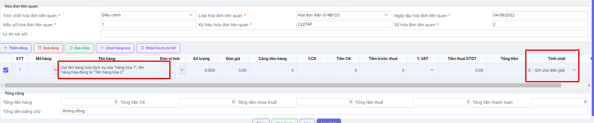

??? Abstract "Điều chỉnh số lượng ảnh hưởng đến thành tiền - Bấm vào đây để xem hướng dẫn"

    #### **Điều chỉnh số lượng ảnh hưởng đến thành tiền**

    Bước 1: Chọn hóa đơn cần điều chỉnh --> Xử lý sai sót --> Điều chỉnh

    

    Bước 2: Điều chỉnh số lượng

    **Ví dụ như trường hợp sau giá trị ban đầu số lượng là 2 điều chỉnh xuống 1 -> có ảnh hưởng đến thành tiền**

    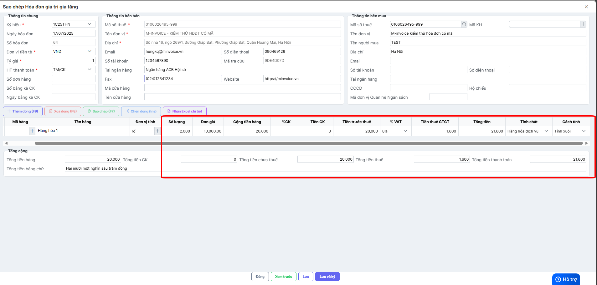

    **Sau khi điều chỉnh**

    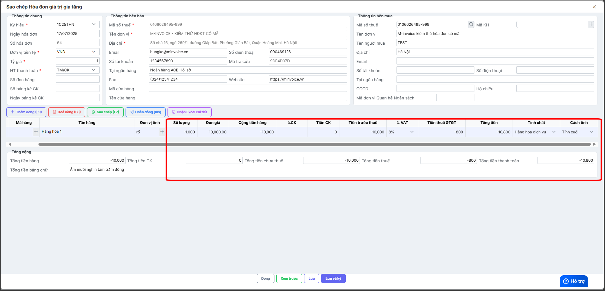

Sau khi điều chỉnh nội dung hóa đơn thành 1 hóa đơn đúng. Người sử dụng có thể Ký và gửi hóa đơn đã được lập điều chỉnh như một hóa đơn thông thường.

## Hướng dẫn lập biên bản hoá đơn điều chỉnh

???+ Note "Căn cứ"

    Theo Nghị định 70/2025/NĐ-CP, việc lập Biên bản là bắt buộc trong các trường hợp làm nghiệp vụ điêu chỉnh/thay thế.

    Người sử dụng có thể sử dụng thao tác này để lập biên bản khi làm nghiệp vụ thay thế hay điều chỉnh hóa đơn

!!! warning "Lưu ý"

    Chỉ lập được khi hóa đơn ở trạng thái thay thế hoặc điều chỉnh

#### Hướng dẫn bằng GIF nhanh

#### Hướng dẫn bằng hình ảnh chi tiết

### **Bước 1: Truy cập mục xử lý sai sót**

Sau khi đã làm thay thế hoặc điều chỉnh

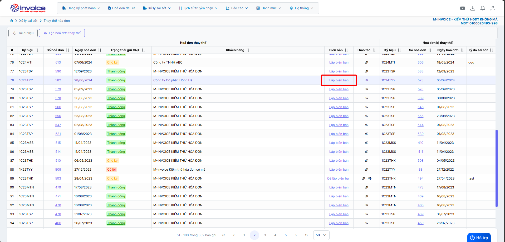

Chọn lập biên bản

### **Bước 2: Kiểm tra thông tin người bán, người mua, điền lý do thay thế hoặc lý do điều chỉnh**

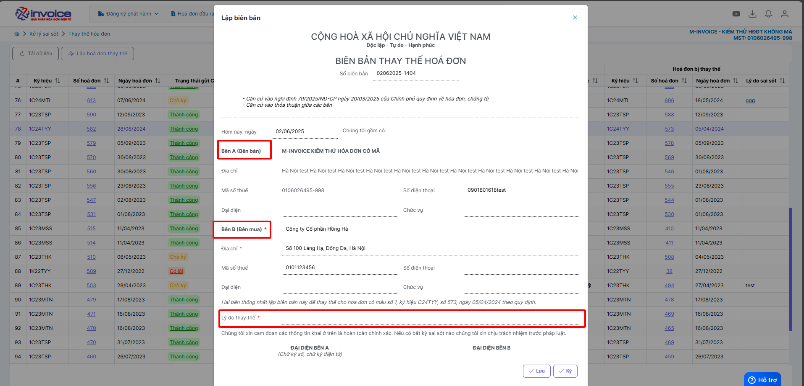

### **Bước 3 : Lưu biên bản thay thế, điều chỉnh**

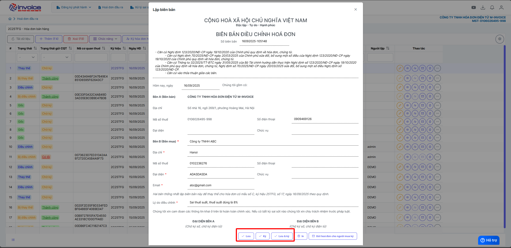

### **Bước 4 : Ký biên bản**

???+ Danger "Lưu ý"

    Để ký được biên bản máy tính phải được cài đặt plugin ký số, nếu đã cài đặt thì bỏ qua bước này

    🖱️ **Click vào đây để cài đặt:**
    📄 [Hướng dẫn tải plugin](../huong-dan/plugin.md#attribute-lists){ data-preview }

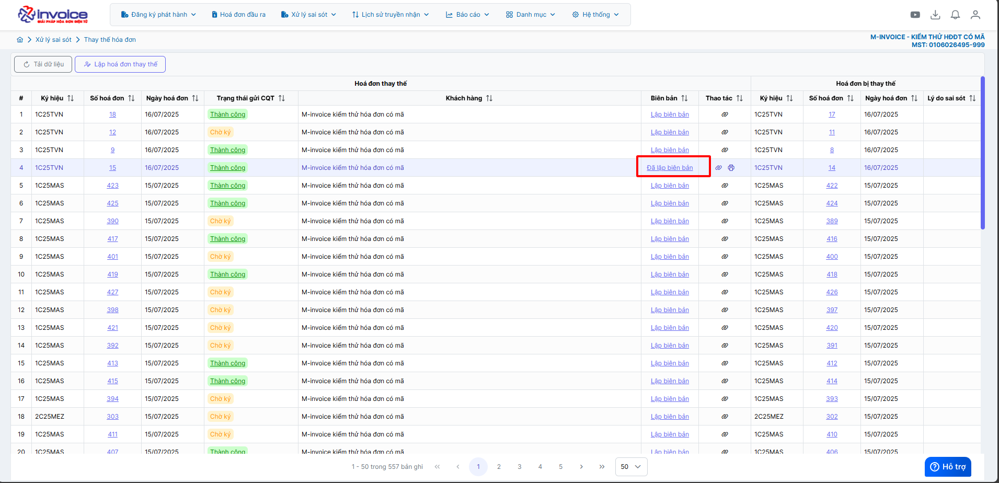

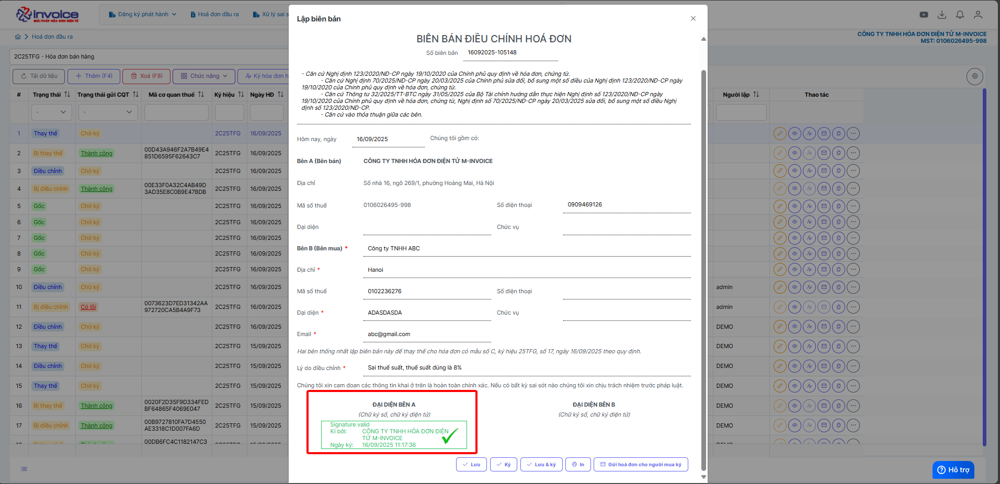

??? Bug "Trường hợp ký báo lỗi "mã lệnh không tồn tại" - Anh chị bấm vào đây để xem hướng dẫn"

    Anh chị vui lòng gỡ plugin ra cài lại để có thể ký được

    Bấm 'WINDOWS + R' gõ lệnh 'appwiz.cpl'

    

    Chọn đến minvoice plugin 2.0 kích đúp để gỡ bỏ

    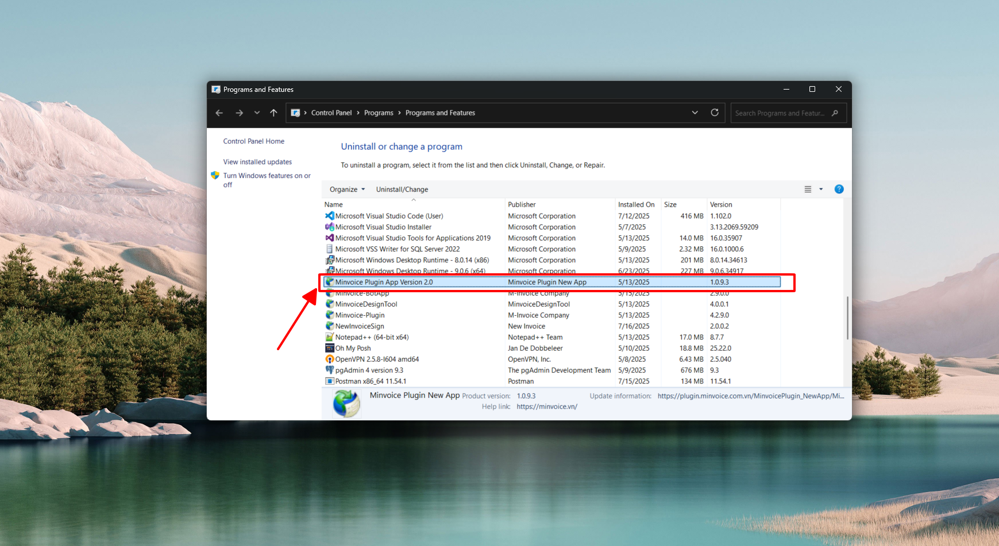

    Gỡ xong bấm vào đây để xem hướng dẫn cài lại plugin

    🖱️ **Click vào đây để cài đặt:**
    📄 [Hướng dẫn tải plugin](../huong-dan/plugin.md#attribute-lists){ data-preview }

### **Bước 5 : Xem và in hoặc tải biên bản**

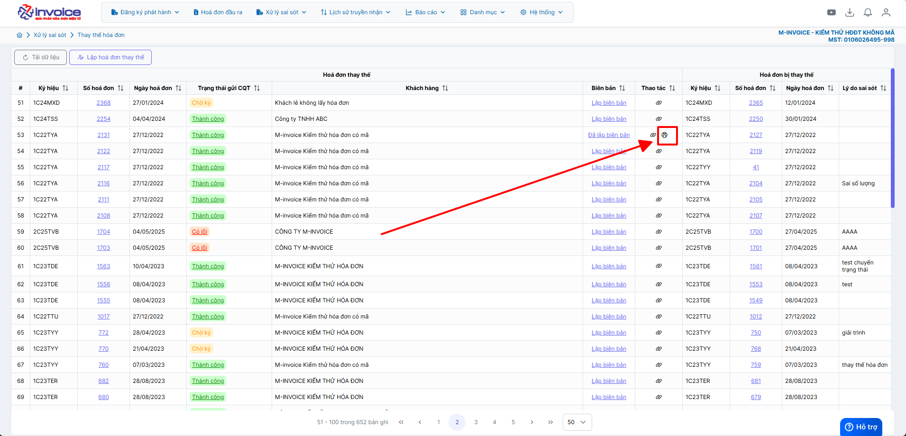

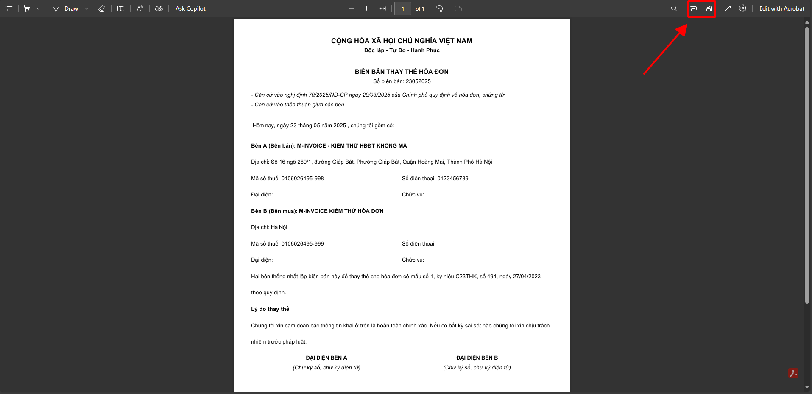

Bấm nút in ở trình duyệt hoặc bấm ctrl + P để in

???+ info "Xin chân thành cảm ơn quý khách hàng đã tin dùng sản phẩm của M-Invoice"

    Có bất kỳ vướng mắc nào trong quá trình sử dụng hãy liên hệ với M-Invoice tại mục Hỗ trợ kỹ thuật góc phải bên dưới màn hình hoặc gọi tổng đài kỹ thuật của M-Invoice (1900.955.557 Nhánh 1)

Last updated on <strong>Jul 17, 2025</strong> by <strong>nhatth</strong>

