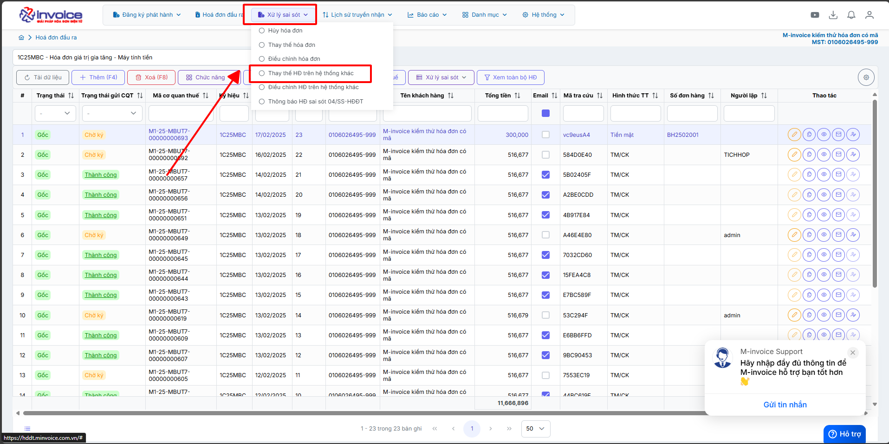
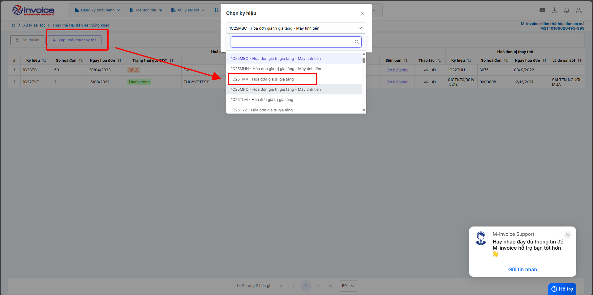
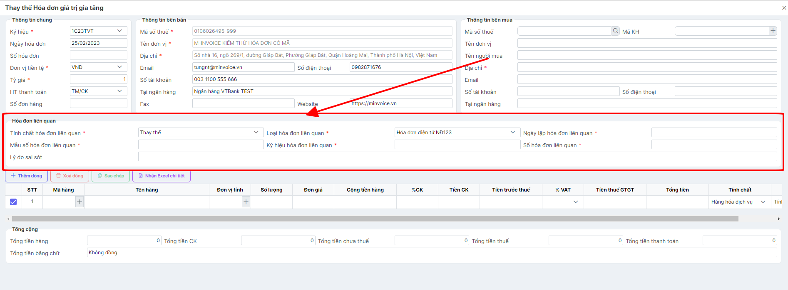

# **Điều chỉnh / Thay thế hoá đơn trên hệ thống khác**

???+ Note "Ghi chú"

    📘 **CĂN CỨ TẠI NGHỊ ĐỊNH 70/2025/NĐ-CP**, SỬA ĐỔI **NGHỊ ĐỊNH 123/2020/NĐ-CP**, QUY ĐỊNH VỀ VIỆC LẬP **HÓA ĐƠN, CHỨNG TỪ** NHƯ SAU:

    ---

    🧾 **Khi người bán phát hiện hóa đơn điện tử đã lập sai** *(bao gồm:)*

    – Hóa đơn điện tử **đã được cấp mã của cơ quan thuế**;

    – Hóa đơn điện tử **không có mã nhưng đã gửi dữ liệu đến cơ quan thuế**;

    → Thì xử lý theo các trường hợp:

    ---

    1. Sai sót nhỏ – **Không làm thay đổi nội dung nghĩa vụ thuế:**

    ✅ **Sai tên người mua**
    → Không cần lập lại hóa đơn.
    → Gửi **Mẫu 04/SS-HĐĐT** cho **Cơ quan thuế** và **thông báo cho bên mua**.

    ✅ **Sai địa chỉ người mua**
    → Không cần lập lại hóa đơn.
    → Gửi **Mẫu 04/SS-HĐĐT** cho **Cơ quan thuế** và **thông báo cho bên mua**.

    ✅ **Sai cả tên và địa chỉ nhưng đúng mã số thuế**
    → Không cần lập lại hóa đơn.
    → Gửi **Mẫu 04/SS-HĐĐT** cho **Cơ quan thuế** và **thông báo cho bên mua**.

    🖱️ **Click vào đây để xem hướng dẫn lập thông báo 04/SS:**
    📄 [Thông báo 04/SS](giai-trinh-mau04ss.md#attribute-lists){ data-preview }

    ---

    ⚠️ 2. Sai sót lớn – **Làm thay đổi nghĩa vụ thuế hoặc thông tin trọng yếu:**

    ❌ **Sai mã số thuế người mua**
    → Phải lập **hóa đơn thay thế**, kèm **biên bản thỏa thuận giữa hai bên**.

    ❌ **Sai thuế suất, số tiền, tiền thuế, đơn giá, thành tiền**
    → Phải lập **hóa đơn điều chỉnh** hoặc **hóa đơn thay thế**, kèm **biên bản thỏa thuận**.

    ❌ **Sai mặt hàng, quy cách, số lượng, đơn vị tính**
    → Phải lập **hóa đơn điều chỉnh** hoặc **hóa đơn thay thế**, kèm **biên bản thỏa thuận**.

    ❌ **Sai mã hàng hóa, mã vạch, thông tin kỹ thuật**
    → Phải lập **hóa đơn điều chỉnh** hoặc **hóa đơn thay thế**, kèm **biên bản thỏa thuận**.

    🖱️ **Click vào đây để xem hướng dẫn điều chỉnh:**
    📄 [Điều chỉnh hóa đơn](dieu-chinh-hoa-don.md#attribute-lists){ data-preview }

    🖱️ **Click vào đây để xem hướng dẫn thay thế:**
    📄 [Thay thế hóa đơn](thay-the-hoa-don.md#attribute-lists){ data-preview }

    ---

    🛑 **GHI NHỚ TỪ 01/06/2025**:

    🚫 **Bỏ nghiệp vụ "Hủy hóa đơn".**

    📌 **Trường hợp hóa đơn đã phát hành nhưng giao dịch bị hủy bỏ, hay bị sai thông tin cần hủy bỏ để lập hóa đơn mới**

    - 📝 **Anh chị làm điều chỉnh giảm về 0 (tương đương hủy) theo hướng dẫn sau**

    🖱️ **Click vào đây để xem hướng dẫn:**
    📄 [Hướng dẫn điều chỉnh giảm về 0](dieu-chinh-giam-ve-0.md#attribute-lists){ data-preview }

    ---

## **Hướng dẫn điều chỉnh và thay thế hóa đơn có sai sót trên hệ thống khác**

=== "Thay thế hoá đơn trên hệ thống khác"

    ???+ Warning "Lưu ý"

        Thay thế hoá đơn (Áp dụng cho HĐ trong kỳ kê khai(chưa kê khai)) và chỉ được phép sử dụng nghiệp vụ thay thế hóa đơn với các điều kiện sau:

        1. Hóa đơn cần thay thế đã được gửi CQT thành công hoặc hóa đơn đã có mã CQT cấp
        2. Hóa đơn cần thay thế ở Trạng thái Gốc (Mới) hoặc Thay thế

        Nếu đã lựa chọn nghiệp vụ thay thế thì không được điều chỉnh hóa đơn thay thế. Từ NGHỊ ĐỊNH 70/2025/NĐ-CP nghiệp vụ này không phải lập kèm 04/SS

    **Thao tác cài đặt và thực hiện như sau**

    <iframe style="width: 43rem; height: 380px" src="https://www.youtube.com/embed/2yVVe_lBgW0?si=gJyIo4SUDCbSe9Sn" title="YouTube video player" frameborder="0" allow="accelerometer; autoplay; clipboard-write; encrypted-media; gyroscope; picture-in-picture; web-share" referrerpolicy="strict-origin-when-cross-origin" allowfullscreen></iframe>

    **Hướng dẫn sử dụng bằng hình ảnh nếu Quý khách không xem được video**

    ### Bước 1: Ở giao diện trang chủ chọn phần Xử lý sai sót --> Thay thế hóa đơn trên hệ thống khác

    

    ### Bước 2: Chọn lập hóa đơn thay thế, sau đó chọn phần ký hiệu mà bạn muốn hóa đơn thay thế nằm trong đó

    

    ### Bước 3 : Lập hóa đơn thay thế

    

    Ở mục hóa đơn liên quan

    + **Tính chất hóa đơn liên quan** : Thay thế hoặc điều chỉnh

    + **Loại hóa đơn liên quan** : Hóa đơn điện tử NĐ123 hoặc hóa đơn NĐ 51 tùy từng trường hợp

    + **Ngày lập hóa đơn liên quan** : Ngày của hóa đơn cần thay thế

    + **Mẫu số hóa đơn liên quan**

    + **Ký hiệu hóa đơn liên quan** :  Nhập đúng ký hiệu của hóa đơn cần thay thế

    + **Số hóa đơn liên quan** : Số hóa đơn cần thay thế

    + **Lý do sai sót** : Nhập lý do sai sót

    Ở mục chi tiết hóa đơn nhập lại nội dung hóa đơn cần thay thế

    ### Bước 4 : Nhấn lưu và ký gửi hóa đơn, như thế là bạn đã hoàn thành việc thay thế hóa đơn trên hệ thống khác

=== "Điều chỉnh hoá đơn trên hệ thống khác"

    ???+ Warning "Lưu ý"

        Điều chỉnh hoá đơn(Áp dụng HĐ trong kỳ (nhưng đã kê khai)hoặc qua kỳ kê khai) và chỉ được phép sử dụng nghiệp vụ điều chỉnh hóa đơn với các điều kiện sau:

        1. Hóa đơn cần điều chỉnh đã được gửi CQT thành công hoặc hóa đơn đã có mã CQT cấp
        2. Hóa đơn cần điều chỉnh ở Trạng thái Gốc (Mới) hoặc bị điều chỉnh

        Nếu đã lựa chọn nghiệp vụ điều chỉnh thì không được thay thế hóa đơn điều chỉnh. Từ NGHỊ ĐỊNH 70/2025/NĐ-CP nghiệp vụ này không phải lập kèm 04/SS

    **Thao tác cài đặt và thực hiện như sau**

    <iframe style="width: 43rem; height: 380px" src="https://www.youtube.com/embed/cUYWKk58Xik?si=CPT8rmPb8QMycFoT" title="YouTube video player" frameborder="0" allow="accelerometer; autoplay; clipboard-write; encrypted-media; gyroscope; picture-in-picture; web-share" referrerpolicy="strict-origin-when-cross-origin" allowfullscreen></iframe>

    ???+ Tip

        Quý khách lên xem video hướng dẫn làm hoá đơn điều chỉnh nếu có sai sót liên quan đến số lượng, đơn giá và thành tiền

    **Hướng dẫn sử dụng bằng hình ảnh nếu Quý khách không xem được video**
    ### Bước 1: Ở giao diện trang chủ chọn phần Xử lý sai sót --> Điều chỉnh hóa đơn trên hệ thống khác

    

    ### Bước 2: Chọn lập hóa đơn điều chỉnh, sau đó chọn phần ký hiệu mà bạn muốn hóa đơn điều chỉnh nằm trong đó

    

    ### Bước 3 : Lập hóa đơn điều chỉnh

    

    Ở mục hóa đơn liên quan

    + **Tính chất hóa đơn liên quan** : điều chỉnh

    + **Loại hóa đơn liên quan** : Hóa đơn điện tử NĐ123 hoặc hóa đơn NĐ 51 tùy từng trường hợp

    + **Ngày lập hóa đơn liên quan** : Ngày của hóa đơn cần điều chỉnh

    + **Mẫu số hóa đơn liên quan**

    + **Ký hiệu hóa đơn liên quan** :  Nhập đúng ký hiệu của hóa đơn cần điều chỉnh

    + **Số hóa đơn liên quan** : Số hóa đơn cần điều chỉnh

    + **Lý do sai sót** : Nhập lý do sai sót

    Ở mục chi tiết hóa đơn nhập nội dung hóa đơn cần điều chỉnh (hướng dẫn video ở trên)

    ### Bước 4 : Nhấn lưu và ký gửi hóa đơn, như thế là bạn đã hoàn thành việc điều chỉnh hóa đơn trên hệ thống khác

Sau khi điều chỉnh hay thay thế nội dung hóa đơn thành 1 hóa đơn đúng. Người sử dụng có thể Ký và gửi hóa đơn đã được lập điều chỉnh hay thay thế như một hóa đơn thông thường.

???+ Danger "Hướng dẫn lập biên bản"

    Theo Nghị định 70/2025/NĐ-CP, việc lập Biên bản điều chỉnh/thay thế hóa đơn là bắt buộc trong các trường hợp có sai sót.

    Sau khi điều chỉnh người dùng lập biên bản theo hướng dẫn sau

    🖱️ **Click vào đây để xem:**
    📄 [Hướng dẫn lập biên bản hóa đơn](lap-bien-ban-hoa-don.md#attribute-lists){ data-preview }

???+ info "Xin chân thành cảm ơn quý khách hàng đã tin dùng sản phẩm của M-Invoice"

    Có bất kỳ vướng mắc nào trong quá trình sử dụng hãy liên hệ với M-Invoice tại mục Hỗ trợ kỹ thuật góc phải bên dưới màn hình hoặc gọi tổng đài kỹ thuật của M-Invoice (1900.955.557 Nhánh 1)

Last updated on <strong>Jul 17, 2025</strong> by <strong>nhatth</strong>

