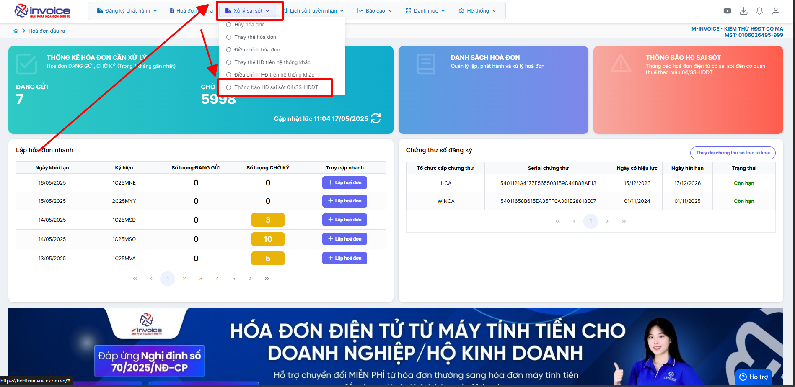
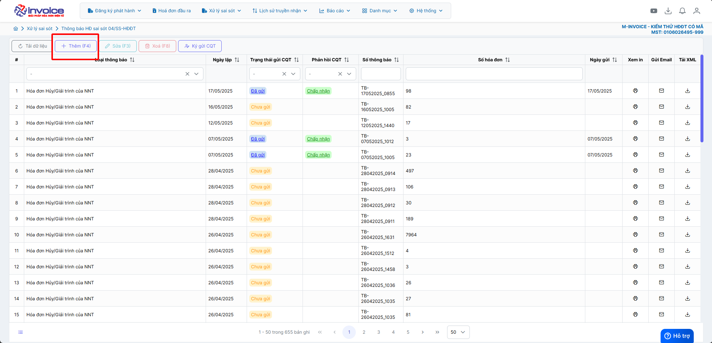
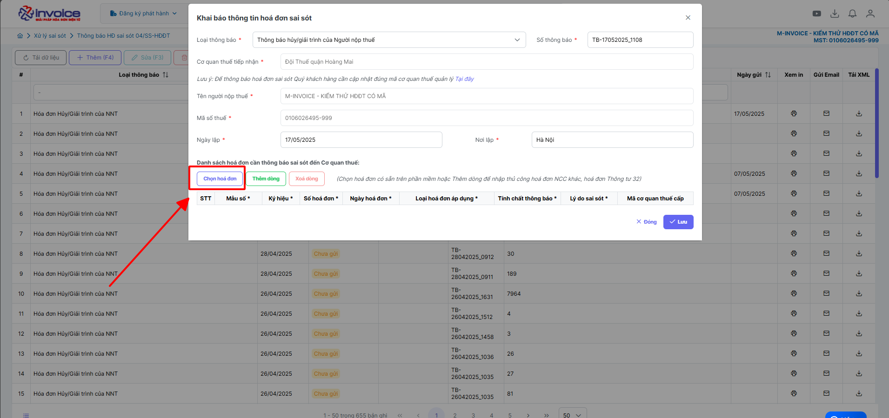
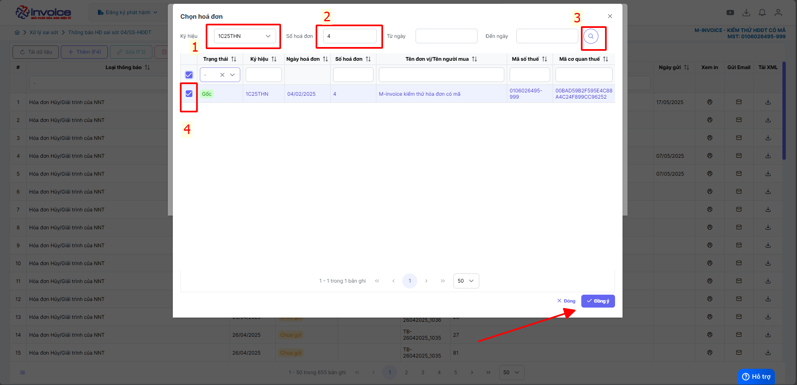
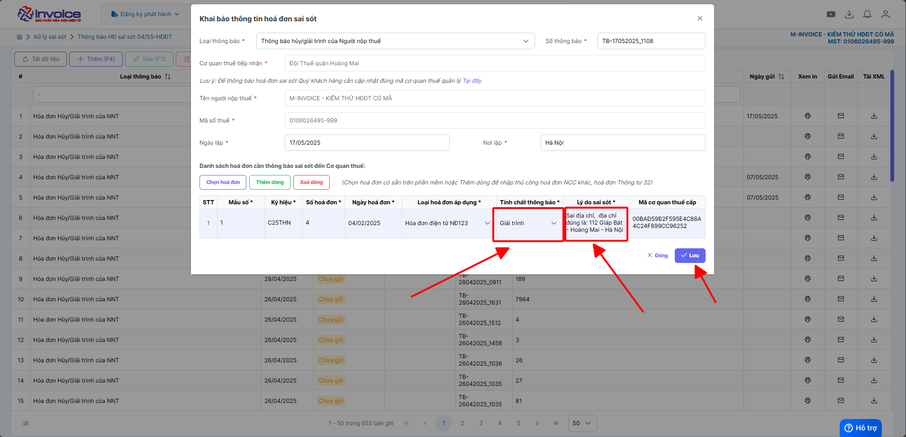

# **Thông báo 04/SS-HDDT sai sót theo NĐ70**

  
<strong>📘 Căn cứ tại Khoản 13 Điều 1 Nghị định 70/2025/NĐ-CP</strong> sửa đổi Điều 19 Nghị định 123/2020/NĐ-CP, quy định về việc lập <strong>Mẫu 04/SS-HĐĐT</strong> như sau:

  
<strong>🧾 Khi người bán phát hiện hóa đơn điện tử đã lập sai</strong> (bao gồm: 
  – Hóa đơn điện tử đã được cấp mã của cơ quan thuế; 
  – Hóa đơn điện tử không có mã nhưng đã gửi dữ liệu đến cơ quan thuế), thì xử lý theo các trường hợp:

  
<strong>🔹 Trường hợp 1:</strong> Sai <u>tên</u>, <u>địa chỉ</u> người mua nhưng <strong>không sai mã số thuế</strong> và các nội dung khác không sai: 
  → Người bán <strong>thông báo cho người mua</strong> về sai sót. 
  → <strong>Không phải lập lại hóa đơn.</strong> 
  → Người bán thực hiện <strong>thông báo với cơ quan thuế</strong> theo <u>Mẫu số 04/SS-HĐĐT</u> theo hướng dẫn dưới đây.

  
<strong>🔹 Trường hợp 2:</strong> Sai các nội dung quan trọng như: 
  – <strong>Mã số thuế</strong> của người mua; 
  – <strong>Số tiền</strong> ghi trên hóa đơn; 
  – <strong>Thuế suất</strong>, <strong>tiền thuế</strong>; 
  – <strong>Hàng hóa</strong> ghi sai quy cách, chất lượng,... 
  → Người bán được phép <strong>lựa chọn</strong> giữa 2 cách xử lý: 
  ✅ <strong>Lập hóa đơn điều chỉnh</strong> hoặc 
  ✅ <strong>Lập hóa đơn thay thế</strong> theo đúng quy định hiện hành.

## **Hướng dẫn lập giải trình 04ss**

**Thao tác cài đặt và thực hiện như sau**

<iframe style="width: 43rem; height: 380px" src="https://www.youtube.com/embed/yfkQsHpXuOo?si=QjHg3a_tgiETA1hM" title="YouTube video player" frameborder="0" allow="accelerometer; autoplay; clipboard-write; encrypted-media; gyroscope; picture-in-picture; web-share" referrerpolicy="strict-origin-when-cross-origin" allowfullscreen></iframe>

**Hướng dẫn sử dụng bằng hình ảnh nếu Quý khách không xem được video**

### **Bước 1: Nhấn vào xử ký sai sót => Thông báo HĐ sai sót 04ss-HDDT**

### **Bước 2: Bấm thêm**

### **Bước 3 : Click chọn hoá đơn**

### **Bước 4 : Chọn ký hiệu, số hoá đơn cần giải trình**

### **Bước 5 : Chọn tính chất là => giải trình, điền lý do sai sót cụ thể và điên thông tin đúng**

==> Bấm lưu -> ký thông báo 04ss giải trình

???+ info "Xin chân thành cảm ơn quý khách hàng đã tin dùng sản phẩm của M-Invoice"

    Có bất kỳ vướng mắc nào trong quá trình sử dụng hãy liên hệ với M-Invoice tại mục Hỗ trợ kỹ thuật góc phải bên dưới màn hình hoặc gọi tổng đài kỹ thuật của M-Invoice (1900.955.557 Nhánh 1)

Last updated on <strong>Jun 5, 2025</strong> by <strong>nhatth</strong>

