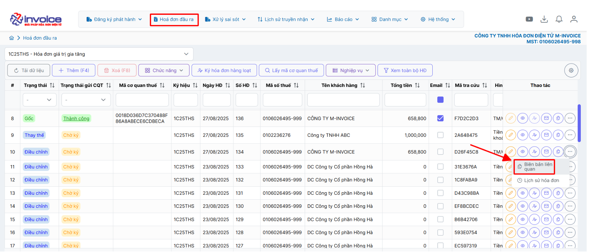
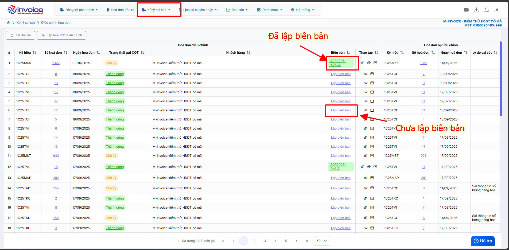
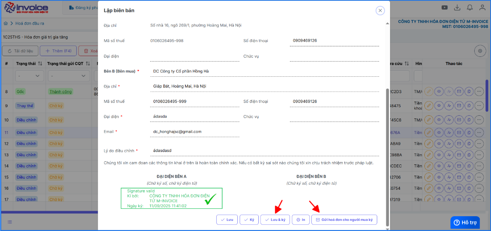
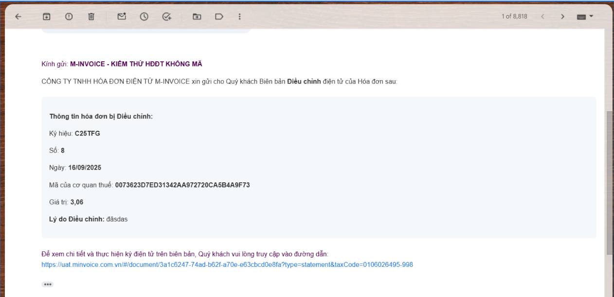
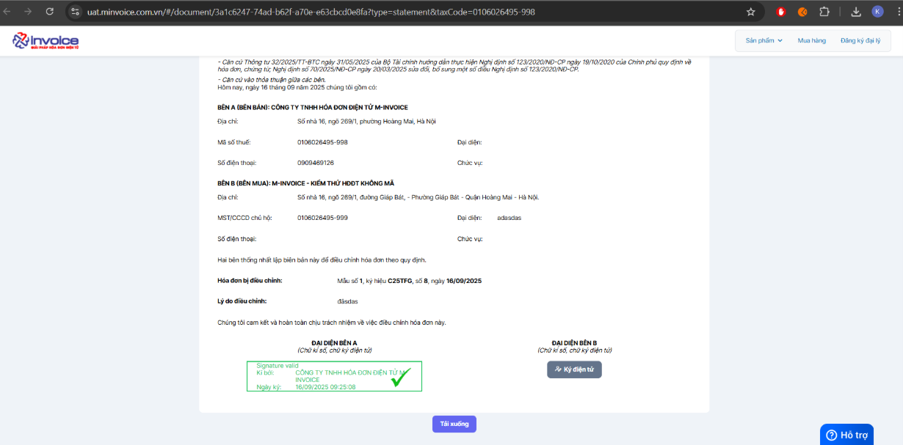
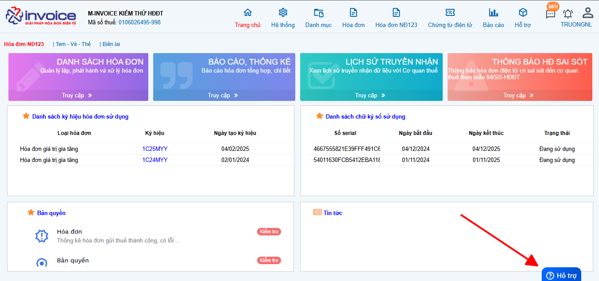

# **Hướng dẫn thao tác ký biên bản người mua**

???+ Note "Mục đích"

    Chức năng hỗ trợ gửi biên bản điện tử tới người mua qua email và cho phép người mua ký xác nhận trực tuyến, giúp quá trình xác nhận chứng từ diễn ra nhanh chóng, minh bạch và tiết kiệm thời gian.

### **Bước 1: Truy cập mục xử lý sai sót**

Sau khi đã làm thay thế hoặc điều chỉnh

**Cách 1**

**Cách 2**

### **Bước 2: Lập biên bản, ký, gửi người mua trong 1 màn hình**

**Email người mua nhận được**

**Giao diện ký và tải biên bản sau ký của người mua**

!!! info "Xin chân thành cảm ơn Quý khách hàng đã tin dùng sản phẩm của M-Invoice"

    Có bất kỳ vướng mắc nào trong quá trình sử dụng hãy liên hệ với M-Invoice tại mục Hỗ trợ kỹ thuật góc phải bên dưới màn hình hoặc gọi tổng đài kỹ thuật của M-Invoice (1900.955.557 Nhánh 1)

Last updated on <strong>Sep 18, 2025</strong> by <strong>NHATTH</strong>

