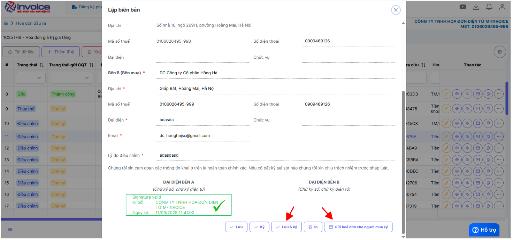
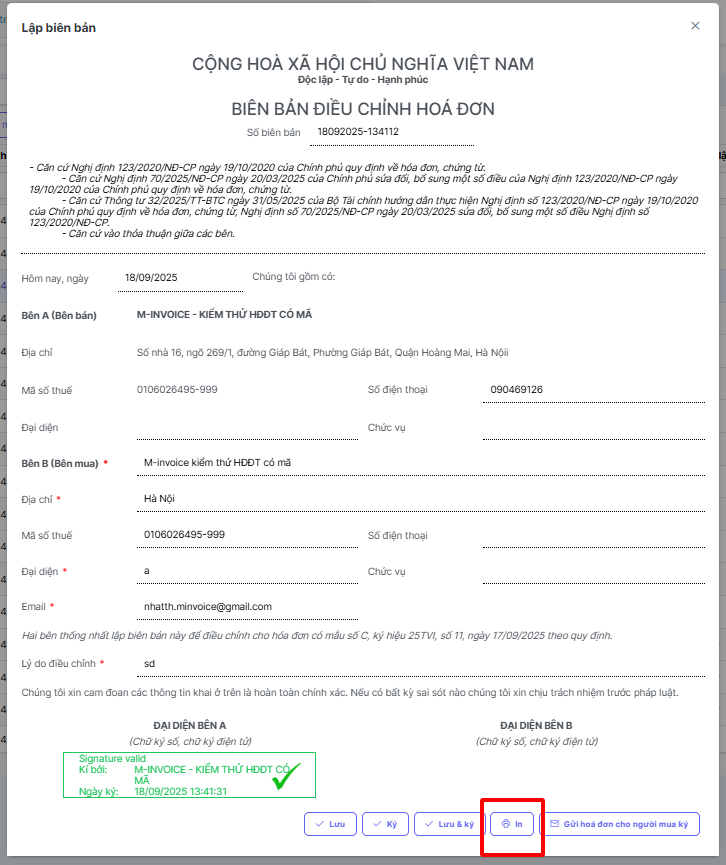
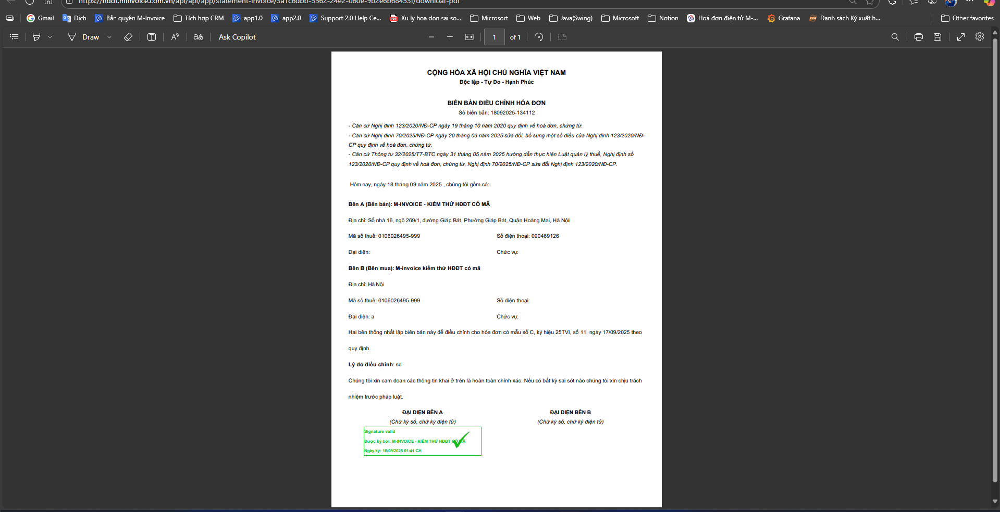
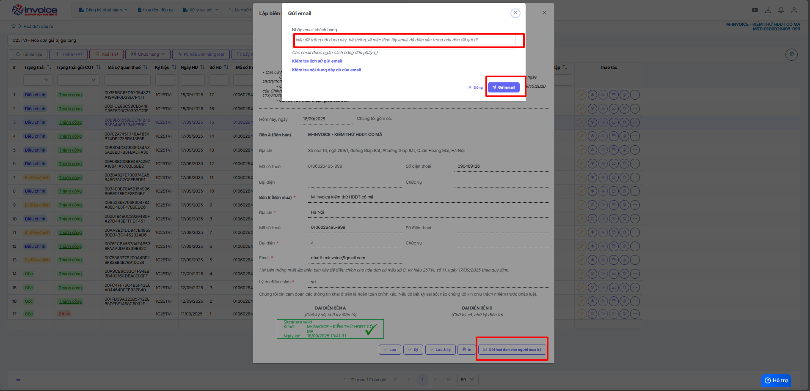
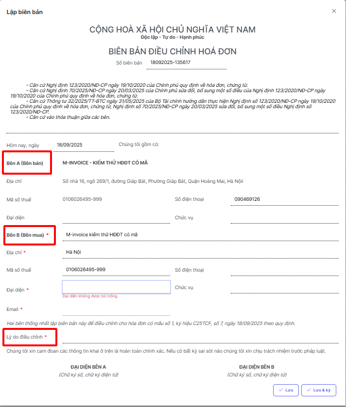
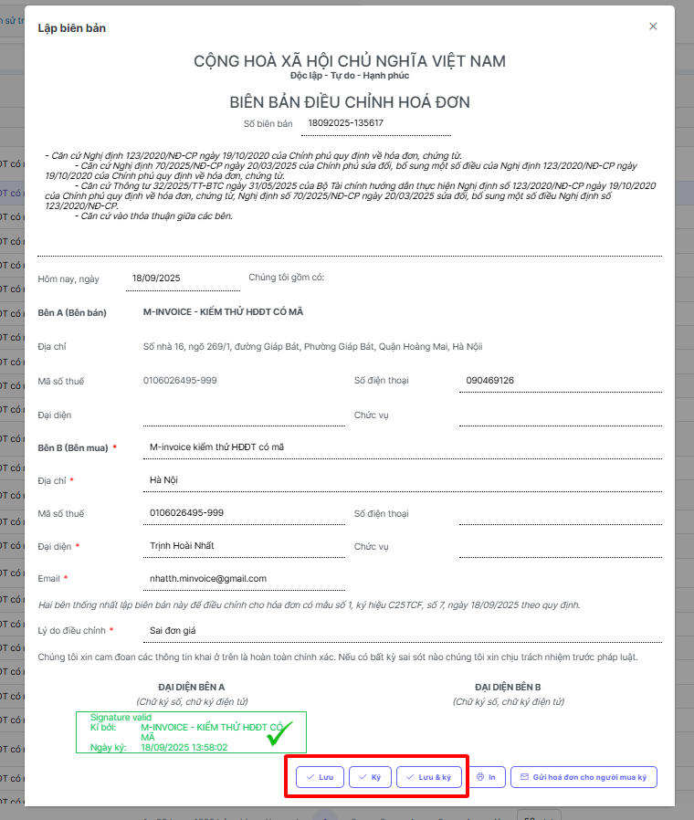
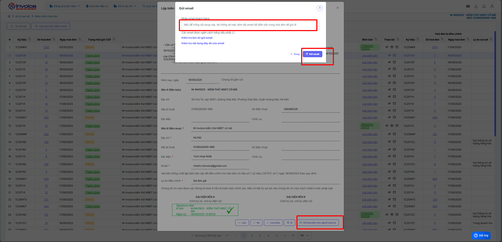

# **Hướng dẫn lập biên bản hoá đơn điều chỉnh thay thế**

???+ Note "Căn cứ"

    Theo Nghị định 70/2025/NĐ-CP, việc lập Biên bản là bắt buộc trong các trường hợp làm nghiệp vụ điêu chỉnh/thay thế.

    Người sử dụng có thể sử dụng thao tác này để lập biên bản khi làm nghiệp vụ thay thế hay điều chỉnh hóa đơn

!!! warning "Lưu ý"

    Chỉ lập được khi hóa đơn ở trạng thái thay thế hoặc điều chỉnh

=== "Cách 1. Lập biên bản tại Danh sách hóa đơn đầu ra"

    **Bước 1: Ở mục Hóa đơn đầu ra**

    Sau khi đã làm thay thế hoặc điều chỉnh

    

    **Chọn biên bản liên quan**

    **Bước 2: Kiểm tra thông tin người bán, người mua, điền lý do thay thế hoặc lý do điều chỉnh**

    

    **Bước 3 : Lưu biên bản thay thế, điều chỉnh hoặc lưu và ký**

    

    ???+ Danger "Lưu ý"

        Để ký được biên bản bằng cks usb máy tính phải được cài đặt plugin ký số, nếu đã cài đặt thì bỏ qua bước này

        🖱️ **Click vào đây để cài đặt:**
        📄 [Hướng dẫn tải plugin](../huong-dan/plugin.md#attribute-lists){ data-preview }

    ??? Bug "Trường hợp ký báo lỗi "mã lệnh không tồn tại" - Anh chị bấm vào đây để xem hướng dẫn"

        Anh chị vui lòng gỡ plugin ra cài lại để có thể ký được

        Bấm 'WINDOWS + R' gõ lệnh 'appwiz.cpl'

        

        Chọn đến minvoice plugin 2.0 kích đúp để gỡ bỏ

        

        Gỡ xong bấm vào đây để xem hướng dẫn cài lại plugin

        🖱️ **Click vào đây để cài đặt:**
        📄 [Hướng dẫn tải plugin](../huong-dan/plugin.md#attribute-lists){ data-preview }

    ### **Bước 4 : Xem in PDF và gửi mail cho người mua để ký biên bản**

    

    

    Bấm nút in ở trình duyệt hoặc bấm ctrl + P để in

    **Gửi mail cho người mua để người mua ký biên bản**

    

=== "Cách 2 Lập biên bản tại mục Xử lý sai sót"

    ### **Bước 1: Truy cập mục xử lý sai sót**

    Sau khi đã làm thay thế hoặc điều chỉnh

    

    

    Chọn lập biên bản

    ### **Bước 2: Kiểm tra thông tin người bán, người mua, điền lý do thay thế hoặc lý do điều chỉnh**

    

    ### **Bước 3 : Lưu và ký biên bản thay thế, điều chỉnh**

    

    ???+ Danger "Lưu ý"

        Để ký được biên bản máy tính phải được cài đặt plugin ký số, nếu đã cài đặt thì bỏ qua bước này

        🖱️ **Click vào đây để cài đặt:**
        📄 [Hướng dẫn tải plugin](../huong-dan/plugin.md#attribute-lists){ data-preview }

    ??? Bug "Trường hợp ký báo lỗi "Vui lòng nâng cấp phiên bản Plugin ký" - Anh chị bấm vào đây để xem hướng dẫn"

        Anh chị vui lòng gỡ plugin ra cài lại để có thể ký được

        Bấm 'WINDOWS + R' gõ lệnh 'appwiz.cpl'

        

        Chọn đến minvoice plugin 2.0 kích đúp để gỡ bỏ

        

        Gỡ xong bấm vào đây để xem hướng dẫn cài lại plugin

        🖱️ **Click vào đây để cài đặt:**
        📄 [Hướng dẫn tải plugin](../huong-dan/plugin.md#attribute-lists){ data-preview }

    ### **Bước 4 : Xem in và gửi mail biên bản cho người mua ký**

    

    Bấm nút in ở trình duyệt hoặc bấm ctrl + P để in

    

    

Xem hướng dẫn ký biên bản người mua chi tiết [tại đây](../huong-dan-ky-bien-ban-nguoi-mua#attribute-lists){ data-preview }

!!! info "Xin chân thành cảm ơn Quý khách hàng đã tin dùng sản phẩm của M-Invoice"

    Có bất kỳ vướng mắc nào trong quá trình sử dụng hãy liên hệ với M-Invoice tại mục Hỗ trợ kỹ thuật góc phải bên dưới màn hình hoặc gọi tổng đài kỹ thuật của M-Invoice (1900.955.557 Nhánh 1)

Last updated on <strong>Sep 18, 2025</strong> by <strong>nhatth</strong>

