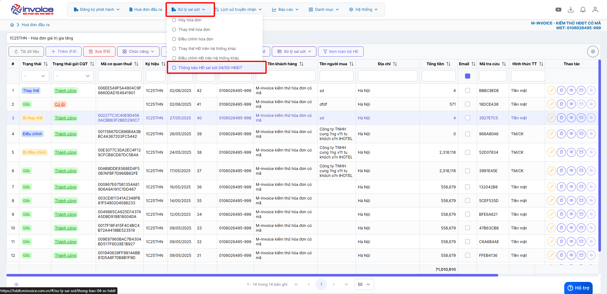
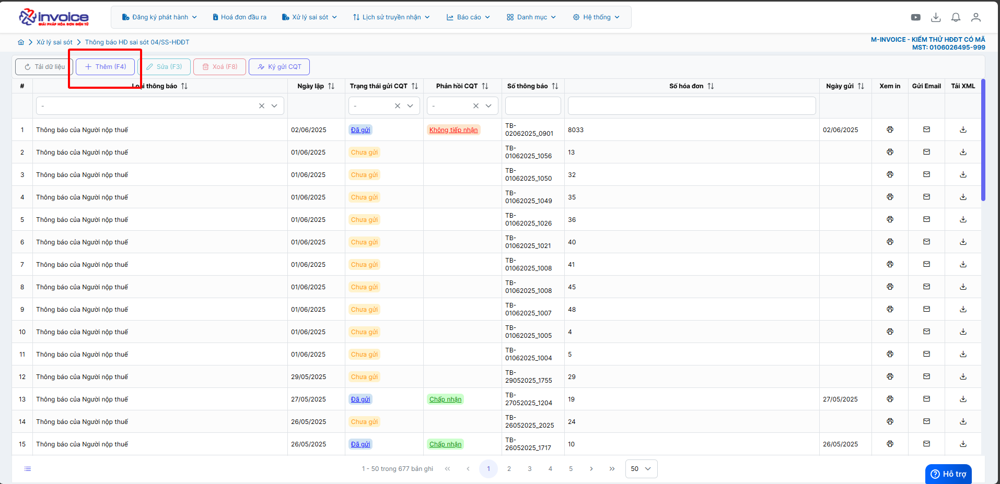
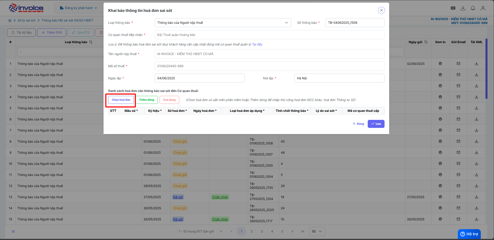
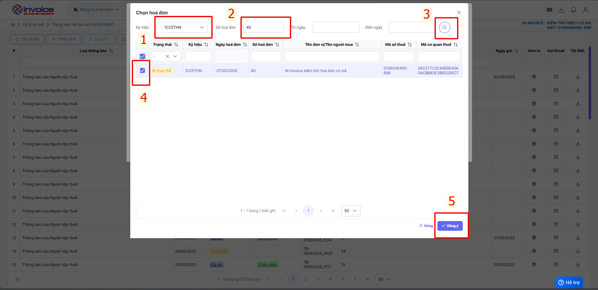
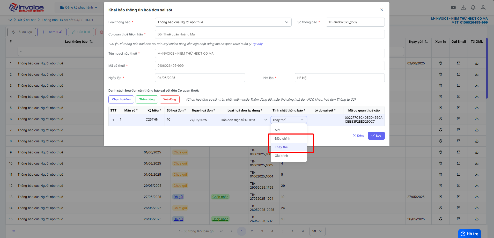
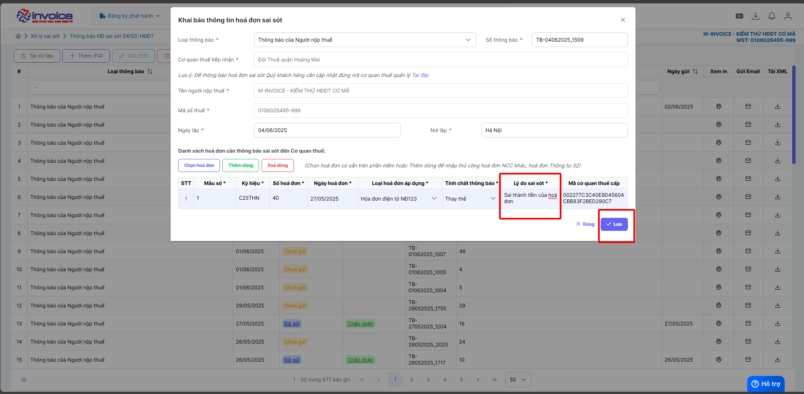
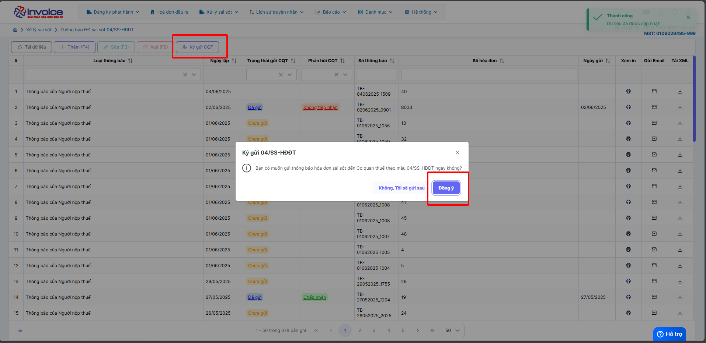

# **Gửi mẫu 04ss thay thế hoặc điều chỉnh hoá đơn**

Dưới đây là những hướng dẫn thao tác cơ bản trên phần mềm hóa đơn điện tử M-Invoice ở phiên bản 2.0 vô cùng mạch lạc và dễ hiểu.

## **Hướng dẫn gửi mẫu 04ss thay thế hoặc điều chỉnh hoá đơn**

???+ Note "Ghi chú"

    Mẫu 04/SS thay thế phù hợp cho các trường hơp làm nghiệp vụ thay thế hóa đơn

???+ Warning "Lưu ý"

    Anh chị phải làm thay thế hoặc điều chỉnh hóa đơn trước rồi mới làm bước này

    Nếu chưa biết thay thế hay điều chỉnh anh chị có thể xem 2 hướng dẫn sau đây

    [Hướng dẫn thay thế hóa đơn](thay-the-hoa-don.md#attribute-lists){ data-preview }

    [Hướng dẫn điều chỉnh hóa đơn](dieu-chinh-hoa-don.md#attribute-lists){ data-preview }

**Thao tác cài đặt và thực hiện như sau**

### **Bước 1: Nhấn vào xử lý sai sót => Thông báo HĐ sai sót 04ss-HDDT**

### **Bước 2: Bấm thêm**

### **Bước 3 : Click chọn hoá đơn**

### **Bước 4 : Chọn ký hiệu, số hoá đơn 'bị điều chỉnh' hoặc 'bị thay thế'**

### **Bước 5 : Chọn tính chất là => thay thế hoặc điều chỉnh (phụ thuộc vào nghiệp vụ mà anh chị làm), điền lý do sai sót cụ thể và điên thông tin đúng**

### **Bước 6: Bấm lưu -> ký thông báo 04ss giải trình**

???+ info "Xin chân thành cảm ơn quý khách hàng đã tin dùng sản phẩm của M-Invoice"

    Có bất kỳ vướng mắc nào trong quá trình sử dụng hãy liên hệ với M-Invoice tại mục Hỗ trợ kỹ thuật góc phải bên dưới màn hình hoặc gọi tổng đài kỹ thuật của M-Invoice (1900.955.557 Nhánh 1)

Last updated on <strong>Jun 5, 2025</strong> by <strong>nhatth</strong>

