# **Hướng dẫn in hóa đơn/đơn hàng**

Dưới đây là những hướng dẫn thao tác cơ bản trên phần mềm bán hàng M-invoice vô cùng mạch lạc và dễ hiểu.

## **Hướng dẫn in hóa đơn/đơn hàng**

**Thao tác cài đặt và thực hiện như sau**

## **1. In đơn hàng và hóa đơn mới**

### **Bước 1: Đăng nhập tài khoản mSeller bằng tài khoản đã được cấp**

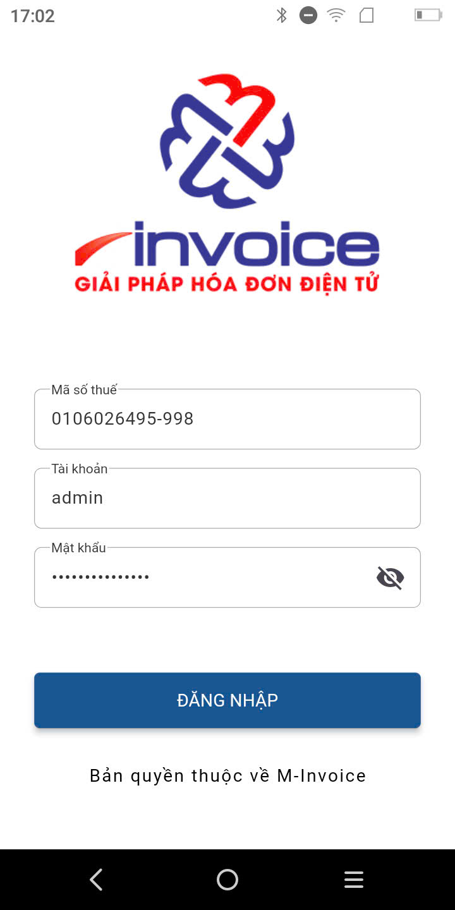{: style="height:650px"}

### **Bước 2: Tạo đơn hàng mới**

Ấn vào dấu “+” ở thanh công cụ để bắt đầu:

- Chọn hàng hóa mong muốn

- Chọn phương thức thanh toán và nhập các thông tin khác trên hóa đơn

- Chọn có xuất hóa đơn hay không

- Ấn thanh toán để hoàn thành tạo mới đơn hàng

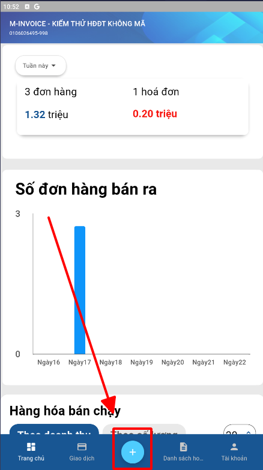{: style="height:500px"}
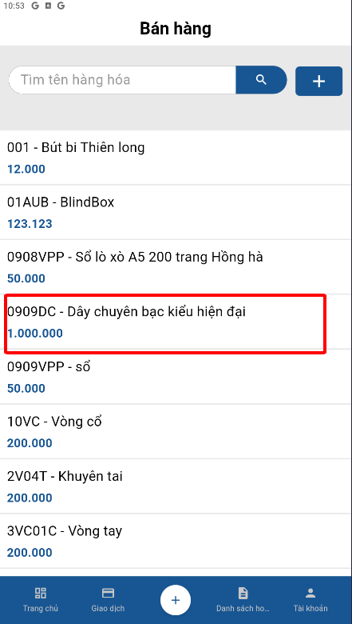{: style="height:500px"}
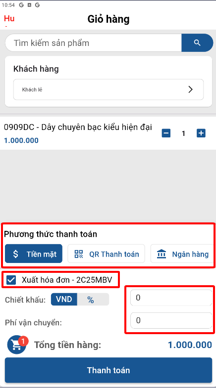{: style="height:500px"}
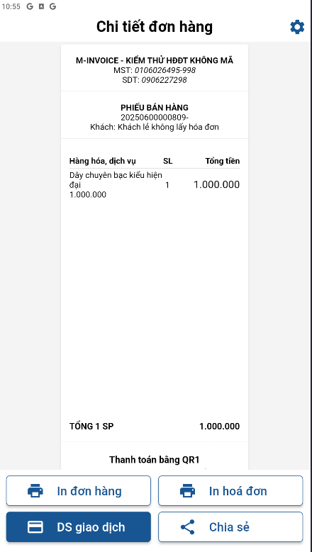{: style="height:500px"}

### **Bước 3: Ấn “In đơn hàng” để máy in/máy pos in đơn hàng.**

### **Bước 4: Ấn “In hóa đơn” để chuyến sang màn in hóa đơn. Sau đó ấn nút “In hóa đơn” để máy in/máy pos in hóa đơn và hoàn thành việc in đơn hàng/in hóa đơn mới.**

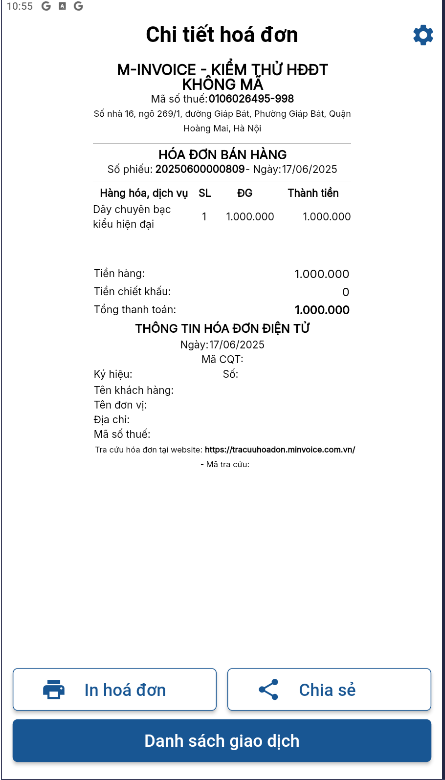{: style="height:500px"}

## **2. In đơn hàng từ danh sách đơn hàng**

### **Bước 1: Vào phần Giao dịch dưới thanh công cụ**

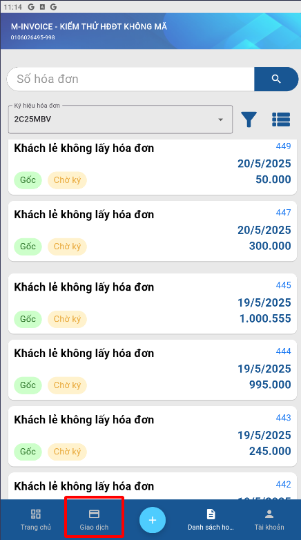{: style="height:500px"}

### **Bước 2: In đơn hàng**

**Cách 1: in trực tiếp**

- Gạt đơn hàng cần in từ phải sang trái để hiển thị các hành động với đơn hàng

- Chọn in đơn hàng để hiển thị bản in của đơn hàng

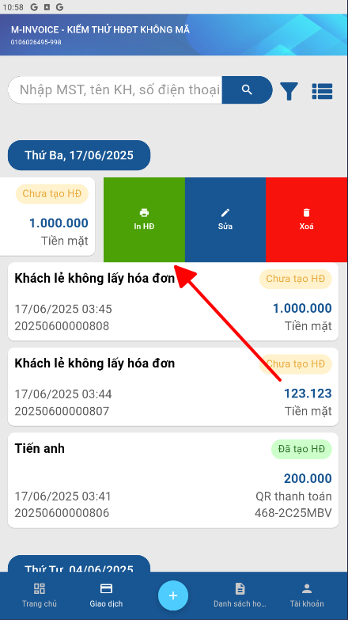{: style="height:500px"}

- Chọn “In đơn hàng” để hoàn thành in đơn hàng

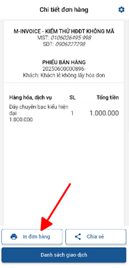{: style="height:500px"}

**Cách 2: Chọn và click vào đơn hàng cần in để hiển thị chi tiết đơn hàng**

- Sau khi hiển thị chi tiết đơn hàng ấn vào icon máy in để hiển thị bản in đơn hàng

- Chọn In đơn hàng để máy in/máy pos in đơn hàng

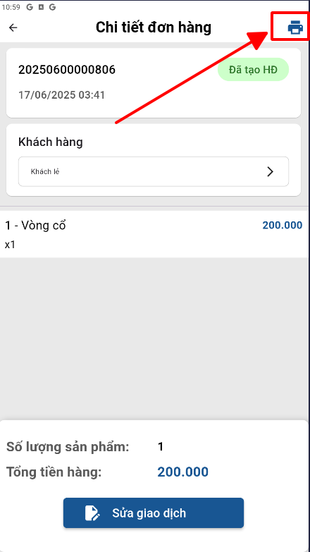{: style="height:500px"}

{: style="height:500px"}

## **3. In hóa đơn từ danh sách hóa đơn**

### **Bước 1: Vào phần Danh sách hóa đơn**

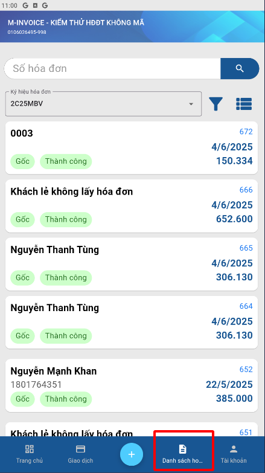{: style="height:500px"}

### **Bước 2: Chọn hóa đơn cần in và in hóa đơn**

**Cách 1: in trực tiếp**

- Gạt hóa đơn cần in từ phải sang trái để hiển thị các hành động với hóa đơn

- Chọn in hóa đơn để hiển thị bản in của hóa đơn

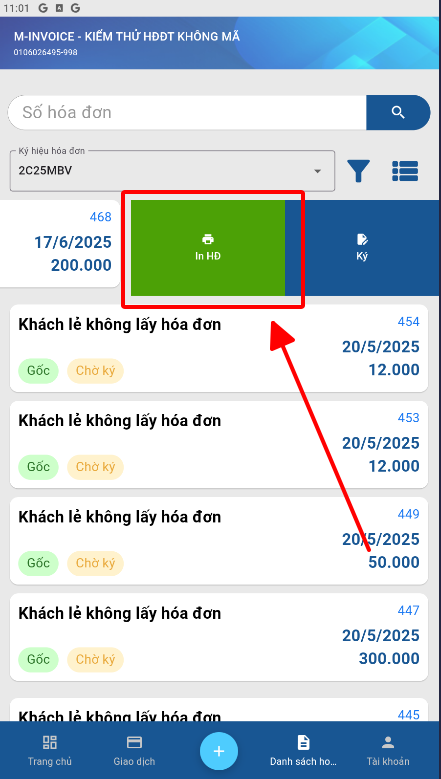{: style="height:500px"}

- Chọn “In hóa đơn” để hoàn thành in hóa đơn

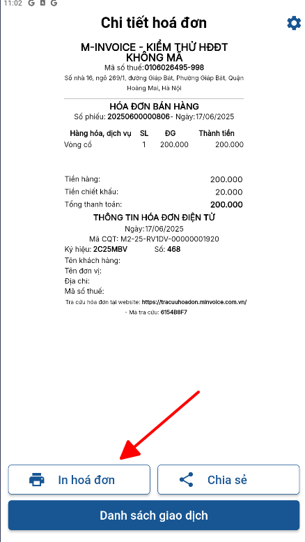{: style="height:500px"}

**Cách 2: Chọn và click vào hóa đơn cần in để hiển thị chi tiết hóa đơn**

- Sau khi hiển thị chi tiết hóa đơn ấn vào nút “Xem in” để hiển thị bản in hóa đơn

- Chọn In hóa đơn để máy in/máy pos in hóa đơn

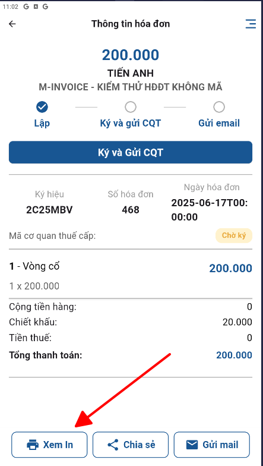{: style="height:500px"}
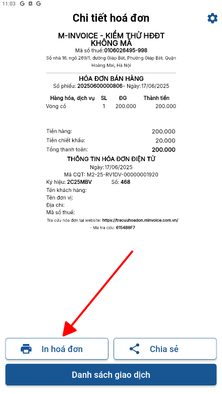{: style="height:500px"}

???+ info "Xin chân thành cảm ơn quý khách hàng đã tin dùng sản phẩm của M-Invoice"

    Có bất kỳ vướng mắc nào trong quá trình sử dụng hãy liên hệ với M-Invoice tại mục Hỗ trợ kỹ thuật góc phải bên dưới màn hình hoặc gọi tổng đài kỹ thuật của M-Invoice (1900.955.557 Nhánh 1)

Last updated on <strong>Jun 17, 2025</strong> by <strong>nhatth</strong>

