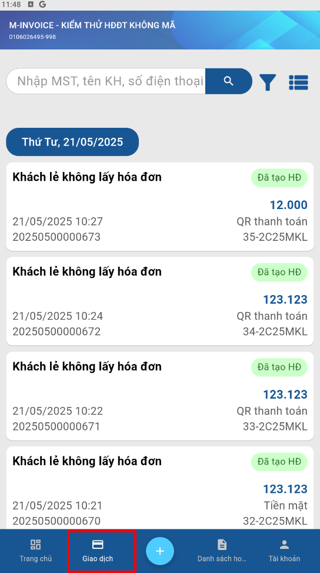
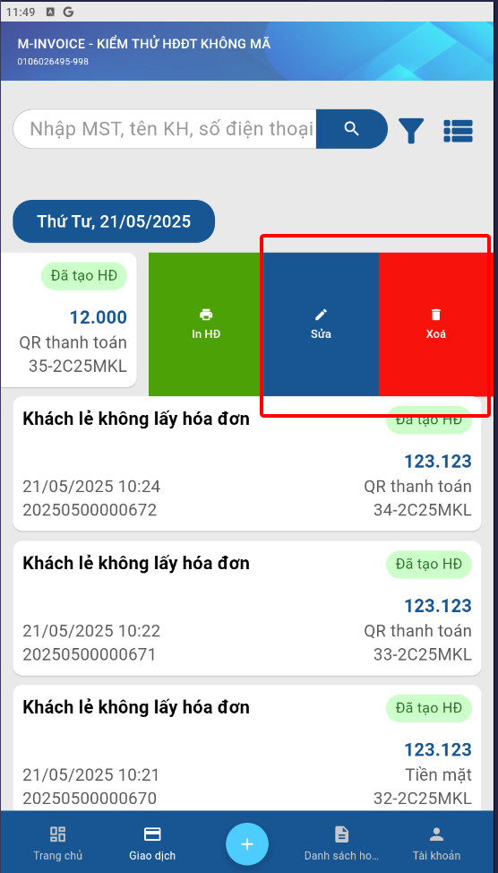

# **Sửa xoá giao dịch**

Dưới đây là những hướng dẫn thao tác cơ bản trên phần mềm bán hàng M-invoice vô cùng mạch lạc và dễ hiểu.

## **Hướng dẫn sửa xóa giao dịch**

???+ Note "Ghi chú"

    Khi lập giao dịch không gặp ít trường hợp cần xóa hoặc chỉnh sửa, sau đây sẽ là hướng dẫn

**Thao tác cài đặt và thực hiện như sau**

### **Bước 1: Truy cập Giao dịch**

{: style="height:650px"}

### **Bước 2: Vuốt sang phải để sửa xóa**

{: style="height:650px"}

???+ failure "Ghi chú"

    Chỉ sửa xóa được giao dịch trong trường hợp sau:

    1. Giao dịch chưa được tạo hóa đơn
    2. Hóa đơn chưa ký và là số hóa đơn lớn nhất

???+ info "Xin chân thành cảm ơn quý khách hàng đã tin dùng sản phẩm của M-Invoice"

    Có bất kỳ vướng mắc nào trong quá trình sử dụng hãy liên hệ với M-Invoice tại mục Hỗ trợ kỹ thuật góc phải bên dưới màn hình hoặc gọi tổng đài kỹ thuật của M-Invoice (1900.955.557 Nhánh 1)

Last updated on <strong>Jun 5, 2025</strong> by <strong>nhatth</strong>

