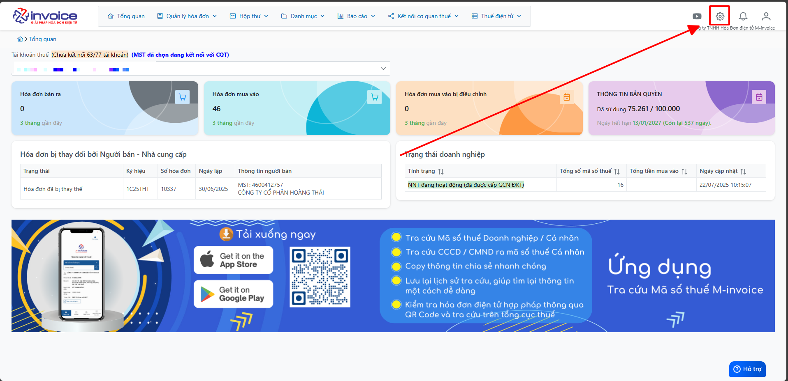
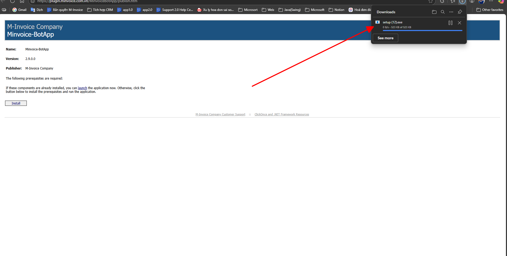
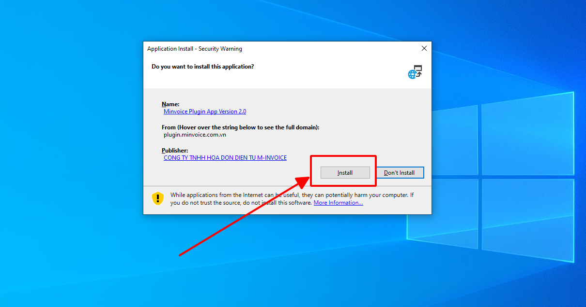
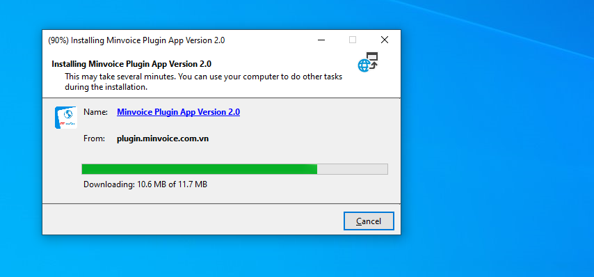
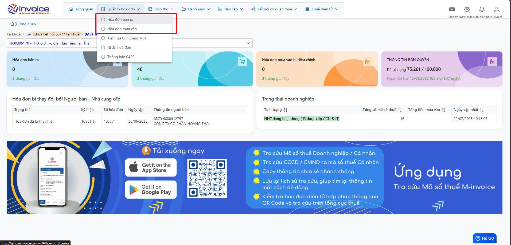
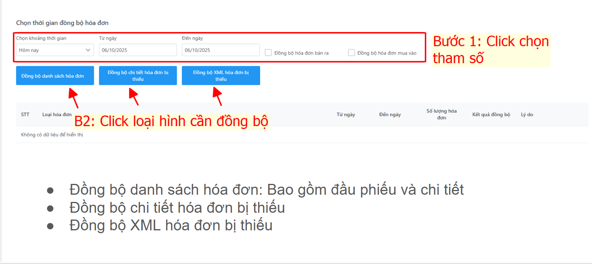
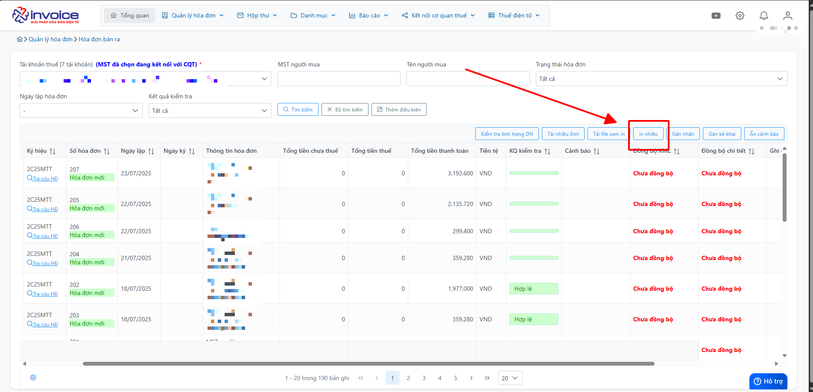
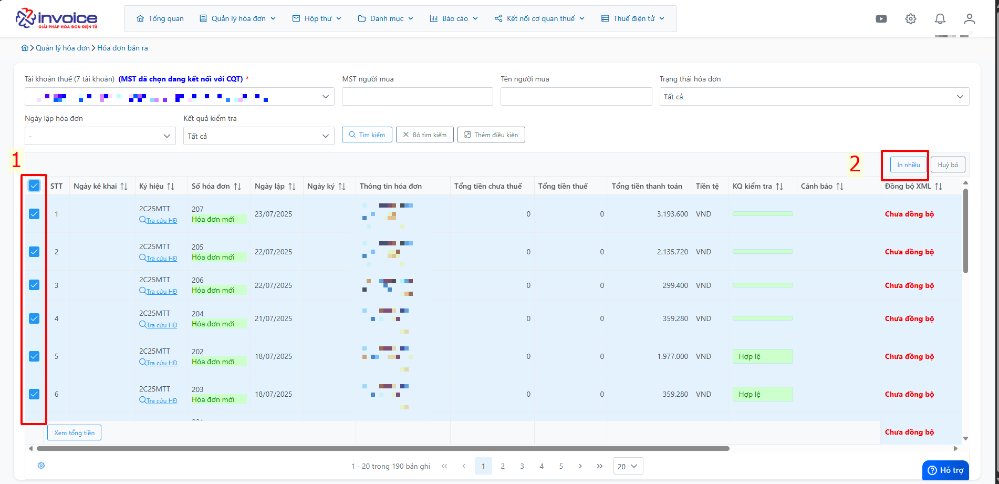

# **Đồng bộ chi tiết hóa đơn và xml hóa đơn**

## **Hướng dẫn Đồng bộ chi tiết hóa đơn và xml hóa đơn**

???+ Note "Nội dung"

    **📝 Lưu ý quan trọng trước khi thực hiện đồng bộ chi tiết hóa đơn**

    > **⚠️ Lưu ý:**
    > Hệ thống hiện đang hỗ trợ **tự động đồng bộ dữ liệu hóa đơn** từ trang Thuế.
    > Tuy nhiên, do một số **hạn chế trong quá trình tích hợp và truyền tải dữ liệu**, đôi khi phần **chi tiết hóa đơn** *(gồm các dòng hàng hóa, dịch vụ)* có thể **bị thiếu hoặc không đầy đủ**.

    ---

    **🎯 Ảnh hưởng khi thiếu chi tiết hóa đơn:**

    - Gây **sai lệch dữ liệu** khi đối soát với chứng từ gốc.

    - Ảnh hưởng đến việc **in hóa đơn đầy đủ thông tin**.

    - Dẫn đến **báo cáo không chính xác** nếu dữ liệu thiếu sót.

    ---

    **✅ Giải pháp đề xuất:**

    Chúng tôi đã cung cấp tính năng **đồng bộ chi tiết hóa đơn thủ công**, giúp người dùng:

    - Chủ động kiểm tra và cập nhật lại **thông tin chi tiết** của từng hóa đơn.

    - Đảm bảo tính **chính xác và đầy đủ** cho toàn bộ dữ liệu hóa đơn trong hệ thống.

    ---

    📘 **Vui lòng xem hướng dẫn chi tiết bên dưới** để thực hiện đúng quy trình đồng bộ.

??? Abstract "Hướng dẫn tải plugin - Bấm vào đây để xem nếu anh chị chưa cài plugin"

    Bước 1: Truy cập phần mềm bấm hình cài đặt để tải file plugin

    

    Bước 2: Chọn Install

    

    **Kích đúp vào file vừa tải về**

    

    Bước 3: Chờ quá trình tải xuống thành công

    

    

#### Bước 1: Truy cập phần HOÁ ĐƠN ĐẦU VÀO hoặc HÓA ĐƠN BÁN RA theo yêu cầu của DN

#### Bước 2: Kéo sang phải kiểm tra các cột Đồng bộ XML và Đồng bộ chi tiết để kiểm tra trạng thái đã đồng bộ hay chưa

Nếu là <strong>Chưa đồng bộ</strong> – Anh/chị vui lòng thực hiện các bước sau đây để đồng bộ chi tiết.

#### Bước 3: Bấm in nhiều chọn các hóa đơn chưa đồng bộ -> rồi bấm in nhiều

**Chờ quá trình được đồng bộ**

!!! info "Xin chân thành cảm ơn Quý khách hàng đã tin dùng sản phẩm của M-Invoice"

    Có bất kỳ vướng mắc nào trong quá trình sử dụng hãy liên hệ với M-Invoice tại mục Hỗ trợ kỹ thuật góc phải bên dưới màn hình hoặc gọi tổng đài kỹ thuật của M-Invoice (1900.955.557 Nhánh 1)

Last updated on <strong>Jun 27, 2025</strong> by <strong>NHATTH</strong>

