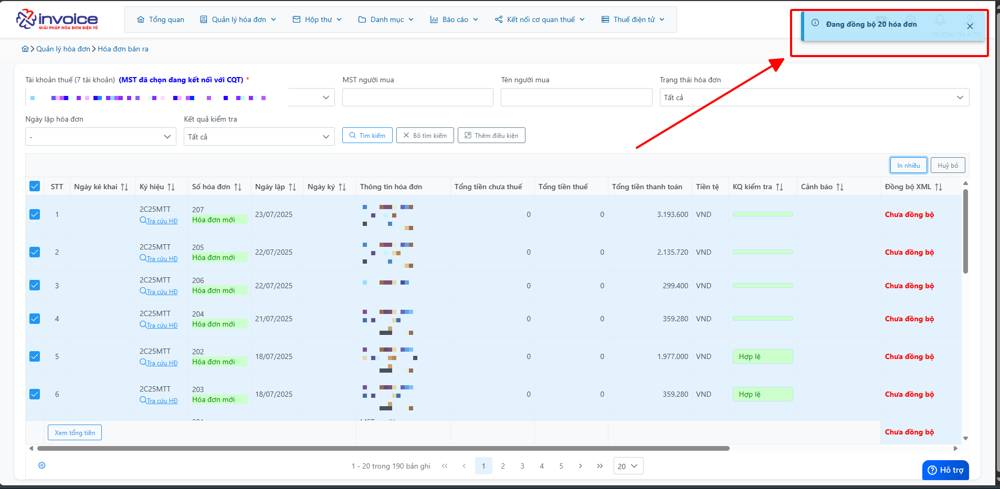

# **Chức năng Đồng bộ ngay mSMI**

## **Hướng dẫn sử dụng chức năng Đồng bộ ngay mSMI**

???+ Note "Mục đích"

    - Giúp khách hàng chủ động lấy Danh sách hóa đơn trong 1 khoảng thời gian,

    - Giúp lấy Đầu phiếu, Chi tiết hóa đơn bị thiếu mà chạy tự động chưa lấy về được

    📘 **Vui lòng xem hướng dẫn chi tiết bên dưới** để thực hiện đúng quy trình đồng bộ.

??? Abstract "Hướng dẫn tải plugin - Bấm vào đây để xem nếu anh chị chưa cài plugin"

    Bước 1: Truy cập phần mềm bấm hình cài đặt để tải file plugin

    

    Bước 2: Chọn Install

    

    **Kích đúp vào file vừa tải về**

    

    Bước 3: Chờ quá trình tải xuống thành công

    

    

## **Button Chức năng**

#### Bước 1: Giao diện chức năng Đồng bộ ngay

- Đồng bộ danh sách hóa đơn: Bao gồm đầu phiếu và chi tiết

- Đồng bộ chi tiết hóa đơn bị thiếu

- Đồng bộ XML hóa đơn bị thiếu

#### Bước 2: Màn hình danh sách hóa đơn lấy được

#### Bước 3: Màn hình chi tiết hóa đơn lấy được

#### Bước 4: Màn hình danh sách XML lấy được

!!! info "Xin chân thành cảm ơn Quý khách hàng đã tin dùng sản phẩm của M-Invoice"

    Có bất kỳ vướng mắc nào trong quá trình sử dụng hãy liên hệ với M-Invoice tại mục Hỗ trợ kỹ thuật góc phải bên dưới màn hình hoặc gọi tổng đài kỹ thuật của M-Invoice (1900.955.557 Nhánh 1)

Last updated on <strong>Oct 09, 2025</strong> by <strong>NHATTH</strong>

