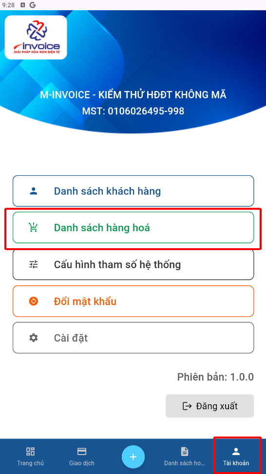
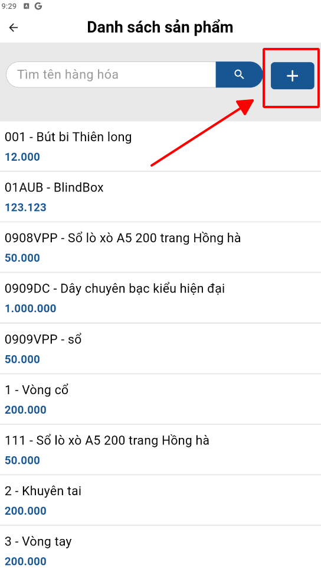
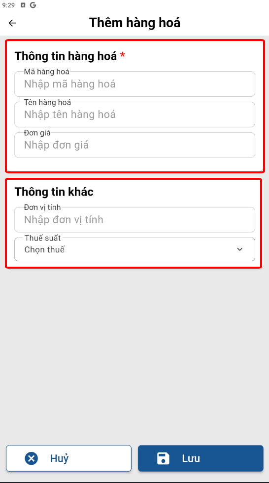
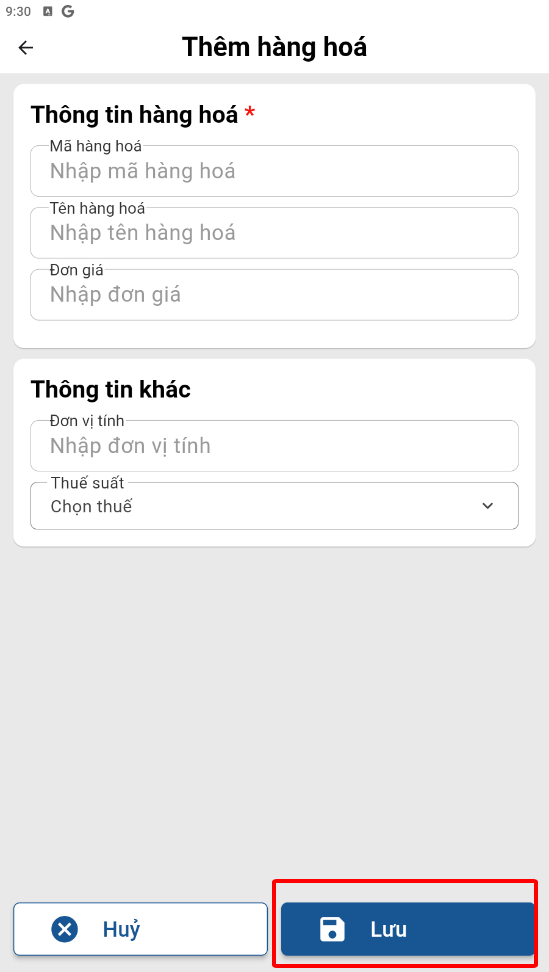

# **Thêm hàng hóa**

Dưới đây là những hướng dẫn thao tác cơ bản trên phần mềm bán hàng M-invoice vô cùng mạch lạc và dễ hiểu.

## **Hướng dẫn thêm hàng hóa**

???+ Note "Ghi chú"

    Thêm hàng hóa vào phần mềm để quản lý, xuất hóa đơn nhanh chóng.

**Thao tác cài đặt và thực hiện như sau**

### **Bước 1: Truy cập Tài khoản -> danh sách hàng hóa**

{: style="height:650px"}

### **Bước 2: Bấm dấu cộng để thêm hàng hoá**

{: style="height:500px"}
{: style="height:500px"}

1. Điền thông tin hàng hoá
2. Điền thông tin đơn vị tính và thuế suất nếu có

Mã hàng hóa là bắt buộc nhập để khi lập hóa đơn có thể truy xuất nhanh chóng

### **Bước 3 : Bấm **LƯU** để lưu khách hàng**

{: style="height:650px"}

???+ info "Xin chân thành cảm ơn quý khách hàng đã tin dùng sản phẩm của M-Invoice"

    Có bất kỳ vướng mắc nào trong quá trình sử dụng hãy liên hệ với M-Invoice tại mục Hỗ trợ kỹ thuật góc phải bên dưới màn hình hoặc gọi tổng đài kỹ thuật của M-Invoice (1900.955.557 Nhánh 1)

