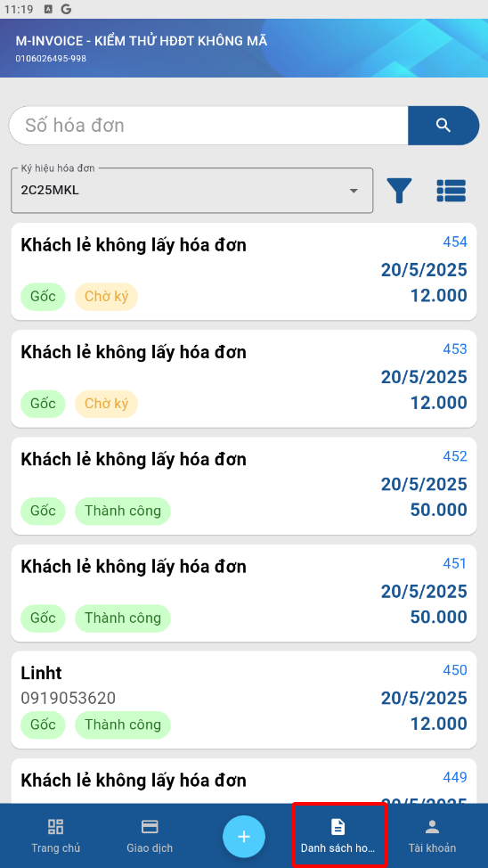
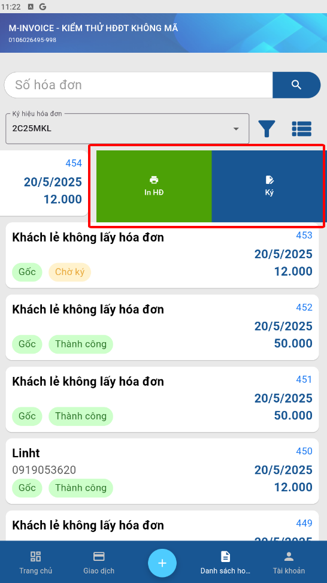
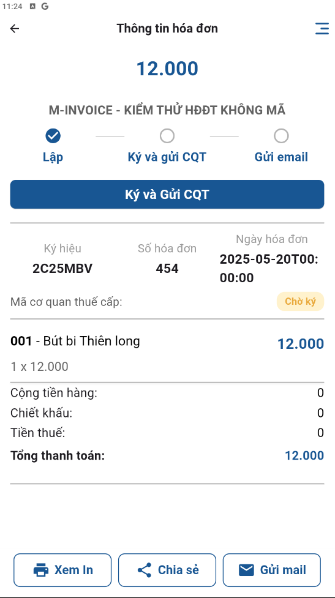
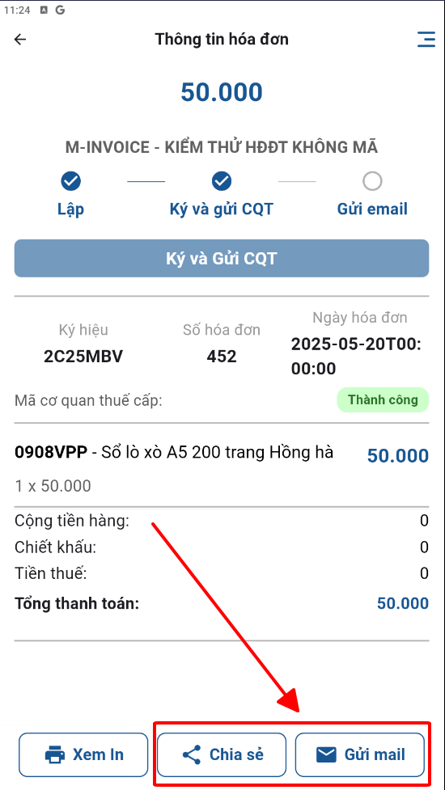

# **Danh sách hóa đơn ký gửi CQT**

Dưới đây là những hướng dẫn thao tác cơ bản trên phần mềm bán hàng M-invoice vô cùng mạch lạc và dễ hiểu.

## **Hướng dẫn danh sách hóa đơn ký gửi CQT**

???+ Note "Ghi chú"

    Quý khách có thể ký gửi CQT sau khi tạo hóa đơn, gửi mail hoặc chia sẻ zalo khi người mua yêu cầu

**Thao tác cài đặt và thực hiện như sau**

### **Bước 1: Truy cập danh sách hóa đơn**

{: style="height:650px"}

- Trên màn hình sẽ có trạng thái 'Chờ ký' và 'Thành công'

Anh/chị có thể tìm kiếm theo số hóa đơn ở thanh tìm kiếm

### **Bước 2: Ký gửi hóa đơn**

- Quý khách vuốt sang phải để chọn in hoặc ký hóa đơn

{: style="height:650px"}

- Hoặc bấm vào hoá đơn để xem trước rồi mới ký

{: style="height:650px"}

### **Bước 3: Gửi mail và Chia sẻ cho khách hàng**

{: style="height:650px"}

???+ danger "Ghi chú"

    Anh/Chị có thể kiểm tra và làm nghiệp vụ hóa đơn nếu có sai sót trên phần mềm hóa đơn theo đường link [Hóa đơn](https://hddt.minvoice.com.vn/#/login){:target="\_blank"}

???+ info "Xin chân thành cảm ơn quý khách hàng đã tin dùng sản phẩm của M-Invoice"

    Có bất kỳ vướng mắc nào trong quá trình sử dụng hãy liên hệ với M-Invoice tại mục Hỗ trợ kỹ thuật góc phải bên dưới màn hình hoặc gọi tổng đài kỹ thuật của M-Invoice (1900.955.557 Nhánh 1)

