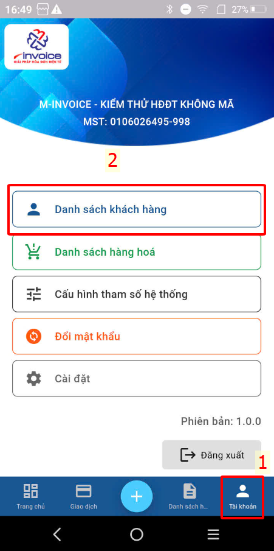
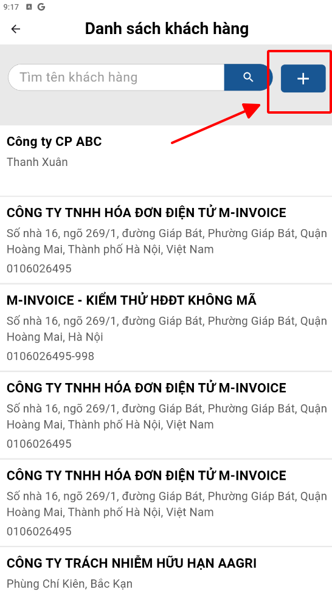
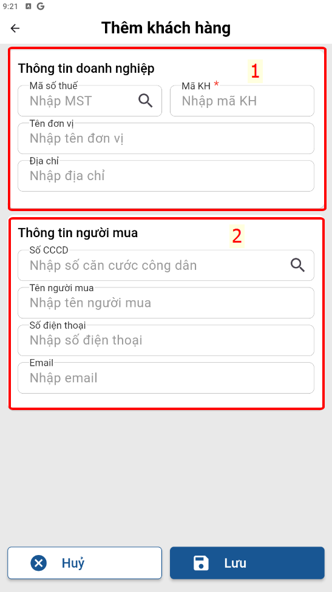
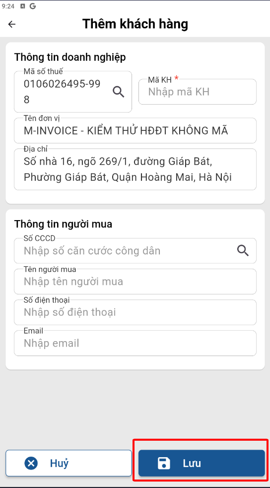

# **Thêm khách hàng**

Dưới đây là những hướng dẫn thao tác cơ bản trên phần mềm bán hàng M-invoice vô cùng mạch lạc và dễ hiểu.

## **Hướng dẫn thêm khách hàng**

???+ Note "Ghi chú"

    Thêm khách hàng vào phần mềm để quản lý, xuất hóa đơn nhanh chóng.

**Thao tác cài đặt và thực hiện như sau**

### Bước 1: Truy cập Tài khoản -> danh sách khách hàng

{: style="height:650px"}

### Bước 2: Bấm dấu cộng để thêm khách hàng

{: style="height:500px"}
{: style="height:500px"}

1. Điền thông tin doanh nghiệp nếu khách hàng là doanh nghiệp
2. Điền thông tin người mua nếu khách hàng là cá nhân

Mã KH là bắt buộc nhập để khi lập sẽ tìm kiếm theo Mã KH (trường hơp là người mua anh chị nên điền mã KH là số điện thoại của khách để dễ truy xuất)

### Bước 3 : Bấm **LƯU** để lưu khách hàng

{: style="height:650px"}

???+ info "Xin chân thành cảm ơn quý khách hàng đã tin dùng sản phẩm của M-Invoice"

    Có bất kỳ vướng mắc nào trong quá trình sử dụng hãy liên hệ với M-Invoice tại mục Hỗ trợ kỹ thuật góc phải bên dưới màn hình hoặc gọi tổng đài kỹ thuật của M-Invoice (1900.955.557 Nhánh 1)

