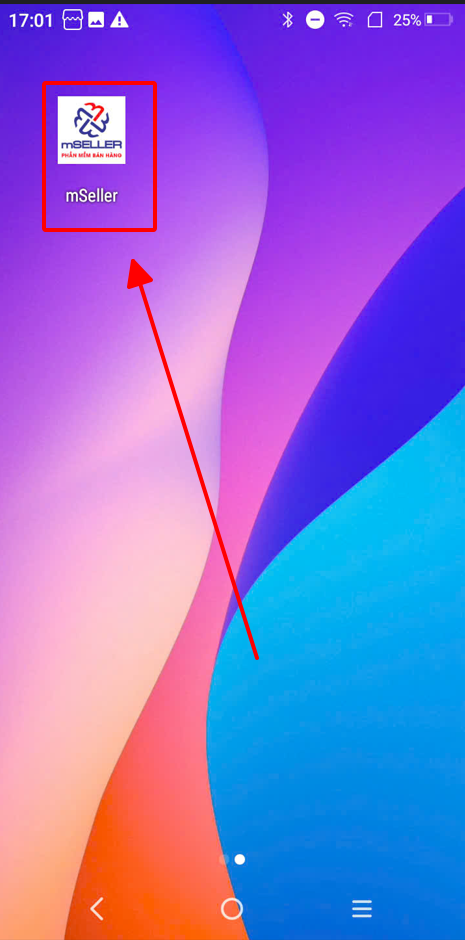
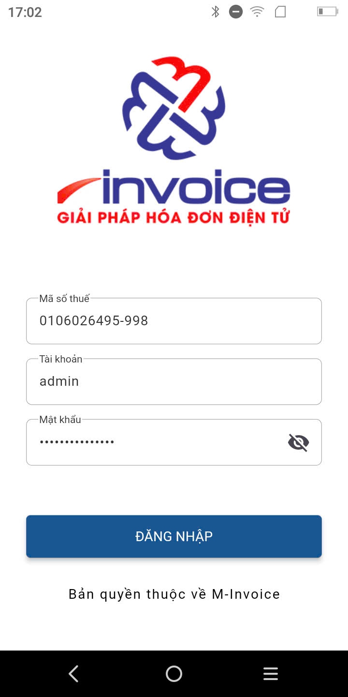
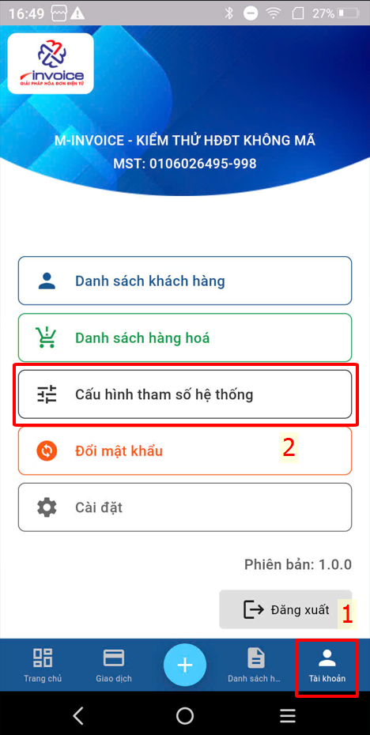
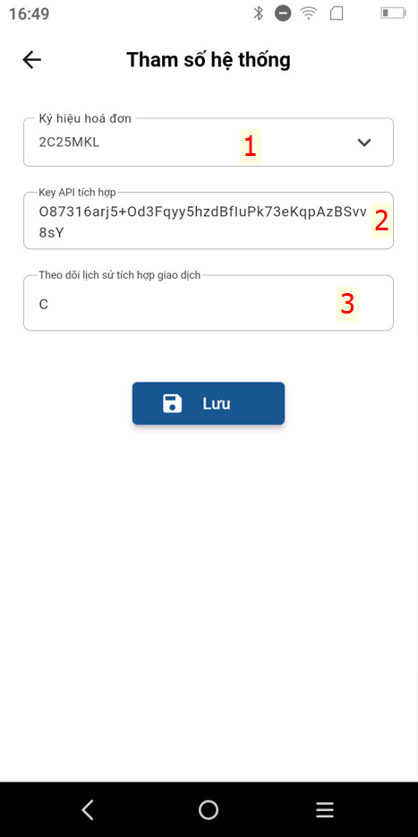
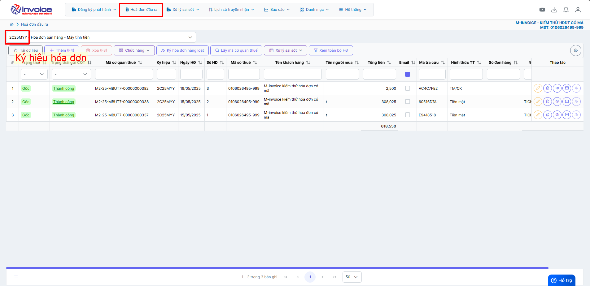
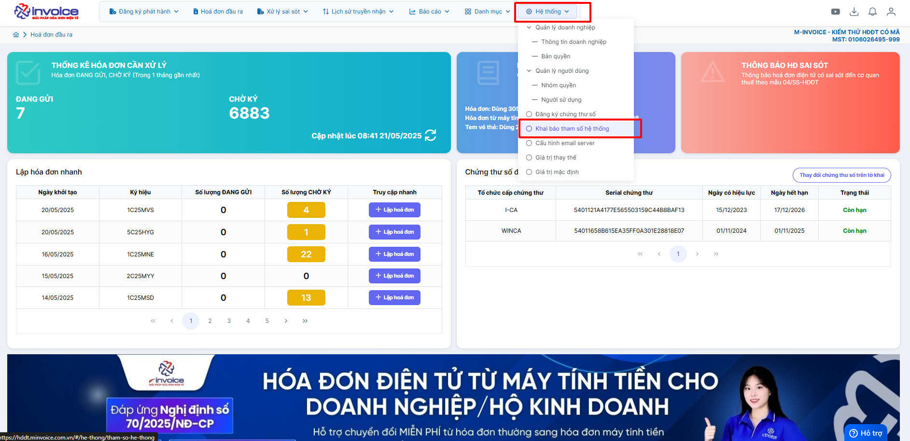
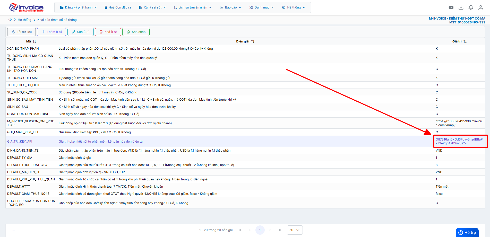
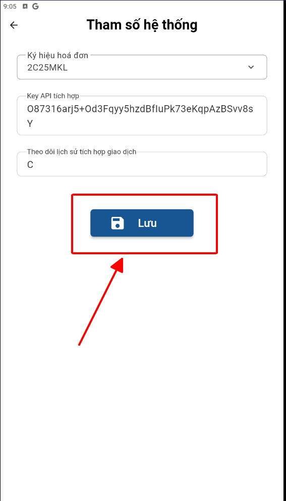

# **Đăng nhập và kết nối tới phần mềm hóa đơn**

Dưới đây là những hướng dẫn thao tác cơ bản trên phần mềm bán hàng M-invoice vô cùng mạch lạc và dễ hiểu.

## **Hướng dẫn đăng nhập và kết nối tới phần mềm hóa đơn**

???+ Note "Ghi chú"

    Để kết nối tới phần mềm hóa đơn để ký gửi lên thuế quý khách cần có tài khoản đăng nhập phần mềm hóa đơn truy cập vào link [Hóa đơn](https://hddt.minvoice.com.vn/#/login){:target="\_blank"}

    Trường hợp chưa có hay liên hệ tới [M-invoice](https://www.minvoice.vn/){:target="\_blank"}

**Thao tác cài đặt và thực hiện như sau**

### **Bước 1: Mở app mSeller trên máy pos**

Tìm đến phần mềm theo hình ảnh sau

{: style="height:650px"}

### **Bước 2: Điền thông tin đăng nhập**

Điền mã số thuế và tài khoản mật khẩu đã được cung cấp

{: style="height:650px"}

### **Bước 3 : Truy cập Tài khoản -> Cấu hình tham số hệ thống**

{: style="height:650px"}

### **Bước 4 : Điền thông tin cấu hình**

???+ Danger "Lưu ý"

    Thông tin ký hiệu hóa đơn được cấu hình trên web trước. App chọn giữa các ký hiệu có từ trên web

{: style="height:650px"}

**Cách để lấy thông tin cấu hình**

1. Truy cập trang hóa đơn theo link sau [Hóa đơn](https://hddt.minvoice.com.vn/#/login){:target="\_blank"}
2. Lấy ký hiệu hóa đơn
   
3. Lấy key API tích hợp
   
   

### **Bước 5 : Bấm **LƯU** để lưu cấu hình**

{: style="height:650px"}

???+ info "Xin chân thành cảm ơn quý khách hàng đã tin dùng sản phẩm của M-Invoice"

    Có bất kỳ vướng mắc nào trong quá trình sử dụng hãy liên hệ với M-Invoice tại mục Hỗ trợ kỹ thuật góc phải bên dưới màn hình hoặc gọi tổng đài kỹ thuật của M-Invoice (1900.955.557 Nhánh 1)

Last updated on <strong>Jun 5, 2025</strong> by <strong>nhatth</strong>

