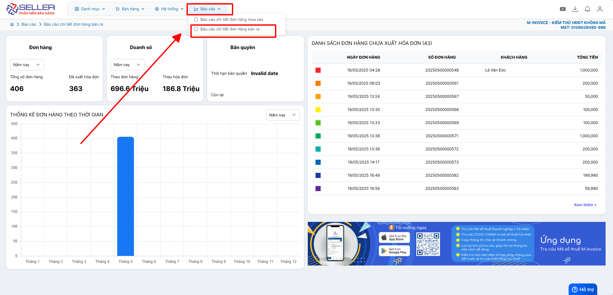
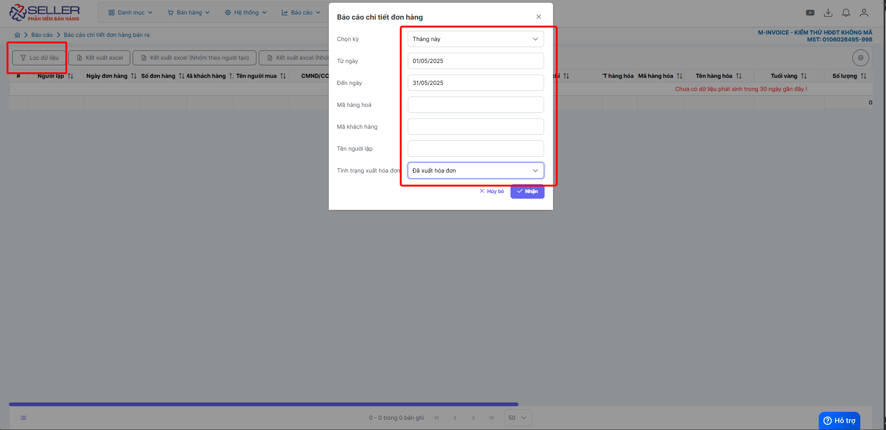
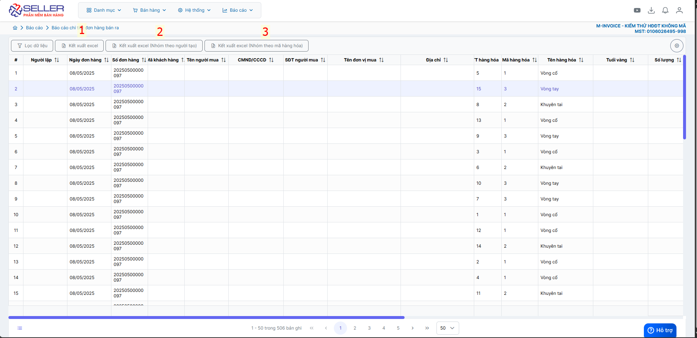
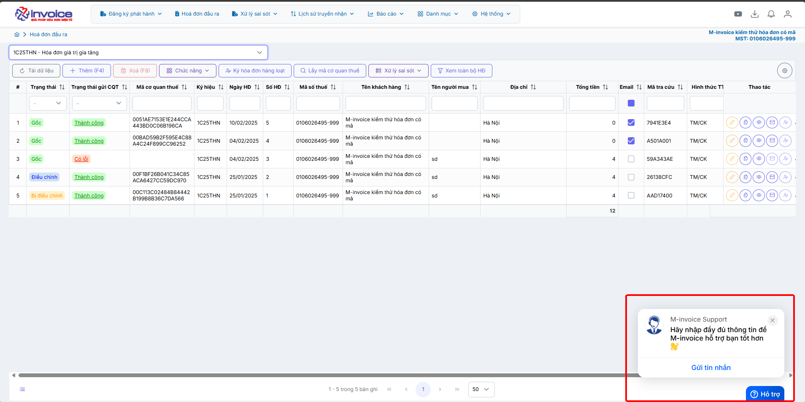

# **Báo cáo chi tiết đơn hàng bán ra**

Dưới đây là những hướng dẫn thao tác cơ bản trên phần mềm bán hàng M-invoice vô cùng mạch lạc và dễ hiểu.

## **Hướng dẫn quản báo cáo chi tiết đơn hàng bán ra**

???+ Note "Ghi chú"

    Kết xuất báo cáo chi tiết các mặt hàng chưa và đã tạo hoá đơn

**Thao tác cài đặt và thực hiện như sau**

### **Bước 1: Truy cập Báo cáo -> Báo cáo chi tiết đơn hàng bán ra**

### **Bước 2: Lọc báo cáo chi tiết hóa đơn**

Anh/chị có thể lọc theo các điều kiện dưới đây

### **Bước 3: Kết xuất excel**

???+ tip "Chú thích theo ảnh"

    1. Kết xuất file excel
    2. Kết xuất và nhóm vào theo người tạo
    3. Kết xuất và nhóm theo mặt hàng

???+ info "Xin chân thành cảm ơn quý khách hàng đã tin dùng sản phẩm của M-Invoice"

    Có bất kỳ vướng mắc nào trong quá trình sử dụng hãy liên hệ với M-Invoice tại mục Hỗ trợ kỹ thuật góc phải bên dưới màn hình hoặc gọi tổng đài kỹ thuật của M-Invoice (1900.955.557 Nhánh 1)

Last updated on <strong>Jun 5, 2025</strong> by <strong>nhatth</strong>

