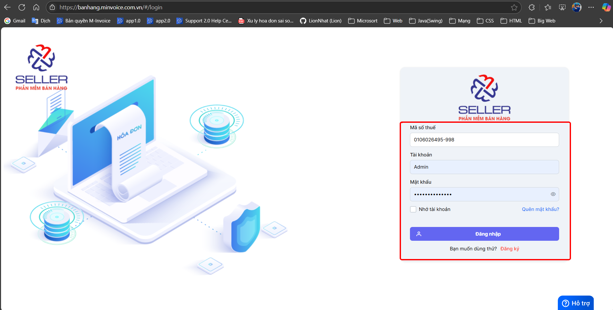
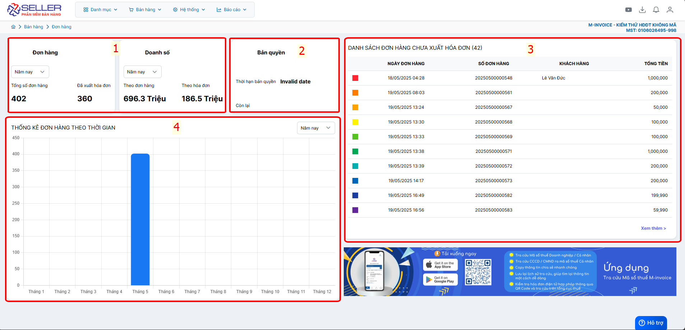

# **Đăng nhập và trang chủ**

Dưới đây là những hướng dẫn thao tác cơ bản trên phần mềm bán hàng M-invoice vô cùng mạch lạc và dễ hiểu.

## **Hướng dẫn đăng nhập và màn hình trang chủ**

???+ Note "Ghi chú"

    Sử dụng cho trường hợp khách hàng muốn sử dụng máy tính để tạo đơn hàng và in bill hóa đơn nhanh chóng

    Trường hợp chưa có tài khoản đăng nhập hay liên hệ tới [M-invoice](https://www.minvoice.vn/){:target="\_blank"}

**Thao tác cài đặt và thực hiện như sau**

### **Bước 1: Truy cập đường link sau để đăng nhập**

[Phần mềm bán hàng](https://banhang.minvoice.com.vn/#/login){:target="\_blank"}

### **Bước 2: Màn hình trang chủ (Dashboard)**

???+ tip "Chú thích theo ảnh"

      1. Tổng số đơn hàng chưa xuất và đã xuất, tổng doanh số theo đơn hàng và theo hóa đơn (lọc theo các mốc thời gian)
      2. Bản quyền khách hàng đã mua
      3. Danh sách đơn hàng chưaưa xuất hóa đơn
      4. Biểu đồ thống kê đơn hàng theo thời gian

???+ info "Xin chân thành cảm ơn quý khách hàng đã tin dùng sản phẩm của M-Invoice"

    Có bất kỳ vướng mắc nào trong quá trình sử dụng hãy liên hệ với M-Invoice tại mục Hỗ trợ kỹ thuật góc phải bên dưới màn hình hoặc gọi tổng đài kỹ thuật của M-Invoice (1900.955.557 Nhánh 1)

Last updated on <strong>Jun 5, 2025</strong> by <strong>nhatth</strong>

