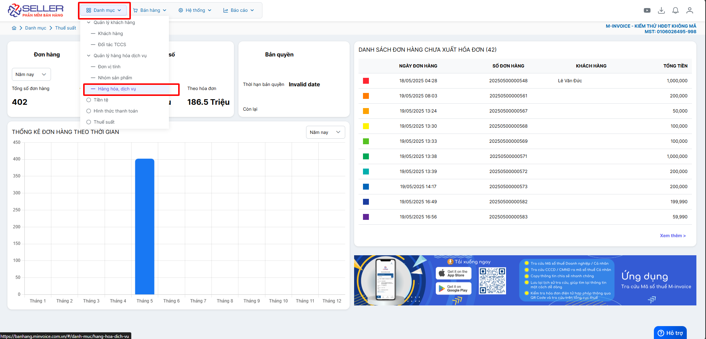
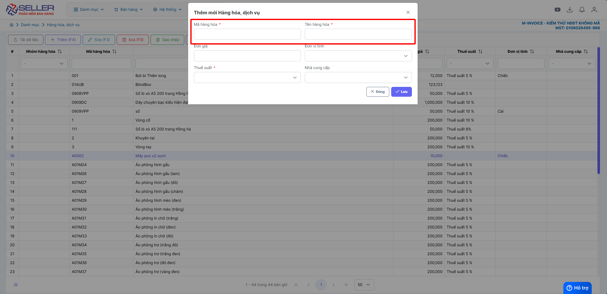
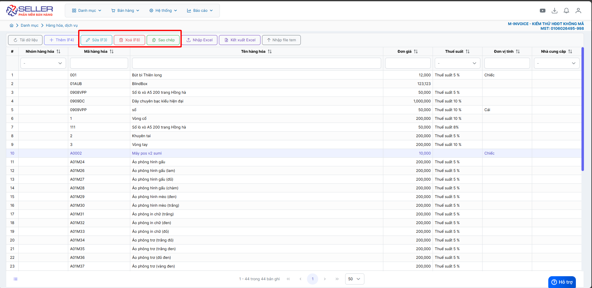

# **Danh mục hàng hóa**

Dưới đây là những hướng dẫn thao tác cơ bản trên phần mềm bán hàng M-invoice vô cùng mạch lạc và dễ hiểu.

## **Hướng dẫn thêm hàng hóa**

???+ Note "Ghi chú"

    - Thêm hàng hóa vào phần mềm để quản lý, xuất hóa đơn nhanh chóng.

    - Thông tin khách hàng đồng bộ với máy POS, trường hợp muốn thêm có thể thêm bằng máy tính sẽ nhanh chóng hơn

**Thao tác cài đặt và thực hiện như sau**

### **Bước 1: Truy cập Danh mục -> hàng hóa**

### **Bước 2: Thêm sửa xóa hàng hoá**

**Thêm hàng hoá**

**Sửa xóa thông tin hàng hoá**

### **Bước 3 : Nhập hàng hoá từ excel**

**Anh chị có thể kết xuất hàng hoá đã nhập ra excel nếu có nhu cầu**

???+ info "Xin chân thành cảm ơn quý khách hàng đã tin dùng sản phẩm của M-Invoice"

    Có bất kỳ vướng mắc nào trong quá trình sử dụng hãy liên hệ với M-Invoice tại mục Hỗ trợ kỹ thuật góc phải bên dưới màn hình hoặc gọi tổng đài kỹ thuật của M-Invoice (1900.955.557 Nhánh 1)

Last updated on <strong>Jun 5, 2025</strong> by <strong>nhatth</strong>

