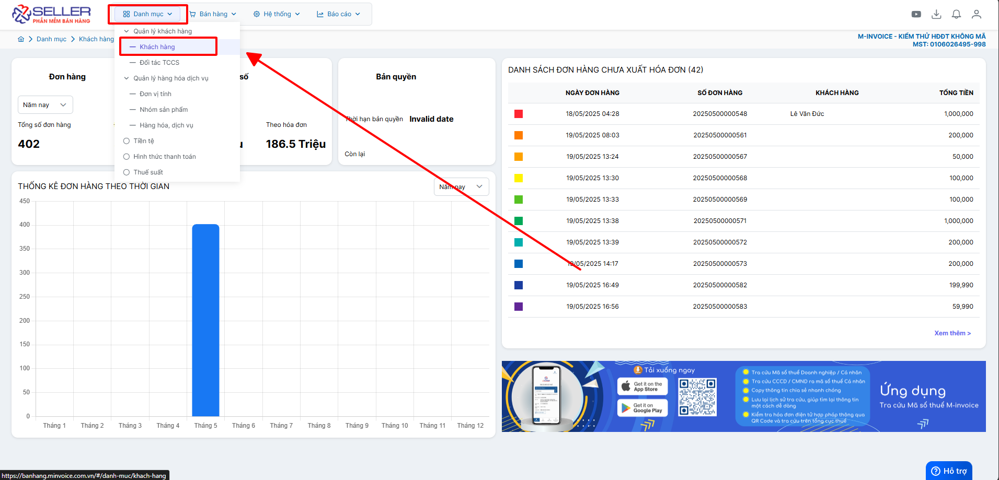
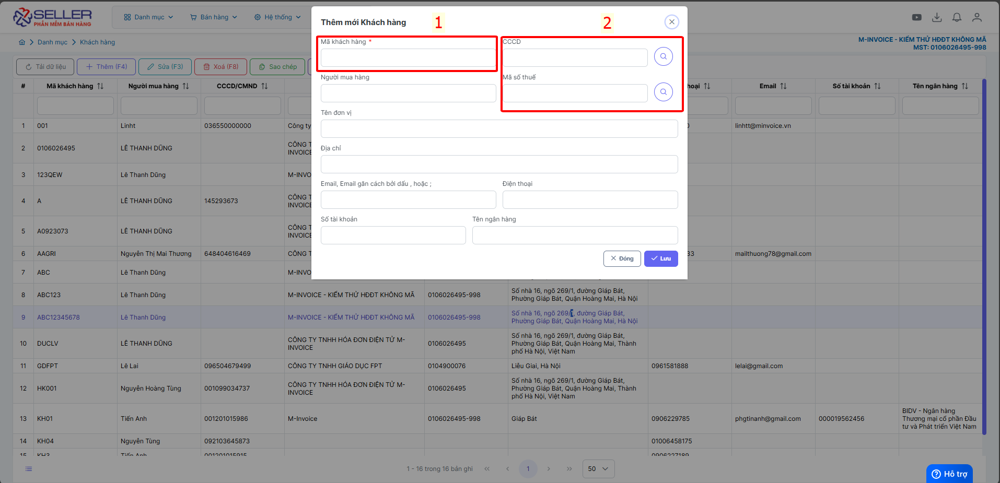
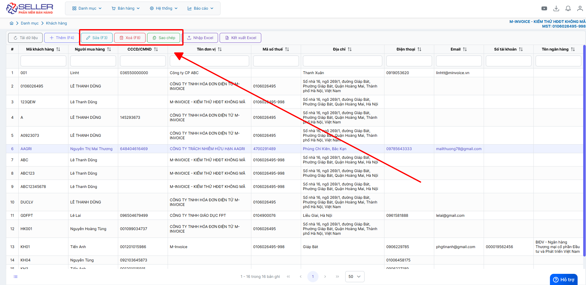

# **Danh mục khách hàng**

Dưới đây là những hướng dẫn thao tác cơ bản trên phần mềm bán hàng M-invoice vô cùng mạch lạc và dễ hiểu.

## **Hướng dẫn thêm khách hàng**

???+ Note "Ghi chú"

    - Thêm khách hàng vào phần mềm để quản lý, xuất hóa đơn nhanh chóng.

    - Thông tin khách hàng đồng bộ với máy POS, trường hợp muốn thêm có thể thêm bằng máy tính sẽ nhanh chóng hơn

**Thao tác cài đặt và thực hiện như sau**

### **Bước 1: Truy cập Danh mục -> khách hàng**

### **Bước 2: Thêm sửa xóa khách hàng**

**Thêm khách hàng**

???+ tip "Chú thích"

    1. Điền mã KH để dễ dàng truy xuất khi xuất đơn hàng

    2. Quý khách có thể tìm kiếm theo CCCD nếu là người mua cá nhân, và MÃ SỐ THUẾ nếu là doanh nghiệp

Mã KH là bắt buộc nhập để khi lập sẽ tìm kiếm theo Mã KH (trường hơp là người mua anh chị nên điền mã KH là số điện thoại của khách để dễ truy xuất)

**Sửa xóa thông tin khách hàng**

### **Bước 3 : Nhập khách hàng từ excel**

**Anh chị có thể kết xuất khách hàng đã nhập ra excel nếu có nhu cầu**

???+ info "Xin chân thành cảm ơn quý khách hàng đã tin dùng sản phẩm của M-Invoice"

    Có bất kỳ vướng mắc nào trong quá trình sử dụng hãy liên hệ với M-Invoice tại mục Hỗ trợ kỹ thuật góc phải bên dưới màn hình hoặc gọi tổng đài kỹ thuật của M-Invoice (1900.955.557 Nhánh 1)

Last updated on <strong>Jun 5, 2025</strong> by <strong>nhatth</strong>

