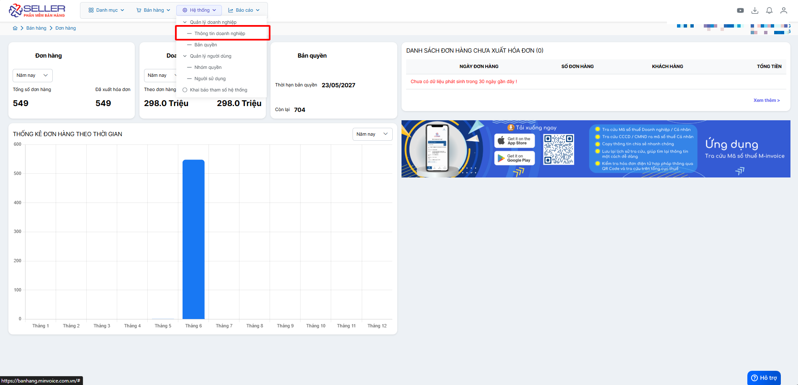
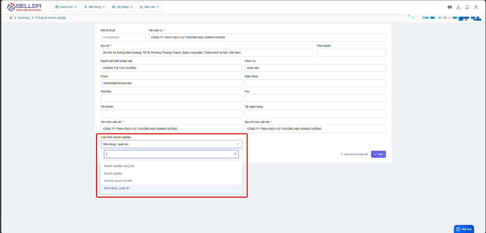

# **Loại hình doanh nghiệp**

Dưới đây là những hướng dẫn thao tác cơ bản trên phần mềm bán hàng M-invoice vô cùng mạch lạc và dễ hiểu.

## **Chọn loại hình doanh nghiệp trong - thông tin doanh nnghiệp**

???+ Note "Ghi chú"

    - Người dùng có thể chọn hình thức phù hợp với doanh nghiệp của mình

???+ Danger "Lưu ý"

    Với loại doanh nghiệp hộ kinh doanh hoặc hộ bán vàng lưu ý chỉ chọn loại hóa đơn máy tính tiền (2C25...)

???+ info "Xin chân thành cảm ơn quý khách hàng đã tin dùng sản phẩm của M-Invoice"

    Có bất kỳ vướng mắc nào trong quá trình sử dụng hãy liên hệ với M-Invoice tại mục Hỗ trợ kỹ thuật góc phải bên dưới màn hình hoặc gọi tổng đài kỹ thuật của M-Invoice (1900.955.557 Nhánh 1)

Last updated on <strong>Jun 5, 2025</strong> by <strong>nhatth</strong>

