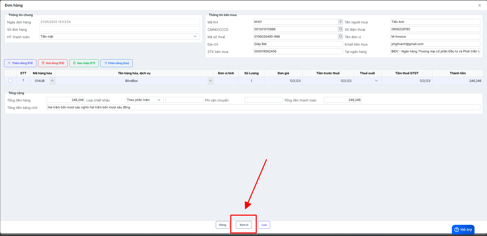

# **Quản lý đơn hàng - tạo hóa đơn**

Dưới đây là những hướng dẫn thao tác cơ bản trên phần mềm bán hàng M-invoice vô cùng mạch lạc và dễ hiểu.

## **Hướng dẫn quản lý đơn hàng - tạo hóa đơn**

???+ Note "Ghi chú"

    Tạo giao dịch và xuất hóa đơn ngay sau khi lập

**Thao tác cài đặt và thực hiện như sau**

### Bước 1: Truy cập mục ĐƠN HÀNG

### Bước 2: Tạo giao dịch

???+ tip "Chú thích theo ảnh"

      1. Chọn các hình thức thanh toán
         - Tiền mặt
         - QR thanh toán (khi khách hàng quét sẽ ra số tiền cần thanh toán mà không cần điền số tiền)
         - Ngân hàng (điền số tiền cần thanh toán)
      2. Chọn đến khách hàng nếu là doanh nghiệp hoặc người mua để lại thông tin (cách thêm khách hàng theo hướng dẫn sau [Danh sách khách hàng](danh-muc-khach-hang.md#attribute-lists){ data-preview })
      3. Điền thông tin hàng hóa, nếu đã thêm vào  [Danh sách hàng hóa](danh-muc-hang-hoa.md#attribute-lists){ data-preview }) thì điền mã hàng hóa hoặc tên đẻ truy xuất nhanh chóng
      4. Điền **chiết khấu** và **phí vận chuyển** nếu có

**Có thể xem in trước khi lưu**

### Bước 3: Tạo hóa đơn từ giao dịch

???+ tip "Chú thích theo ảnh"

    1. Nhấp vào giao dịch cần tạo hóa đơn
    2. Chọn tạo hóa đơn hoặc chọn tạo nhanh bằng chức năng số 3 trên ảnh

Phải là giao dịch có "trạng thái xuất hóa đơn" là "Chưa xuất" thì mới tạo được hóa đơn

### Bước 4: Các thao tác thường sử dụng

???+ tip "Chú thích theo ảnh"

    1. Chỉnh sửa hóa đơn và giao dịch (không áp dụng cho hóa đơn ký rồi)
    2. Sao chép hóa đơn hoặc giao dịch
    3. Xem in hóa đơn
    4. Tạo hóa đơn
    5. Cập nhật hóa đơn
    6. Xem lịch sử
    7. Ký gửi CQT
    8. In đơn hàng

???+ info "Xin chân thành cảm ơn quý khách hàng đã tin dùng sản phẩm của M-Invoice"

    Có bất kỳ vướng mắc nào trong quá trình sử dụng hãy liên hệ với M-Invoice tại mục Hỗ trợ kỹ thuật góc phải bên dưới màn hình hoặc gọi tổng đài kỹ thuật của M-Invoice (1900.955.557 Nhánh 1)

