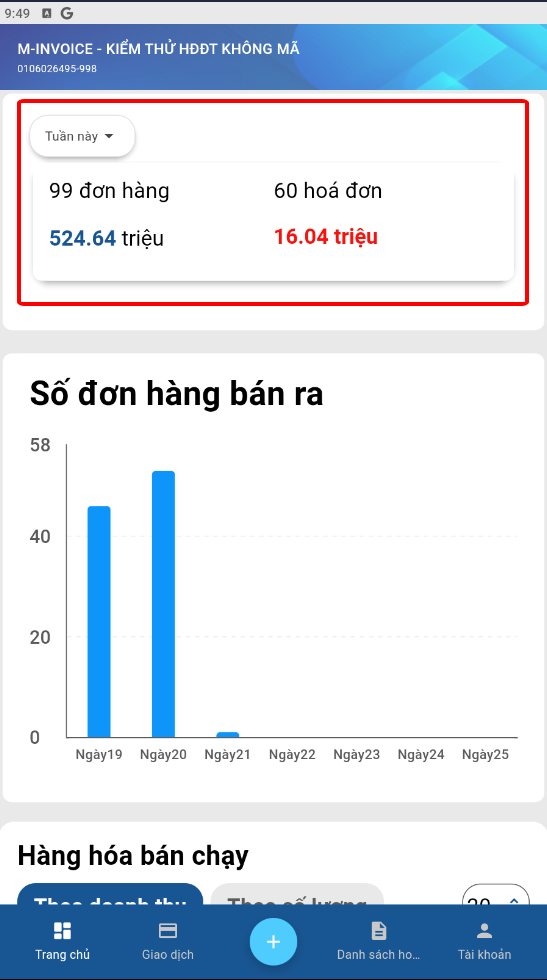
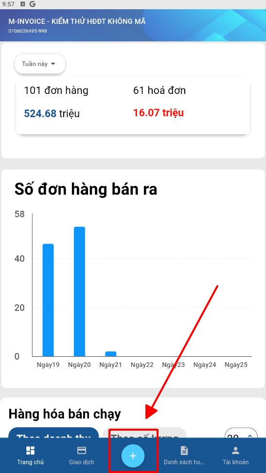
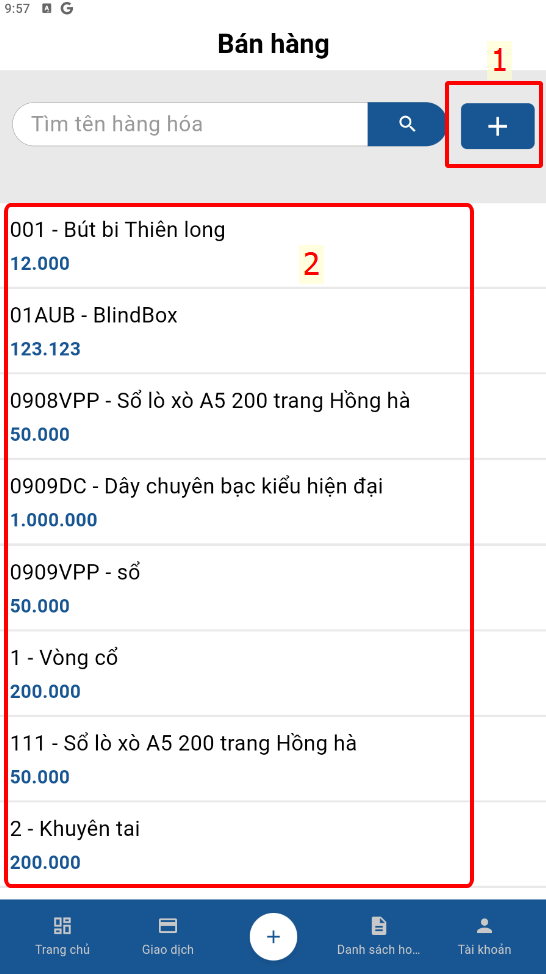
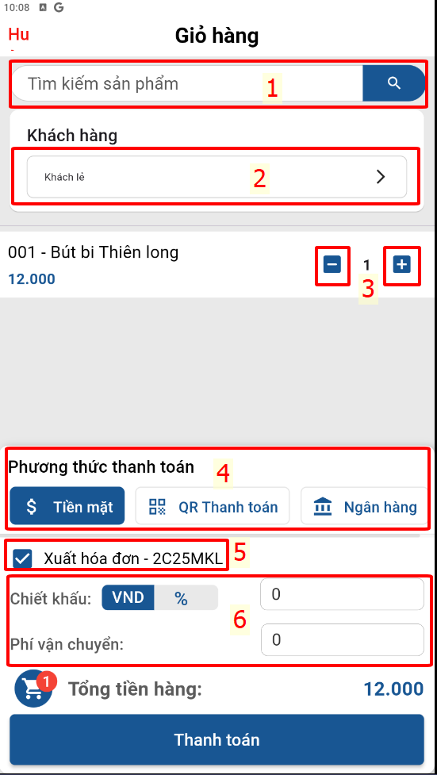
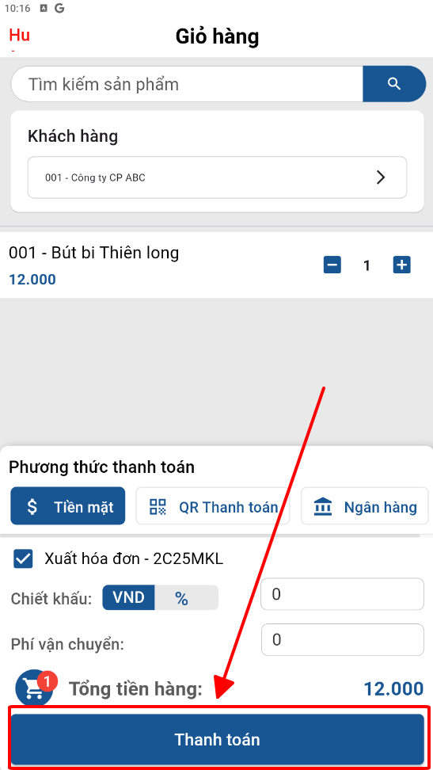
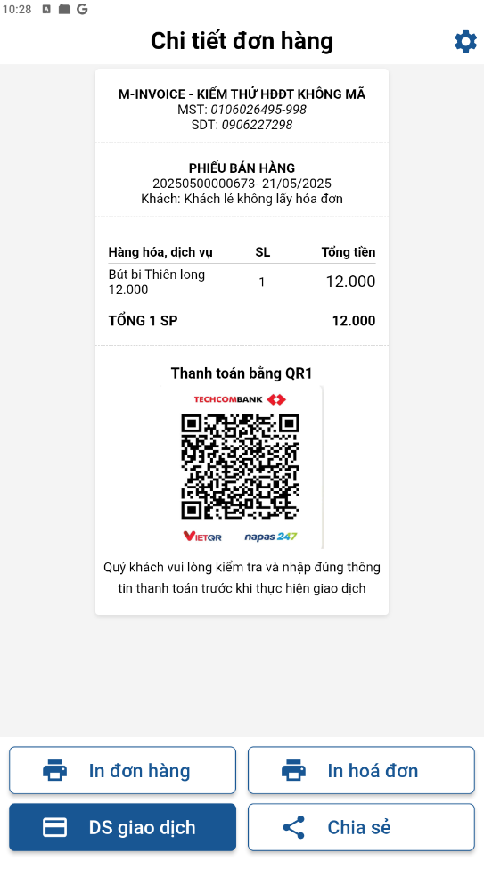
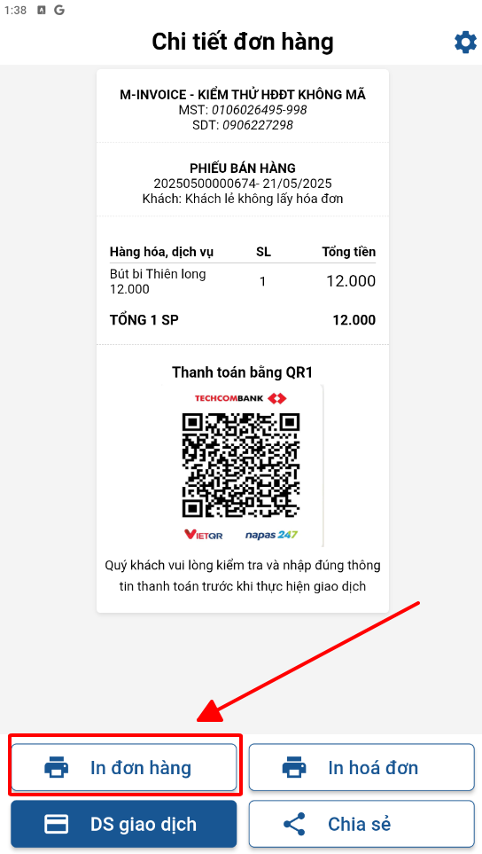
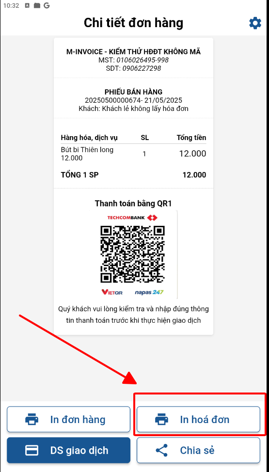
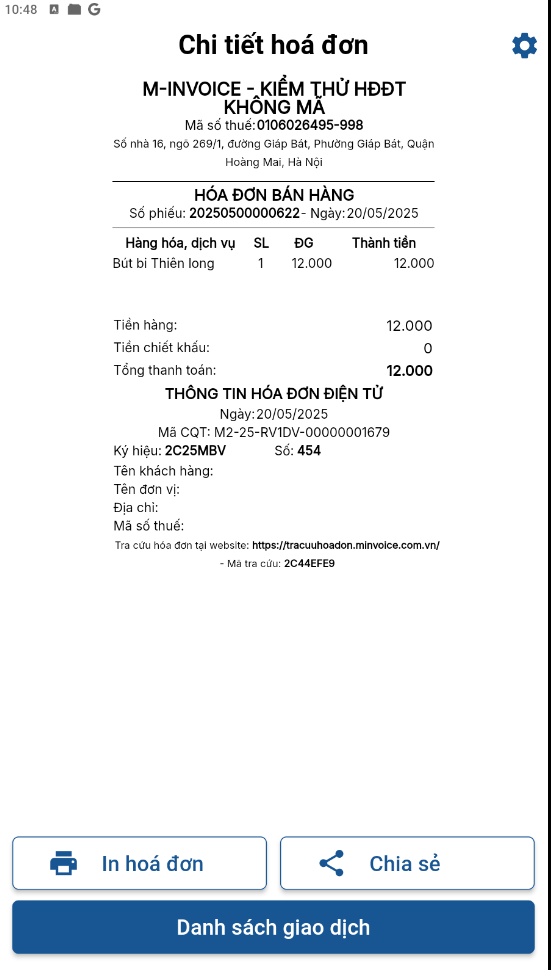

# **Thêm giao dịch và tạo hóa đơn**

Dưới đây là những hướng dẫn thao tác cơ bản trên phần mềm bán hàng M-invoice vô cùng mạch lạc và dễ hiểu.

## **Hướng dẫn thêm giao dịch và tạo hóa đơn**

???+ Note "Ghi chú"

    Tạo giao dịch và xuất hóa đơn ngay sau khi lập

**Thao tác cài đặt và thực hiện như sau**

### **Bước 1: Màn hàn hình Dashbroad ở Trang chủ**

{: style="height:650px"}

???+ Note "Ghi chú"

    Màn hình trang chủ bao gồm:

    + Tổng số đơn hàng đã lập, tổng số tiền đơn hàng (có thể lọc theo các dấu thời gian)
    + Tổng số hóa đơn đã tạo từ đơn hàng, tổng số tiền của hóa đơn
    + Biểu đồ số đơn hàng bán ra theo ngày
    + Hàng hóa bán chạy theo doanh thu hoặc số lượng

### **Bước 2: Tạo giao dịch**

{: style="height:500px"}
{: style="height:500px"}

1. Anh/chị bấm nút dấu cộng để điền thông tin hàng hóa nếu chưa thêm vào **danh sách hàng hóa**
2. Anh/chị chọn sẵn hàng hóa đã nhập từ [Danh sách hàng hóa](danh-sach-hang-hoa.md#attribute-lists){ data-preview }

{: style="height:650px"}

???+ tip "Chú thích theo ảnh"

      1. Thêm sản phẩm nếu khách hàng mua nhiều
      2. Chọn đến khách hàng nếu là doanh nghiệp hoặc người mua để lại thông tin (cách thêm khách hàng theo hướng dẫn sau [Danh sách khách hàng](danh-sach-khach-hang.md#attribute-lists){ data-preview })
      3. Thêm giảm số lượng hàng hóa
      4. Phương thức thanh toán:
         - Tiền mặt
         - QR thanh toán (khi khách hàng quét sẽ ra số tiền cần thanh toán mà không cần điền số tiền)
         - Ngân hàng (điền số tiền cần thanh toán)
      5. Tích nếu muốn xuất hóa đơn ở dạng chờ ký luôn
      6. Điền **chiết khấu** và **phí vận chuyển** nếu có

### **Bước 3: Bấm Thanh toán để ra phiếu đơn hàng**

{: style="height:500px"}
{: style="height:500px"}

Chọn in đơn hàng để ra in bill đơn hàng

Chọn in hóa đơn luôn sau khi khách hàng thanh toán

{: style="height:500px"}
{: style="height:500px"}

???+ info "Xin chân thành cảm ơn quý khách hàng đã tin dùng sản phẩm của M-Invoice"

    Có bất kỳ vướng mắc nào trong quá trình sử dụng hãy liên hệ với M-Invoice tại mục Hỗ trợ kỹ thuật góc phải bên dưới màn hình hoặc gọi tổng đài kỹ thuật của M-Invoice (1900.955.557 Nhánh 1)

Last updated on <strong>Jun 5, 2025</strong> by <strong>nhatth</strong>

