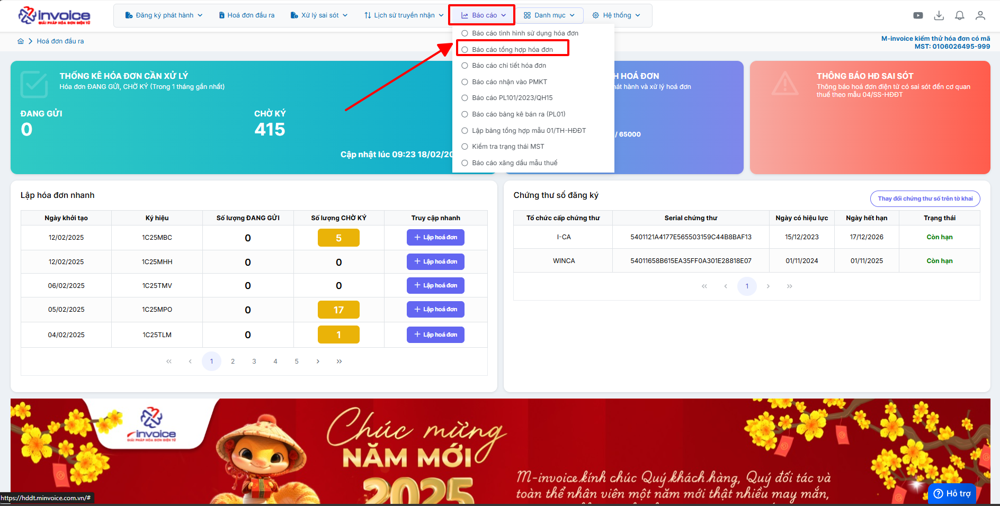
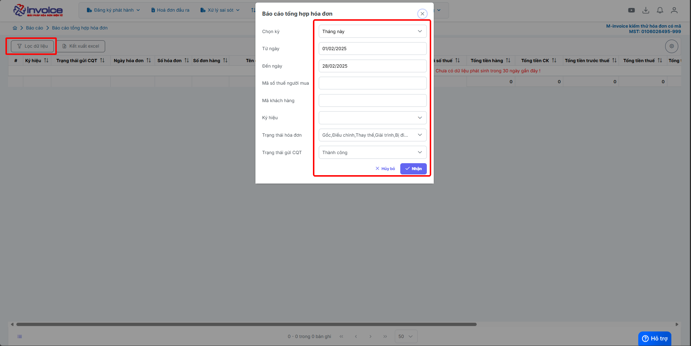

# **Báo cáo tổng hợp hóa đơn**

Dưới đây là những hướng dẫn thao tác cơ bản trên phần mềm hóa đơn điện tử M-Invoice ở phiên bản 2.0 vô cùng mạch lạc và dễ hiểu.

## **Hướng dẫn xem báo cáo tổng hợp hóa đơn**

### **Bước 1: Ở giao diện trang chủ chọn Báo cáo --> Báo cáo tổng hợp hóa đơn**

### **Bước 2: Chọn điều kiện lọc**

Nhấn nhận để hệ thống tải báo cáo theo điều kiện lọc

### **Bước 3 : Chọn tải file Excel để kết xuất báo cáo về**

???+ info "Xin chân thành cảm ơn quý khách hàng đã tin dùng sản phẩm của M-Invoice"

    Có bất kỳ vướng mắc nào trong quá trình sử dụng hãy liên hệ với M-Invoice tại mục Hỗ trợ kỹ thuật góc phải bên dưới màn hình hoặc gọi tổng đài kỹ thuật của M-Invoice (1900.955.557 Nhánh 1)

