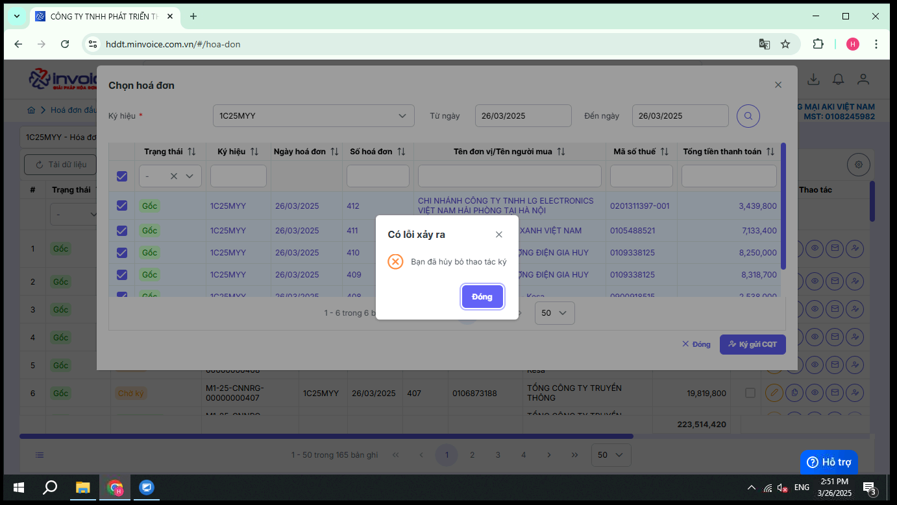
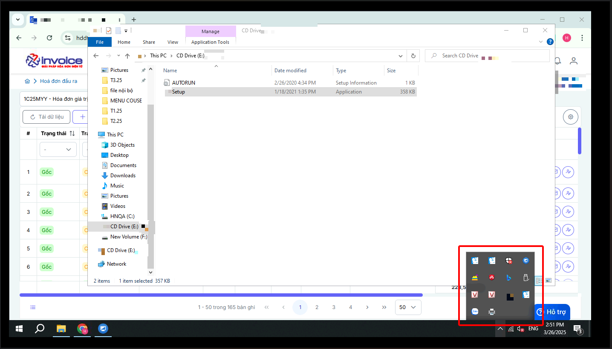
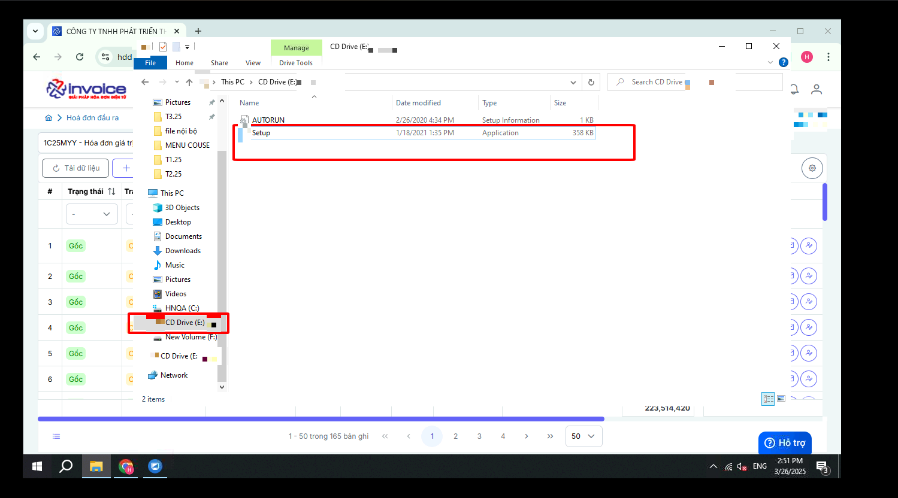
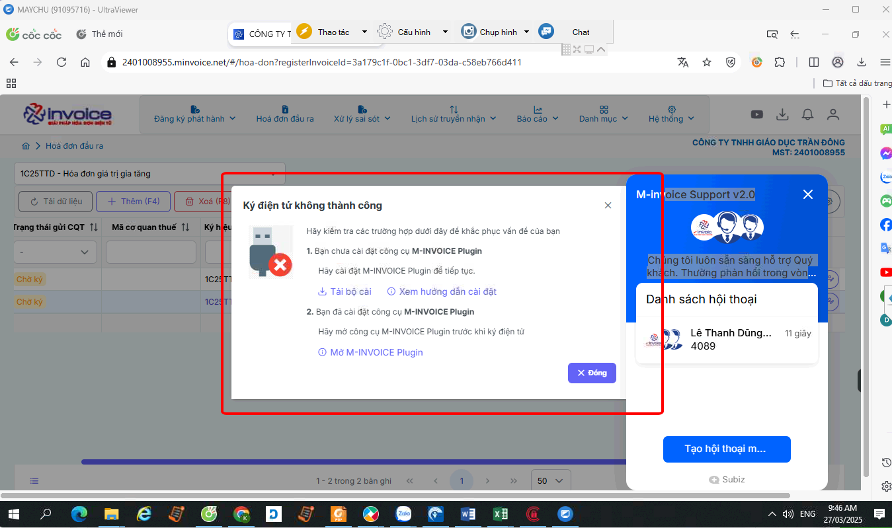
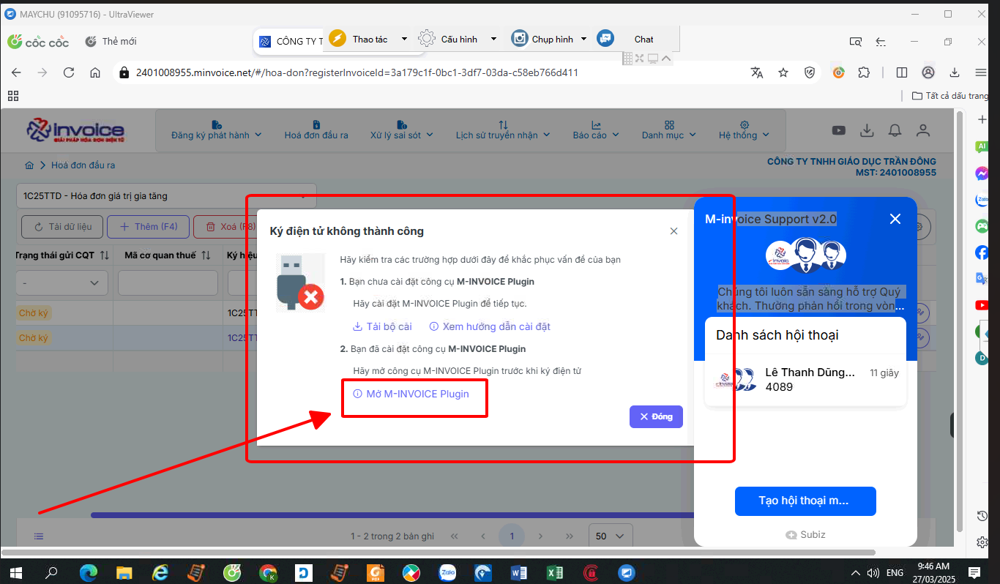
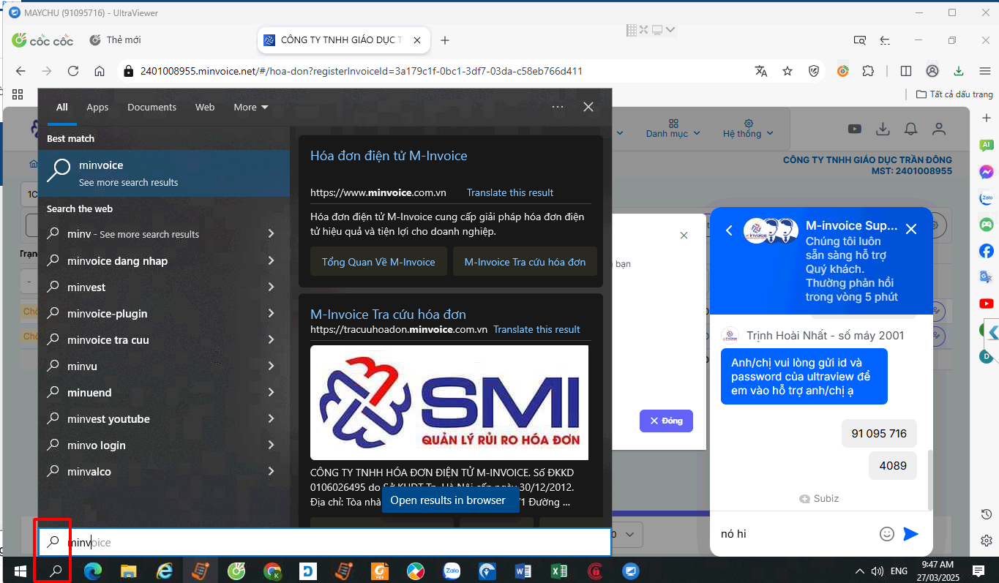

# **Các lỗi ký hoá đơn thường gặp**

Dưới đây là những hướng dẫn thao tác cơ bản trên phần mềm hóa đơn điện tử M-Invoice ở phiên bản 2.0 vô cùng mạch lạc và dễ hiểu.

## **Hướng dẫn sửa lỗi ký hoá đơn thường gặp**

???+ Note "Ghi chú"

    Trong quá trình sử dụng hóa đơn điện tử, người dùng có thể gặp những lỗi ký hoá đơn hãy bấm vào xem những hướng dẫn dưới đây để có thể sửa lỗi nhé.

??? Failure "Lỗi "Bạn đã huỷ bỏ thao tác ký""

    

    ???+ Warning "Ghi chú"

        Lỗi này thường xảy ra khi quý khách chưa cài phần mềm chữ ký số hãy kiểm tra theo cách dưới đây và cài đặt

    ### Bước 1: Kiểm tra xem phần mềm cks đã cài đặt trên máy mình chưa bằng cách sau

    

    **Nếu không thấy icon của cks hiện là chưa cài đặt**

    ### Bước 2: Cài đặt phần mềm cks

    

    **Bấm windows + E để vào Explorer bấm vào biểu tượng phần mềm cks -> click Setup để cài đặt**

    ???+ Warning "Lưu ý"

        Trường hợp nếu không có thì quý khách vui lòng rút USB ra và cắm lại hoặc có thể quý khách chưa cắm usb cks vào máy tính

??? Failure "Lỗi "Bạn chưa cài đặt công cụ plugin để ký hoá đơn""

    

    ???+ Warning "Ghi chú"

        Lỗi này thường xảy ra khi quý khách chưa cài plugin ký số

    ### Bước 1: Kiểm tra xem plugin ký số đã cài đặt trên máy mình chưa bằng cách sau

    

    **hoặc bằng cách sau**

    

    **Trường hợp nếu thấy chưa cài đặt thì có thể làm theo [Hướng dẫn cài đặt plugin](plugin.md#attribute-lists){ data-preview }**

???+ info "Xin chân thành cảm ơn quý khách hàng đã tin dùng sản phẩm của M-Invoice"

    Có bất kỳ vướng mắc nào trong quá trình sử dụng hãy liên hệ với M-Invoice tại mục Hỗ trợ kỹ thuật góc phải bên dưới màn hình hoặc gọi tổng đài kỹ thuật của M-Invoice (1900.955.557 Nhánh 1)

