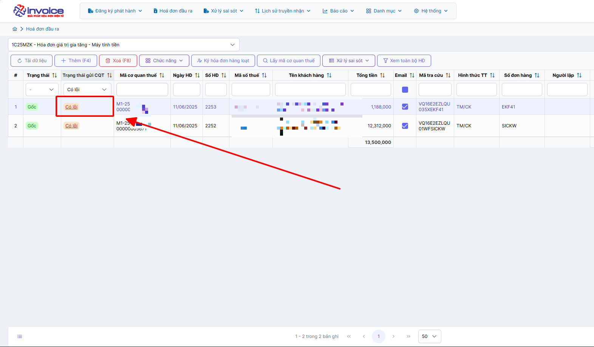

# **Lỗi kết nối không nhận được phản hồi từ CQT**

Dưới đây là những hướng dẫn thao tác cơ bản trên phần mềm hóa đơn điện tử M-Invoice ở phiên bản 2.0 vô cùng mạch lạc và dễ hiểu.

## **Hướng dẫn xử lý lỗi kết nối không nhận được phản hồi từ CQT**

Bấm vào chữ `có lỗi` ở hóa đơn => M100 - Lỗi kết nối, không nhận được phản hồi của CQT

???+ Danger "Mô tả lỗi"

    Thời điểm ký gửi CQT có vấn đề trong truyền nhận và bị treo rất nhiều hóa đơn đang gửi, M-invocie đã gửi đối soát các hóa đơn này tới CQT cho
    khách hàng, bên cạnh các hóa đơn được đối soát thành công thì cũng có các hóa đơn CQT đối soát không thành công và trả về thông điệp bị lỗi

    với mã M100 - Lỗi kết nối, không nhận được phản hồi của CQT

**Các bước khắc phục như sau**

### **Bước 1: Chọn hóa đơn có lỗi --> bấm vào chức năng sao chép hóa đơn để lập lại hóa đơn này**

### **Bước 2 : Bấm lưu hoặc lưu và ký**

Các hóa đơn có lỗi sẽ không tính doanh thu hay báo cáo nên không cần làm nghiệp vụ sai sót các hóa đơn này

Như vậy bạn đã xử lý thành công hóa đơn bị lỗi kết nối

???+ info "Xin chân thành cảm ơn quý khách hàng đã tin dùng sản phẩm của M-Invoice"

    Có bất kỳ vướng mắc nào trong quá trình sử dụng hãy liên hệ với M-Invoice tại mục Hỗ trợ kỹ thuật góc phải bên dưới màn hình hoặc gọi tổng đài kỹ thuật của M-Invoice (1900.955.557 Nhánh 1)

Last updated on <strong>Jun 17, 2025</strong> by <strong>nhatth</strong>

