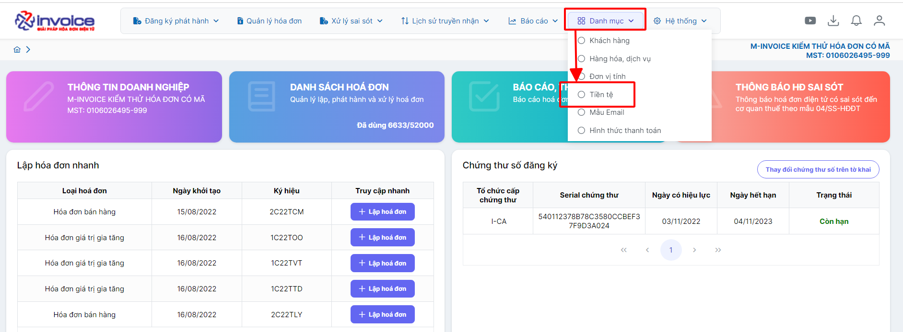
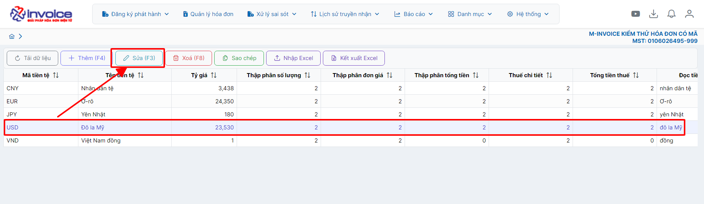
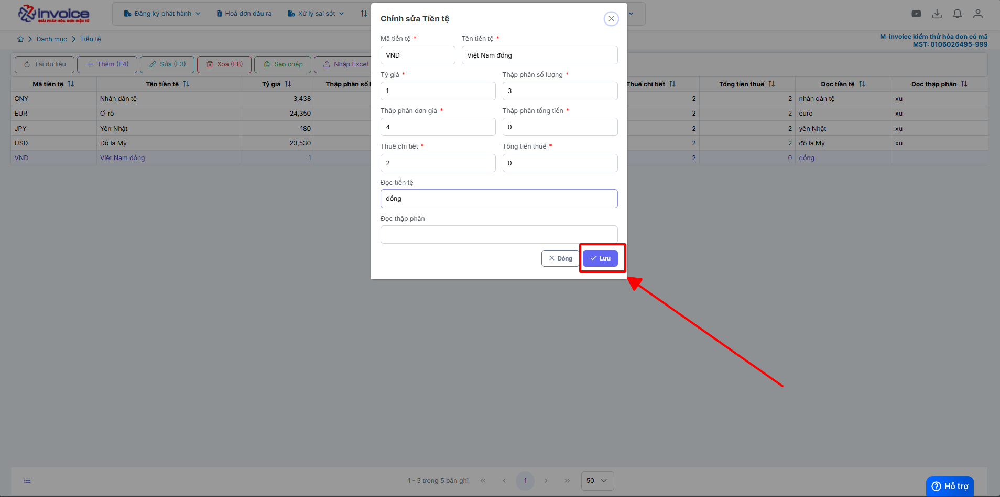

# **Chỉnh phần số thập phân của phần tiền**

Dưới đây là những hướng dẫn thao tác cơ bản trên phần mềm hóa đơn điện tử M-Invoice ở phiên bản 2.0 vô cùng mạch lạc và dễ hiểu.

## **Hướng dẫn điều chỉnh phần số thập phân của phần tiền**

???+ Note "Ghi chú"

    Trong quá trình sử dụng phần mềm hóa đơn điện tử M-invoice, NSD sẽ muốn có thêm phần số thập phân sau dấu phẩy ở các trường thông tin như số lượng, đơn giá, ... để khi tính tổng tiền có thể ra được số tiền phù hợp với yêu cầu của khách hàng. M-invoice xin giới thiệu với khách hàng và người sử dụng tính năng điều chỉnh phần số thập phân trên phần mềm

### **Bước 1: Ở màn hình trang chủ bạn truy cập vào phần Danh mục --> tiền tệ**

### **Bước 2: Chọn vào loại tiền bạn muốn sửa và nhấn sửa**

### **Bước 3: Sửa các phần số thập phân đằng sau dấu phẩy, bạn muốn để bao nhiêu số ở phần nào thì sửa lại phần đó**

Sau đó nhấn lưu -> load lại trang -> thử lại

???+ info "Xin chân thành cảm ơn quý khách hàng đã tin dùng sản phẩm của M-Invoice"

    Có bất kỳ vướng mắc nào trong quá trình sử dụng hãy liên hệ với M-Invoice tại mục Hỗ trợ kỹ thuật góc phải bên dưới màn hình hoặc gọi tổng đài kỹ thuật của M-Invoice (1900.955.557 Nhánh 1)

