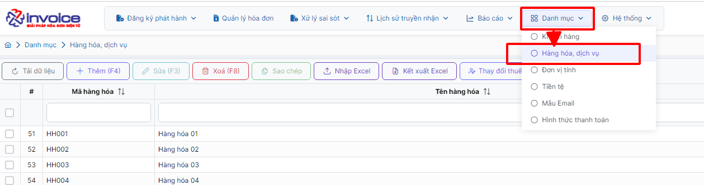
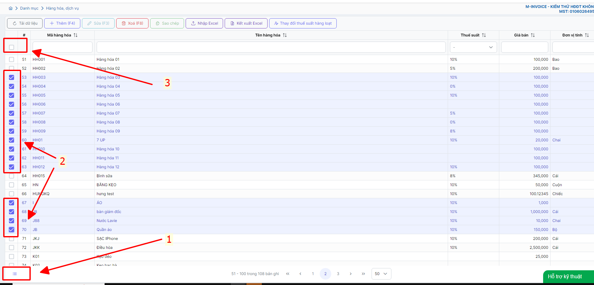
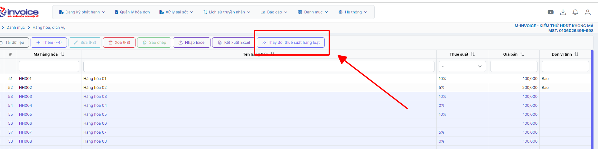
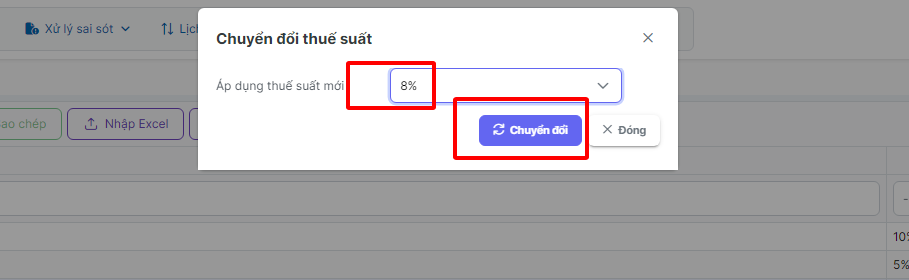

---
hide:
  - toc
---

# **Thay đổi thuế suất hàng loạt trong danh mục hàng hóa**

Dưới đây là những hướng dẫn thao tác cơ bản trên phần mềm hóa đơn điện tử M-Invoice ở phiên bản 2.0 vô cùng mạch lạc và dễ hiểu.

## **Hướng dẫn thay đổi thuế suất hàng loạt trong danh mục hàng hóa**

???+ Note "Ghi chú"

    Nhằm chuẩn bị cho nghị định 44/2023/NĐ-CP giảm thuế suất 2%, M-invoice xin hướng dẫn quỹ khách hàng cập nhất lại thuế suất cho danh mục hàng hóa dịch vụ

    Xin gửi Anh chị Em file excel Danh sách các mặt hàng không được giảm thuế GTGT theo Phụ lục Nghị định 44/2023/NĐ-CP mới nhất

<iframe src="https://docs.google.com/spreadsheets/d/1ephNvlgn_fcNuoX4KHvhmpCI8kIA9a333rcAv9CYP4c/edit?gid=0#gid=0widget=true&headers=false" 
        width="100%" 
        height="600px"></iframe>

### **Bước 1: Quý khách truy cập vào phần danh mục --> Hàng hóa dịch vụ**

### **Bước 2: Tích chọn vào những hàng hóa cần thay đổi (1), (2)**

Các bạn cũng có thể tích toàn bộ trên một trang bằng cách nhấn vào tích (3)

### **Bước 3: Nhấn vào phần thay đổi thuế suất**

### **Bước 4: Chọn loại thuế suất áp dụng mới sau đó nhấn chuyển đổi**

Như vậy bạn đã cấp nhật hàng loạt thuế suất của danh mục hàng hóa mới

???+ info "Xin chân thành cảm ơn quý khách hàng đã tin dùng sản phẩm của M-Invoice"

    Có bất kỳ vướng mắc nào trong quá trình sử dụng hãy liên hệ với M-Invoice tại mục Hỗ trợ kỹ thuật góc phải bên dưới màn hình hoặc gọi tổng đài kỹ thuật của M-Invoice (1900.955.557 Nhánh 1)

Last updated on <strong>Jun 5, 2025</strong> by <strong>nhatth</strong>

