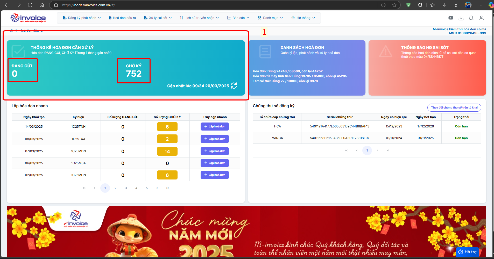
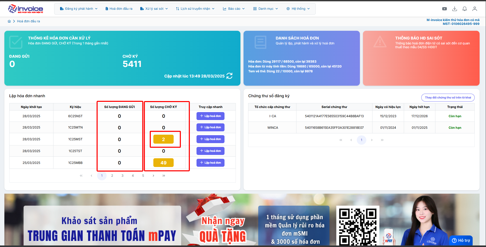
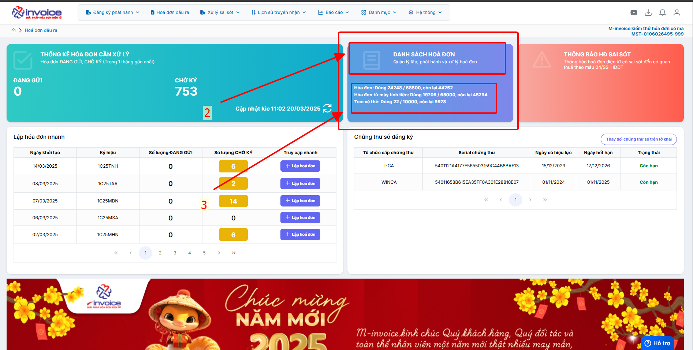
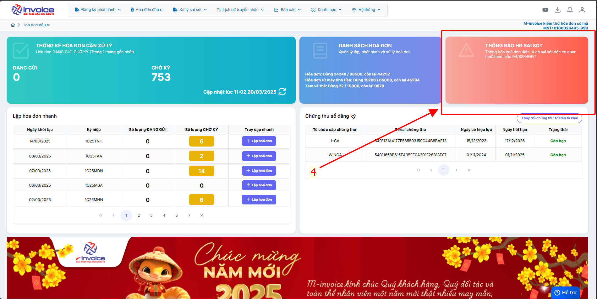
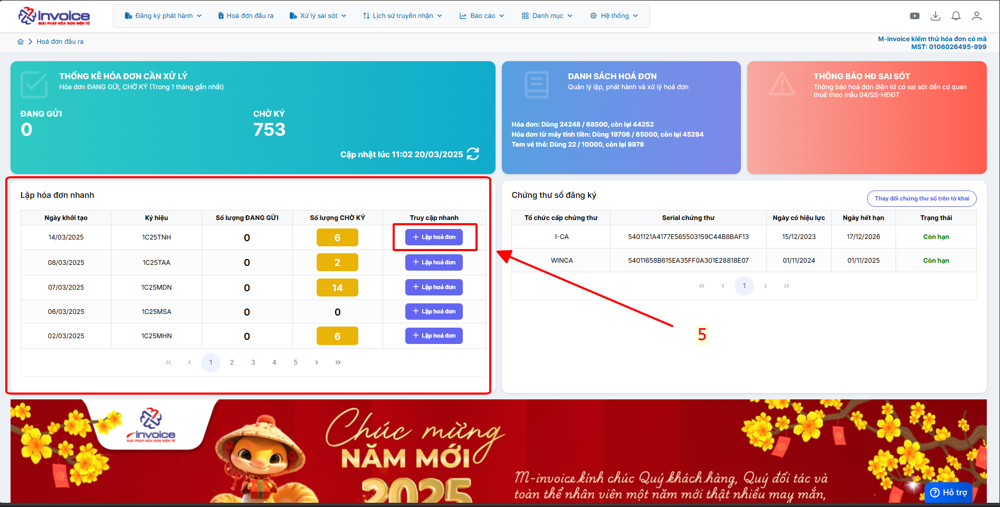
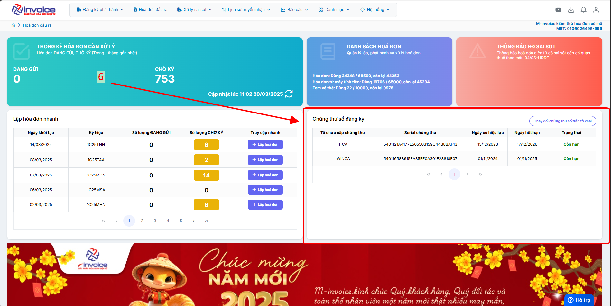

# **Dashboard 2.0**

Dưới đây là những hướng dẫn thao tác cơ bản trên phần mềm hóa đơn điện tử M-Invoice ở phiên bản 2.0 vô cùng mạch lạc và dễ hiểu.

## **Hướng dẫn truy cập nhanh trên trang chủ Dashboard**

???+ Note "Ghi chú"

    Quý khách có thể truy cập nhanh bằng các chức năng trên màn hình Dashboard một cách nhanh chóng và tiện lợi

**Video giới thiệu về phần mềm hoá đơn điện tử M-invoice**

<iframe style="width: 43rem; height: 450px" src="https://www.youtube.com/embed/umLV8QLS9A4?si=Ov8UF3dCLRhXzkbf" title="YouTube video player" frameborder="0" allow="accelerometer; autoplay; clipboard-write; encrypted-media; gyroscope; picture-in-picture; web-share" referrerpolicy="strict-origin-when-cross-origin" allowfullscreen></iframe>

## **Tổng quát**

???+ Note "Số 1"

    **Xem các hoá đơn "chờ ký" và "đang gửi" trong 1 tháng gần nhất**

???+ Note "Số 2"

    **Quý khách hàng click vào sẽ ra danh sách hoá đơn**

???+ Note "Số 3"

    **Số lượng hoá đơn khách hàng đã dùng và số lượng còn lại**

???+ Note "Số 4"

    **Danh sách thông báo sai sót 04ss**

???+ Note "Số 5"

    **Bấm vào "lập hoá đơn" ở ký hiệu mới nhất để lập hoá đơn nhanh**

???+ Note "Số 6"

    **Danh sách chữ ký số đang dùng và trạng thái của chữ ký số**

    Trường hợp anh chị muốn thay đổi cks khi vừa thêm mới hoặc gia hạn thì có thể bấm vào **thay đổi chứng thư số trên tờ khai** hoặc
    xem chi tiết ở đây [Hướng dẫn thêm cks mới](them-cks-moi.md#attribute-lists){ data-preview }

???+ info "Xin chân thành cảm ơn quý khách hàng đã tin dùng sản phẩm của M-Invoice"

    Có bất kỳ vướng mắc nào trong quá trình sử dụng hãy liên hệ với M-Invoice tại mục Hỗ trợ kỹ thuật góc phải bên dưới màn hình hoặc gọi tổng đài kỹ thuật của M-Invoice (1900.955.557 Nhánh 1)

Last updated on <strong>Mar 28, 2025</strong> by <strong>Trinh Hoai Nhat</strong>

