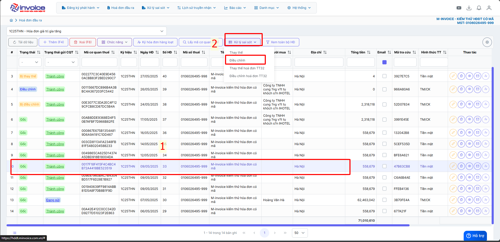
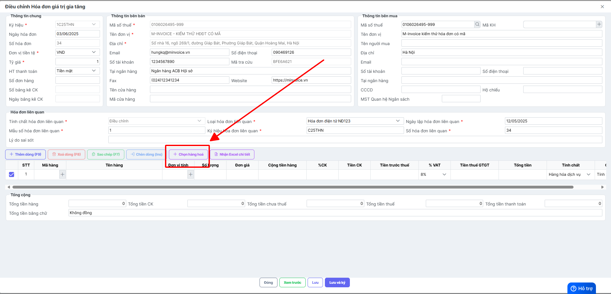
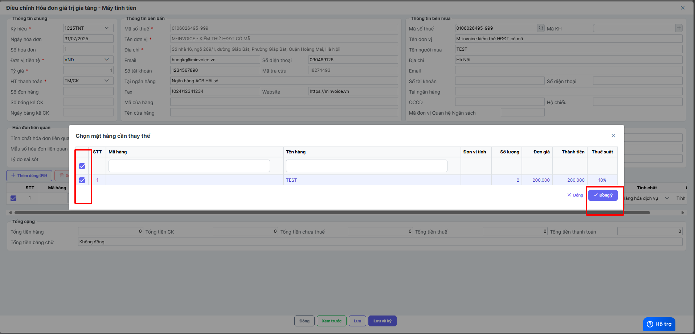
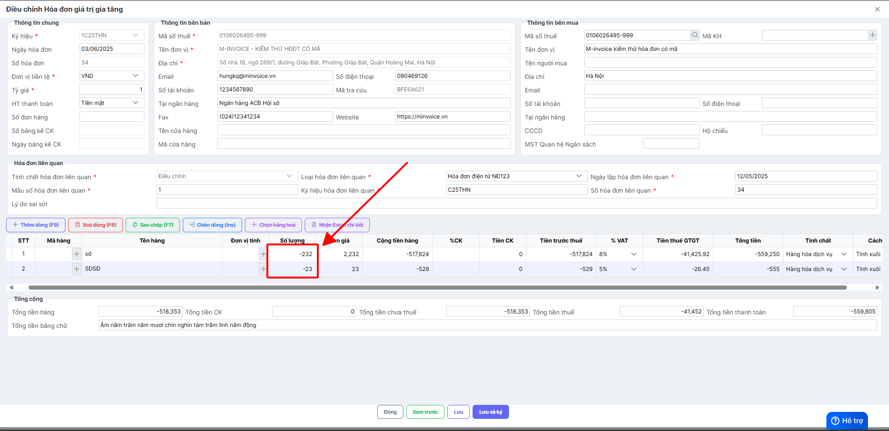
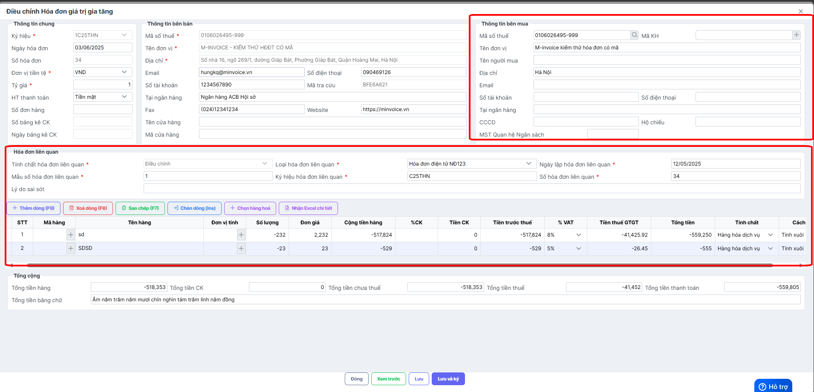
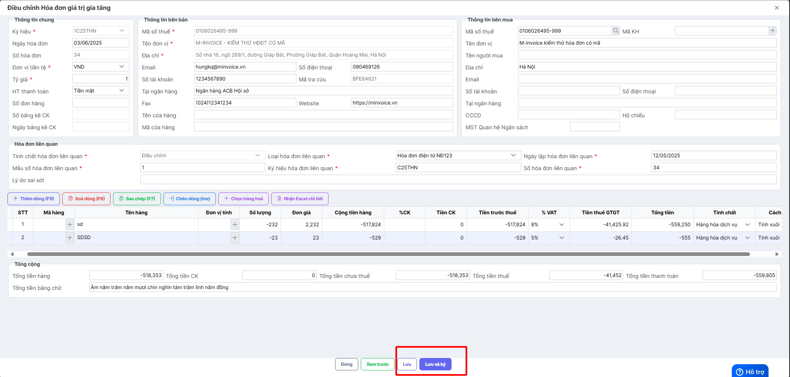
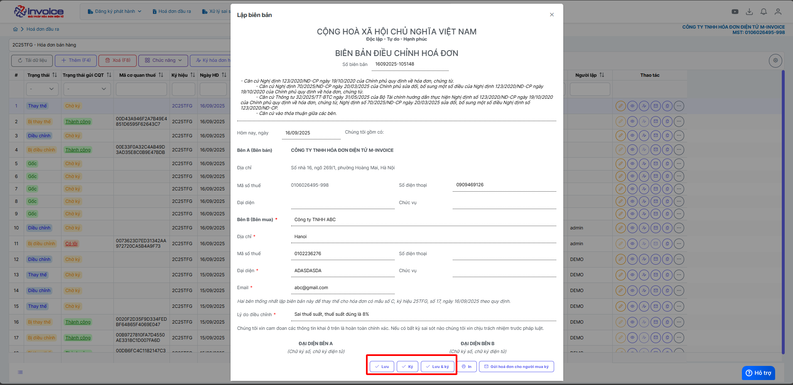
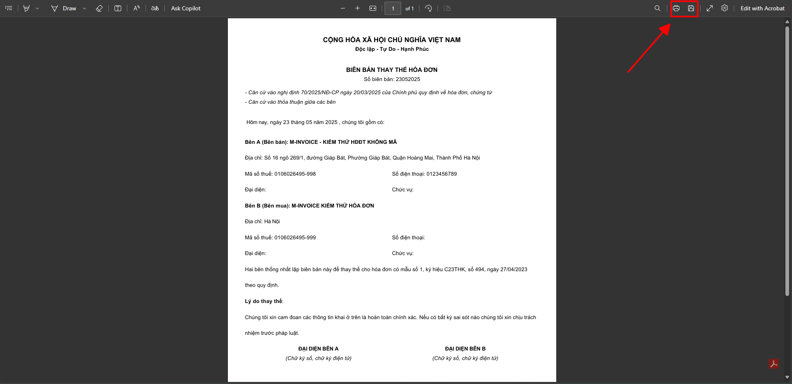

# **Điều chỉnh hoá đơn về 0**

Dưới đây là những hướng dẫn thao tác cơ bản trên phần mềm hóa đơn điện tử M-Invoice ở phiên bản 2.0 vô cùng mạch lạc và dễ hiểu.

## **Hướng dẫn điều chỉnh hoá đơn về không giá trị**

???+ Note "Ghi chú"

    Trong quá trình phát hành hóa đơn không tránh khỏi những sai sót sau đây:

    1. Giao dịch bị huỷ hoặc không phát sinh
    2. Xuất hóa đơn nhầm khách hàng
    3. Hóa đơn lập sai toàn bộ thông tin
    4. Bên mua từ chối nhận hóa đơn
    5. Xuất hóa đơn nhiều lần cho cùng một giao dịch
    6. Đơn hàng bị trả lại toàn bộ

???+ Warning "Lưu ý"

    Nếu đã lựa chọn nghiệp vụ điều chỉnh thì không được thay thế hoá đơn

**Thao tác cài đặt và thực hiện như sau**

### **Bước 1: Chọn hóa đơn cần điều chỉnh --> Xử lý sai sót --> Điều chỉnh**

### **Bước 2 : Bấm chọn hàng hóa để chọn lại hàng hóa của hóa đơn bị điều chỉnh**

### **Bước 3 : Điền âm số lượng hóa đơn**

### **Bước 4 : Kiểm tra các thông tin của hóa đơn -> LƯU**

Kiểm tra các thông tin hóa đơn nếu đúng thì bấm lưu hoặc ký

## Hướng dẫn lập biên bản hoá đơn sau khi làm điều chỉnh giảm về 0

???+ Danger "Hướng dẫn lập biên bản"

    Theo Nghị định 70/2025/NĐ-CP, việc lập Biên bản điều chỉnh/thay thế chứng từ điện tử khấu trừ thuế TNCN là bắt buộc trong các trường hợp có sai sót.

!!! Note "Ghi chú"

    Người sử dụng có thể sử dụng thao tác này để lập biên bản khi làm nghiệp vụ thay thế hay điều chỉnh hóa đơn

!!! warning "Lưu ý"

    Chỉ lập được khi ở trạng thái thay thế hoặc điều chỉnh

### **Bước 1: Truy cập mục xử lý sai sót**

Sau khi đã làm thay thế hoặc điều chỉnh

Chọn lập biên bản

### **Bước 2: Kiểm tra thông tin người bán, người mua, điền lý do thay thế hoặc lý do điều chỉnh**

### **Bước 3 : Lưu hoặc ký biên bản thay thế, điều chỉnh**

Hiện tại chỉ ký được biên bản nếu cks là cks hsm

### **Bước 4 : Xem và in biên bản**

Bấm nút in ở trình duyệt hoặc bấm ctrl + P để in

???+ info "Xin chân thành cảm ơn quý khách hàng đã tin dùng sản phẩm của M-Invoice"

    Có bất kỳ vướng mắc nào trong quá trình sử dụng hãy liên hệ với M-Invoice tại mục Hỗ trợ kỹ thuật góc phải bên dưới màn hình hoặc gọi tổng đài kỹ thuật của M-Invoice (1900.955.557 Nhánh 1)

Last updated on <strong>Jun 5, 2025</strong> by <strong>nhatth</strong>

