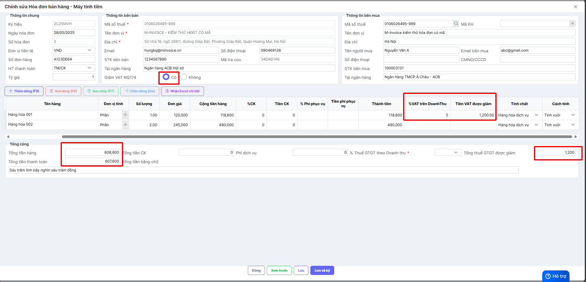

🔔<span style="color:red">THÔNG BÁO ĐẶC BIỆT QUAN TRỌNG</span> 🔔

???+ Note "Triển khai hóa đơn bán hàng và ưu đãi thuế GTGT cho hộ kinh doanh"

    Căn cứ Nghị quyết số 174/2024/QH15, từ thời điểm hiện tại, các hộ kinh doanh (HKD) sử dụng hóa đơn bán hàng ký hiệu 2xxxxx sẽ được giảm 20% mức tỷ lệ % để tính thuế giá trị gia tăng (GTGT) theo quy định của pháp luật.

    Các HKD khi xuất hóa đơn bắt buộc phải áp dụng mức thuế GTGT đã giảm đối với các hàng hóa thuộc danh mục được giảm thuế.

    👉 Quý đối tác vui lòng thực hiện theo tài liệu kỹ thuật do M-invoice cung cấp tại Mục 3 (Thêm/Sửa/Xóa hóa đơn).

    📌 Danh mục hàng hóa được giảm thuế GTGT tra cứu tại:

    🔗 [Tra cứu giảm thuế](https://tracuugiamthue.minvoice.com.vn/tra-cuu-mat-hang-giam-thue-nghi-dinh-44-2023-nd-cp){:target="\_blank"}

Công thức giảm thuế mẫu

<table border="1" cellspacing="0" cellpadding="8" style="border-collapse: collapse; width: 100%; font-family: Arial, sans-serif; table-layout: fixed;">
  <thead>
    <tr style="background-color: #f8f8f8;">
      <th colspan="4" style="color: red; text-align: left; font-size: 18px;">THÔNG TIN TRONG CHI TIẾT HÀNG HÓA</th>
    </tr>
    <tr style="background-color: #efefef; text-align: center;">
      <th style="width: 40%;">Tên hàng</th>
      <th style="width: 15%;">Số lượng</th>
      <th style="width: 20%;">Đơn giá</th>
      <th style="width: 25%;">Thành tiền</th>
    </tr>
  </thead>
  <tbody>
    <tr>
      <td>Món ăn 1</td>
      <td align="center">1</td>
      <td align="right">1,000,000</td>
      <td align="right">1,000,000</td>
    </tr>
    <tr>
      <td>Món ăn 2</td>
      <td align="center">1</td>
      <td align="right">560,000</td>
      <td align="right">560,000</td>
    </tr>
    <tr>
      <td>Bia Heineken</td>
      <td align="center">10</td>
      <td align="right">50,000</td>
      <td align="right">500,000</td>
    </tr>
    <tr>
      <td>Rượu Chivas 24</td>
      <td align="center">1</td>
      <td align="right">5,000,000</td>
      <td align="right">5,000,000</td>
    </tr>
    <tr>
      <td>...</td>
      <td colspan="3"></td>
    </tr>
    <tr>
      <th colspan="4" style="color: blue; text-align: left; font-size: 16px;">TỔNG CỘNG TRÊN ĐẦU PHIẾU</th>
    </tr>
    <tr>
      <td colspan="2"><strong>Tổng tiền hàng (<code>inv_totalAmount</code>):</strong></td>
      <td colspan="2" align="right">7,060,000</td>
    </tr>
    <tr>
      <td colspan="2"><strong>% Thuế GTGT theo Doanh thu (<code>tlptdoanhthu20</code>):</strong></td>
      <td colspan="2" align="right">2</td>
    </tr>
    <tr>
      <td colspan="2"><strong>Tổng thuế GTGT được giảm (<code>tgtck20</code>):</strong></td>
      <td colspan="2" align="right">28,240</td>
    </tr>
    <tr>
      <td colspan="2"><strong>Tổng tiền thanh toán (<code>inv_TotalAmount</code>):</strong></td>
      <td colspan="2" align="right">7,031,760</td>
    </tr>
  </tbody>
</table>

<span style="color:red">Cách trường thông tin cần truyền</span>

??? Note "🔹 Trường hợp 1: Các thông tin trường cần thêm để giảm trên cả hóa đơn"

    Các trường thông tin:
    <table border="1" cellspacing="0" cellpadding="5" style="border-collapse: collapse; width: 100%;">
    <thead>
    <tr>
      <th style="width: 170px; text-align: left;">Tên trường</th>
      <th style="text-align: left;">Kiểu dữ liệu</th>
      <th style="text-align: left;">Độ dài</th>
      <th style="text-align: left;">Bắt buộc</th>
      <th style="width: 200px; text-align: left;">Ghi chú</th>
    </tr>
    </thead>
    <tbody>
    <tr>
      <td><code>tlptdoanhthu20</code></td>
      <td>int</td>
      <td></td>
      <td></td>
      <td>
        <span style="color:red;">(CHỈ ÁP DỤNG CHO HÓA ĐƠN BÁN HÀNG có giảm thuế GTGT theo NQ101-2023/QH15)</span><br>
        Tỷ lệ % thuế GTGT trên doanh thu của mặt hàng đang sử dụng, nhận giá trị:<br>
        1 - Phân phối, cung cấp hàng hóa dịch vụ<br>
        2 - Hoạt động kinh doanh khác<br>
        3 - Sản xuất, vận tải, dịch vụ có gắn với hàng hóa, xây dựng có bao thầu nguyên vật liệu<br>
        5 - Dịch vụ xây dựng không bao thầu nguyên vật liệu
      </td>
    </tr>
    <tr>
      <td><code>tgtck20</code></td>
      <td>decimal</td>
      <td>21,6</td>
      <td></td>
      <td>
        <span style="color:red;">(CHỈ ÁP DỤNG CHO HÓA ĐƠN BÁN HÀNG có giảm thuế GTGT theo NQ101-2023/QH15)</span><br>
        Tổng tiền thuế GTGT được giảm đối với HÓA ĐƠN BÁN HÀNG theo NQ101/2023/QH15
      </td>
    </tr>
    <tr>
      <td><code>isDeductionNQ43</code></td>
      <td>boolean</td>
      <td></td>
      <td></td>
      <td>
        <span style="color:red;">(CHỈ ÁP DỤNG CHO HÓA ĐƠN BÁN HÀNG có giảm thuế GTGT theo NQ101-2023/QH15)</span><br>
        Có Áp dụng giảm thuế cho HÓA ĐƠN BÁN HÀNG theo NQ 101/2023/NĐ-CP không?<br>
        <strong>true</strong>: có<br>
        <strong>false</strong>: không
      </td>
    </tr>
    </tbody>
    </table>

    <span style="color:red;">json mẫu</span>
    ```json
    {
    "editmode": 1,
    "data": [
        {
      "inv_invoiceSeries": "2C25MAC",
      "inv_invoiceIssuedDate": "2025-05-28",
      "inv_currencyCode": "VND",
      "inv_exchangeRate": 1,
      "so_benh_an": "A123DE64",
      "inv_buyerDisplayName": "Nguyễn Văn A",
      "inv_buyerLegalName": "CÔNG TY M-INVOICE",
      "inv_buyerTaxCode": "0106026495-999",
      "inv_buyerAddressLine": "Giáp Bát, Hoàng Mai, Hà Nội",
      "inv_buyerEmail": "abc@gmail.com",
      "inv_buyerBankAccount": "100003131",
      "inv_buyerBankName": "Ngân hàng TMCP Á Châu - ACB",
      "inv_paymentMethodName": "TM/CK",
      "nonTaxZone": 0,
      "isDeductionNQ43": true,
      "tgtck20": 5000,
      "inv_discountAmount": 0,
      "inv_TotalAmount": 606340,
      "key_api": "",
      "details": [
        {
          "data": [
            {
              "tchat": 1,
              "stt_rec0": 1,
              "inv_itemCode": "HH001",
              "inv_itemName": "Hàng hóa 001",
              "inv_unitCode": "Phần",
              "inv_quantity": 1,
              "inv_unitPrice": 120000,
              "inv_discountPercentage": 0,
              "inv_discountAmount": 0,
              "inv_TotalAmountWithoutVat": 118800
            },
            {
              "tchat": 1,
              "stt_rec0": 2,
              "inv_itemCode": "HH002",
              "inv_itemName": "Hàng hóa 002",
              "inv_unitCode": "Phần",
              "inv_quantity": 2,
              "inv_unitPrice": 245000,
              "inv_discountPercentage": 0,
              "inv_discountAmount": 0,
              "inv_TotalAmountWithoutVat": 490000
            }
          ]
        }
      ]
        }
        ]
        }
    ```
    Kết quả mong muốn:

    

??? Note "🔹 Trường hợp 2: Các thông tin trường cần thêm để giảm trên từng dòng hàng"

    Các trường thông tin:
    <table border="1" cellpadding="8" cellspacing="0" style="border-collapse: collapse; width: 100%;">
    <thead>
    <tr>
      <th style="width: 170px;">Tên trường</th>
      <th>Kiểu dữ liệu</th>
      <th>Độ dài</th>
      <th>Bắt buộc</th>
      <th style="width: 400px;">Ghi chú</th>
    </tr>
    </thead>
    <tbody>
    <tr>
      <td><code>inv_vatRateDeduction</code></td>
      <td>int</td>
      <td></td>
      <td></td>
      <td>
        <span style="color:red;">(CHỈ ÁP DỤNG CHO HÓA ĐƠN BÁN HÀNG có giảm thuế GTGT theo NQ101-2023/QH15)</span><br/>
        Tỷ lệ % thuế GTGT trên doanh thu của mặt hàng đang sử dụng, nhận giá trị:
        <ul style="margin: 4px 0 0 20px;">
          <li>1 - Phân phối, cung cấp hàng hóa dịch vụ</li>
          <li>2 - Hoạt động kinh doanh khác</li>
          <li>3 - Sản xuất, vận tải, dịch vụ có gắn với hàng hóa, xây dựng có bao thầu nguyên vật liệu</li>
          <li>5 - Dịch vụ xây dựng không bao thầu nguyên vật liệu</li>
        </ul>
      </td>
    </tr>
    <tr>
      <td><code>inv_vatAmountDeduction</code></td>
      <td>decimal</td>
      <td>21,6</td>
      <td></td>
      <td>
        <span style="color:red;">(CHỈ ÁP DỤNG CHO HÓA ĐƠN BÁN HÀNG có giảm thuế GTGT theo NQ101-2023/QH15)</span><br/>
        Tổng số tiền thuế GTGT được giảm<br/>
        Xem công thức tại đây
      </td>
    </tr>
    </tbody>
    </table>

    <span style="color:red;">json mẫu</span>
    ```json
    {
    "editmode": 1,
    "data": [
    {
      "inv_invoiceSeries": "2C25MAC",
      "inv_invoiceIssuedDate": "2025-05-28",
      "inv_currencyCode": "VND",
      "inv_exchangeRate": 1,
      "so_benh_an": "A123DE64",
      "inv_buyerDisplayName": "Nguyễn Văn A",
      "inv_buyerLegalName": "CÔNG TY M-INVOICE",
      "inv_buyerTaxCode": "0106026495-999",
      "inv_buyerAddressLine": "Giáp Bát, Hoàng Mai, Hà Nội",
      "inv_buyerEmail": "abc@gmail.com",
      "inv_buyerBankAccount": "100003131",
      "inv_buyerBankName": "Ngân hàng TMCP Á Châu - ACB",
      "inv_paymentMethodName": "TM/CK",
      "nonTaxZone": 0,
      "isDeductionNQ43": true,
      "inv_discountAmount": 0,
      "inv_TotalAmount": 606340,
      "key_api": "",
      "details": [
        {
          "data": [
            {
              "tchat": 1,
              "stt_rec0": 1,
              "inv_itemCode": "HH001",
              "inv_itemName": "Hàng hóa 001",
              "inv_unitCode": "Phần",
              "inv_quantity": 1,
              "inv_unitPrice": 120000,
              "inv_discountPercentage": 0,
              "inv_discountAmount": 0,
              "inv_vatRateDeduction": 5,
              "inv_vatAmountDeduction": 1200,
              "inv_TotalAmountWithoutVat": 118800
            },
            {
              "tchat": 1,
              "stt_rec0": 2,
              "inv_itemCode": "HH002",
              "inv_itemName": "Hàng hóa 002",
              "inv_unitCode": "Phần",
              "inv_quantity": 2,
              "inv_unitPrice": 245000,
              "inv_discountPercentage": 0,
              "inv_discountAmount": 0,
              "inv_TotalAmountWithoutVat": 490000
            }
          ]
        }
      ]
    }
    ]
    }
    ```
    Kết quả mong muốn:

    
