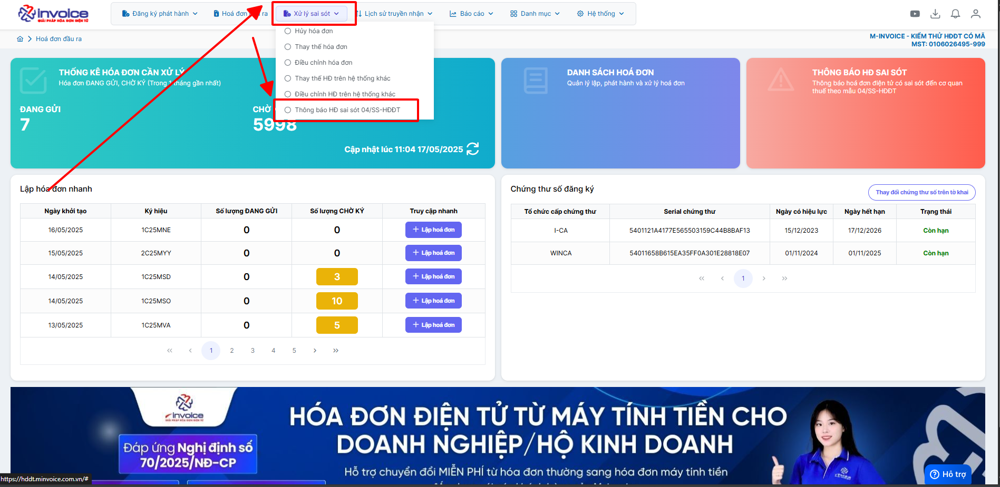
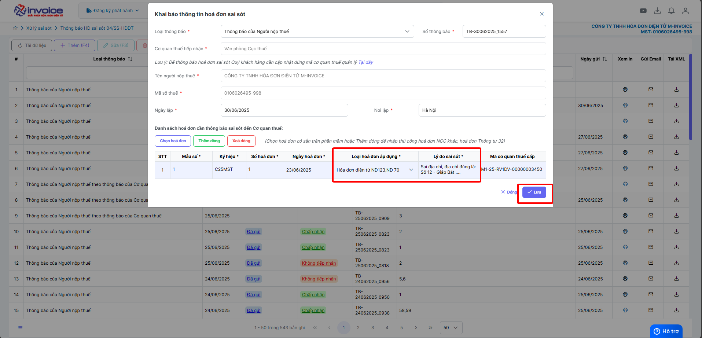

# **Giải trình hoá đơn**

Dưới đây là những hướng dẫn thao tác cơ bản trên phần mềm hóa đơn điện tử M-Invoice ở phiên bản 2.0 vô cùng mạch lạc và dễ hiểu.

## **Hướng dẫn lập giải trình 04ss**

???+ Note "Ghi chú"

    Mẫu 04/SS giải trình phù hợp trong các trường hợp sai sót sau

    - Sai tên người mua, địa chỉ

**Thao tác cài đặt và thực hiện như sau**

<iframe style="width: 43rem; height: 380px" src="https://www.youtube.com/embed/yfkQsHpXuOo?si=QjHg3a_tgiETA1hM" title="YouTube video player" frameborder="0" allow="accelerometer; autoplay; clipboard-write; encrypted-media; gyroscope; picture-in-picture; web-share" referrerpolicy="strict-origin-when-cross-origin" allowfullscreen></iframe>

**Hướng dẫn sử dụng bằng hình ảnh nếu Quý khách không xem được video**

### **Bước 1: Nhấn vào xử ký sai sót => Thông báo HĐ sai sót 04ss-HDDT**

### **Bước 2: Bấm thêm**

### **Bước 3 : Click chọn hoá đơn**

### **Bước 4 : Chọn ký hiệu, số hoá đơn cần giải trình**

### **Bước 5 : Chọn tính chất là => giải trình, điền lý do sai sót cụ thể và điên thông tin đúng**

==> Bấm lưu -> ký thông báo 04ss giải trình

???+ info "Xin chân thành cảm ơn quý khách hàng đã tin dùng sản phẩm của M-Invoice"

    Có bất kỳ vướng mắc nào trong quá trình sử dụng hãy liên hệ với M-Invoice tại mục Hỗ trợ kỹ thuật góc phải bên dưới màn hình hoặc gọi tổng đài kỹ thuật của M-Invoice (1900.955.557 Nhánh 1)

Last updated on <strong>Jun 5, 2025</strong> by <strong>nhatth</strong>

