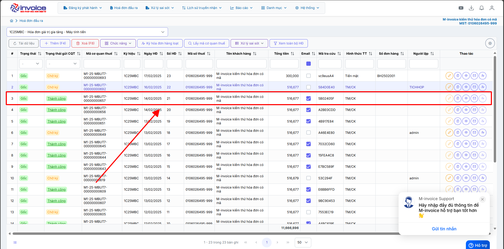
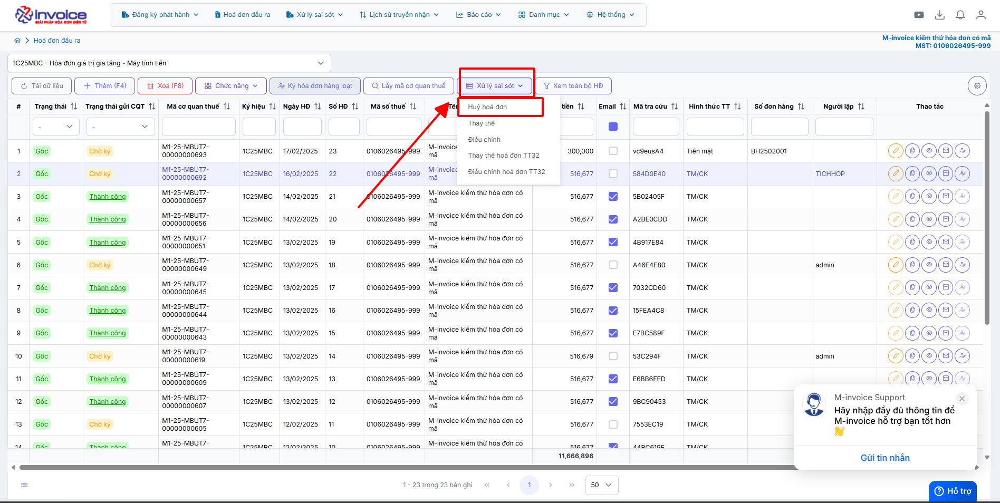
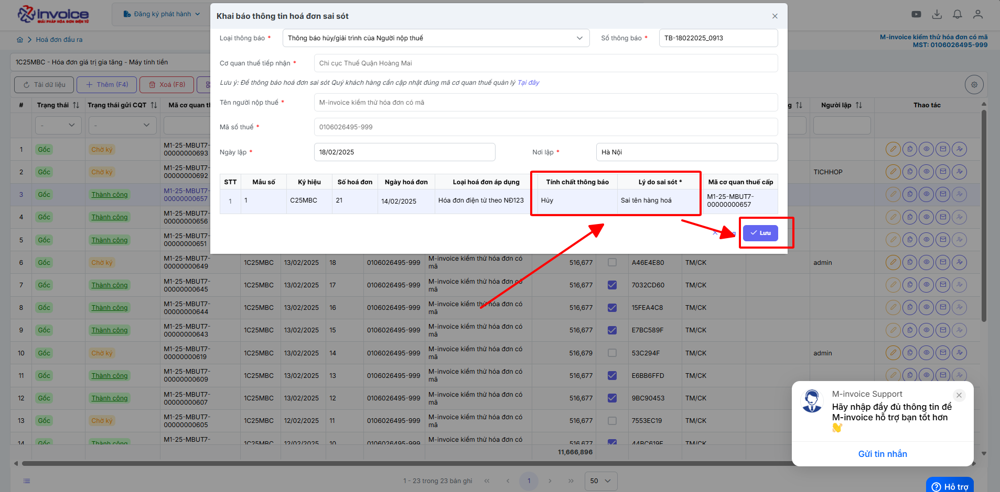
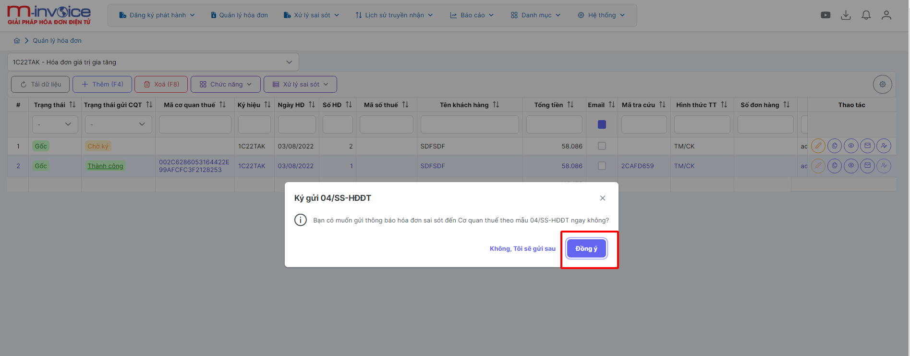
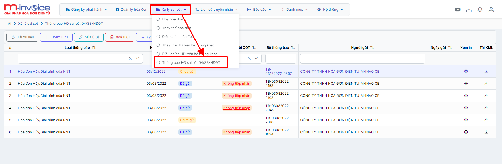
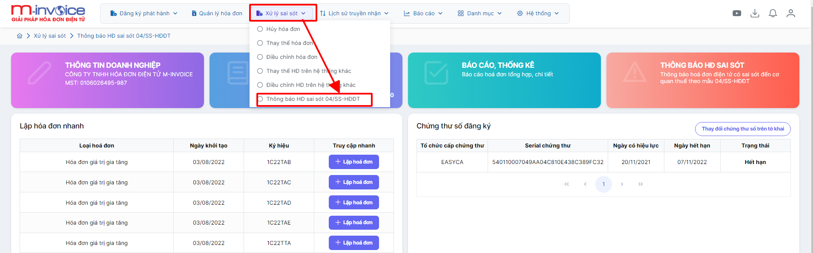

# **Huỷ hoá đơn**

Dưới đây là những hướng dẫn thao tác cơ bản trên phần mềm hóa đơn điện tử M-Invoice ở phiên bản 2.0 vô cùng mạch lạc và dễ hiểu.

## **Hướng dẫn huỷ hóa đơn có sai sót**

???+ Note "Ghi chú"

    Trong quá trình phát hành hóa đơn không tránh khỏi những sai sót. Sau đây, M-Invoice hướng dẫn NSD thực hiện xử lý hóa đơn đã lập có sai sót như sau:
    Người sử dụng có thể sử dụng Nghiệp vụ này khi phát hiện hoá đơn đã ký gửi có sai sót và chỉ được phép sử dụng nghiệp vụ Huỷ hóa đơn với các điều kiện sau:

    1. Hóa đơn cần Huỷ bỏ đã được gửi CQT thành công hoặc hóa đơn đã có mã CQT cấp

    2. Hóa đơn cần Huỷ ở Trạng thái Gốc (Mới)

???+ Warning "Lưu ý"

    Nếu đã lựa chọn nghiệp vụ Huỷ hoá đơn thì không được dùng nghiệp vụ Điều chỉnh hóa đơn hoặc Thay thế. **Nghiệp vụ này bắt buộc phải lập 04/SS.**

**Thao tác cài đặt và thực hiện như sau**

<iframe style="width: 43rem; height: 380px" src="https://www.youtube.com/embed/-HJheUs8byk?si=noXqy7zQeoq4z6Rn" title="YouTube video player" frameborder="0" allow="accelerometer; autoplay; clipboard-write; encrypted-media; gyroscope; picture-in-picture; web-share" referrerpolicy="strict-origin-when-cross-origin" allowfullscreen></iframe>

**Hướng dẫn sử dụng bằng hình ảnh nếu Quý khách không xem được video**

### **Bước 1: Chọn hóa đơn sai sót cần hủy bỏ**

### **Bước 2: Vào phần: Xử lý sai sót --> Hủy hóa đơn**

### **Bước 3 : Khai báo thông tin sai sót hóa đơn (Mẫu 04/SS)**

Bạn điền vào phần **Lý do sai sót** sau đó nhấn Lưu để hoàn thiện mẫu 04ss

### **Bước 4 : Gửi thông báo 04/SS lên thuế**

???+ Note

    Phần mềm sẽ hỏi bạn có muốn gửi thông báo sai sót đến cơ quan thuế theo mấu 04/SS ngay không

    + Bạn chọn Đồng ý thì phần mềm sẽ gửi ngay lập tức

    + Bạn chọn Không tôi sẽ gửi sau thì sau đó bạn có thể vào phần Xử lý sai sót >> Thông báo hóa đơn sai sót 04/SS - HDĐT để ký gửi lại

### **Bước 5 : Kiểm tra CQT đã chấp nhận 04/SS**

Bạn vào phần Xử lý sai sót >> Thông báo hóa đơn sai sót 04/SS - HDĐT

Ở phần Phản hồi CQT nếu trạng thái CQT Tiếp nhận là CQT đã chấp thuận cho quý khách hàng hủy

???+ info "Xin chân thành cảm ơn quý khách hàng đã tin dùng sản phẩm của M-Invoice"

    Có bất kỳ vướng mắc nào trong quá trình sử dụng hãy liên hệ với M-Invoice tại mục Hỗ trợ kỹ thuật góc phải bên dưới màn hình hoặc gọi tổng đài kỹ thuật của M-Invoice (1900.955.557 Nhánh 1)

