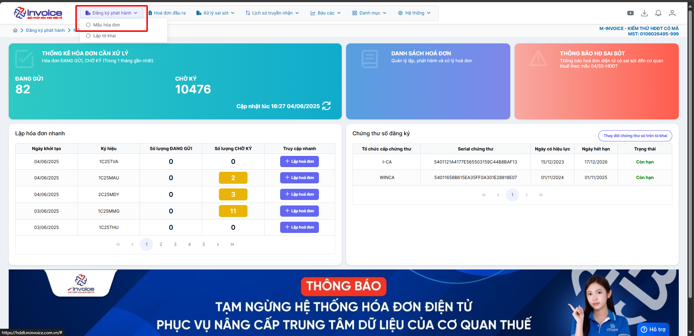
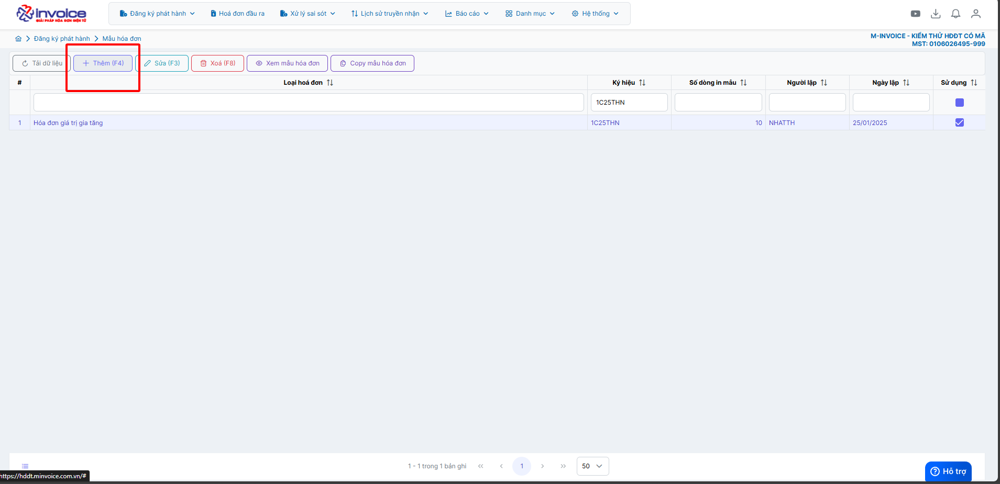
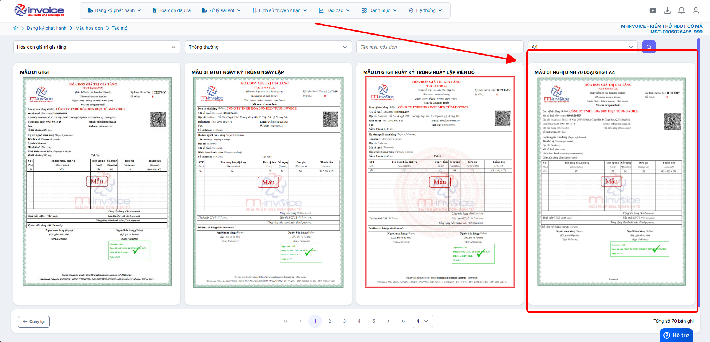
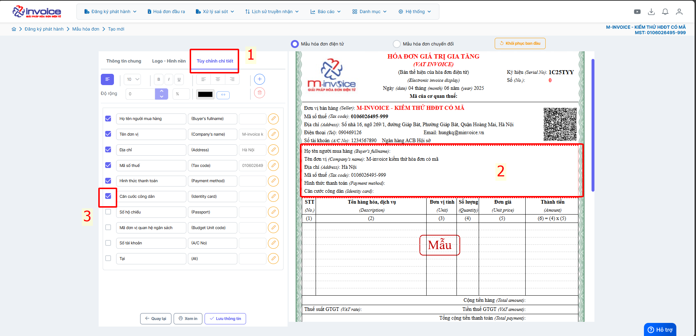
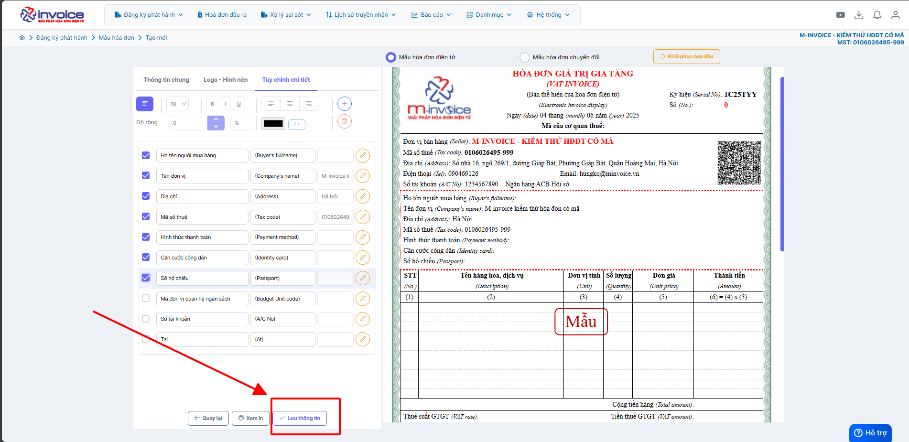

# **Hướng dẫn thêm các trường mới theo NĐ70 ở trên mẫu hóa đơn**

Dưới đây là những hướng dẫn thao tác cơ bản trên phần mềm hóa đơn điện tử M-Invoice ở phiên bản 2.0 vô cùng mạch lạc và dễ hiểu.

### **Bước 1: Truy cập mẫu hóa đơn**

### **Bước 2: Thêm mẫu**

Bấm thêm và chọn mẫu mới

### **Bước 3: Thêm các trường mới**

Anh chị bấm LƯU để lưu thông tin vừa chỉnh sửa

???+ info "Xin chân thành cảm ơn quý khách hàng đã tin dùng sản phẩm của M-Invoice"

    Có bất kỳ vướng mắc nào trong quá trình sử dụng hãy liên hệ với M-Invoice tại mục Hỗ trợ kỹ thuật góc phải bên dưới màn hình hoặc gọi tổng đài kỹ thuật của M-Invoice (1900.955.557 Nhánh 1)

