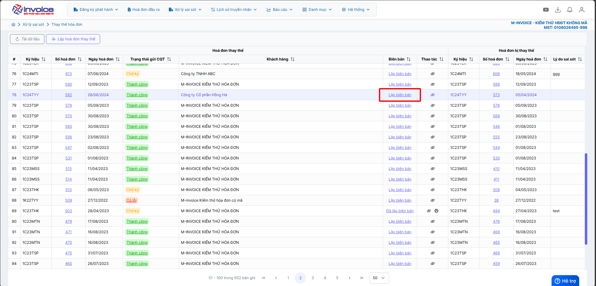

# **Hướng dẫn lập biên bản hoá đơn điều chỉnh thay thế**

!!! Note "Ghi chú"

    Người sử dụng có thể sử dụng thao tác này để lập biên bản khi làm nghiệp vụ thay thế hay điều chỉnh hóa đơn

!!! warning "Lưu ý"

    Chỉ lập được khi ở trạng thái thay thế hoặc điều chỉnh

### **Bước 1: Truy cập mục xử lý sai sót**

Sau khi đã làm thay thế hoặc điều chỉnh

Chọn lập biên bản

### **Bước 2: Kiểm tra thông tin người bán, người mua, điền lý do thay thế hoặc lý do điều chỉnh**

### **Bước 3 : Lưu hoặc ký biên bản thay thế, điều chỉnh**

Hiện tại chỉ ký được biên bản nếu cks là cks hsm

### **Bước 4 : Xem và in biên bản**

Bấm nút in ở trình duyệt hoặc bấm ctrl + P để in

!!! info "Xin chân thành cảm ơn Quý khách hàng đã tin dùng sản phẩm của M-Invoice"

    Có bất kỳ vướng mắc nào trong quá trình sử dụng hãy liên hệ với M-Invoice tại mục Hỗ trợ kỹ thuật góc phải bên dưới màn hình hoặc gọi tổng đài kỹ thuật của M-Invoice (1900.955.557 Nhánh 1)

