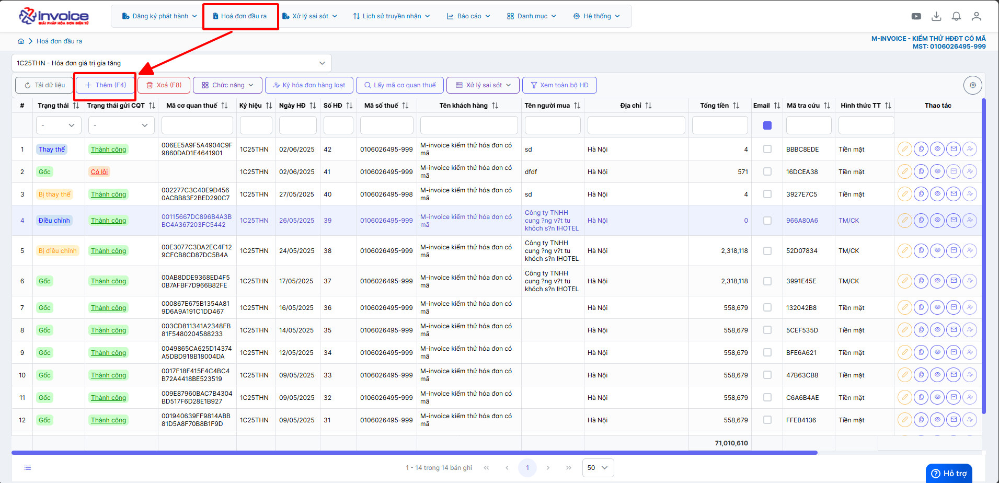
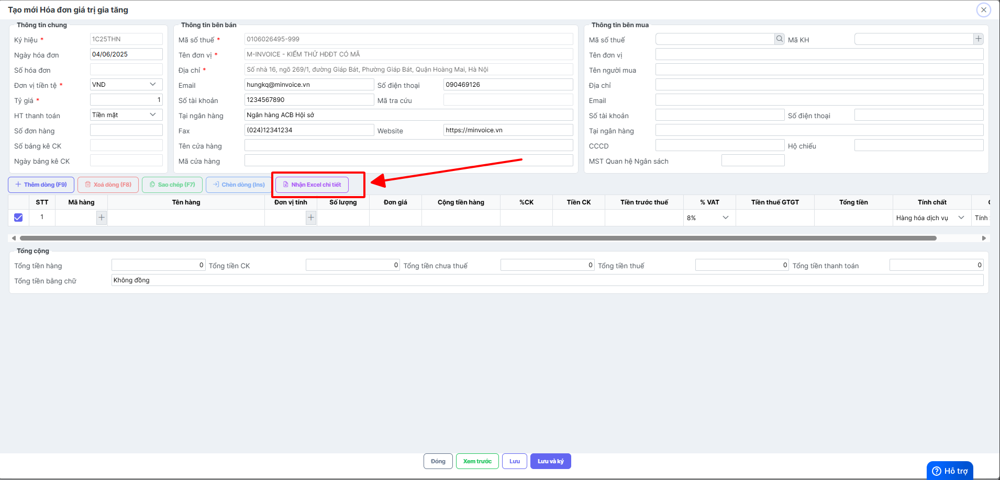
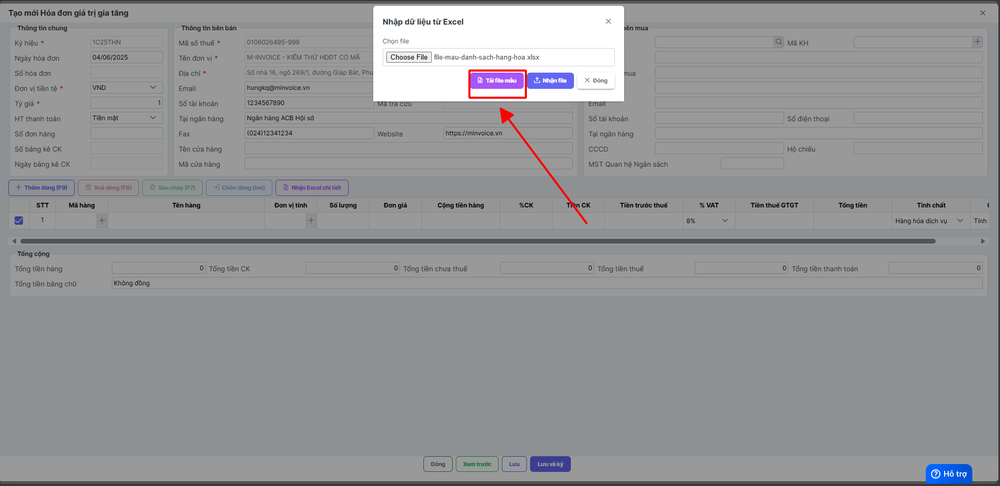
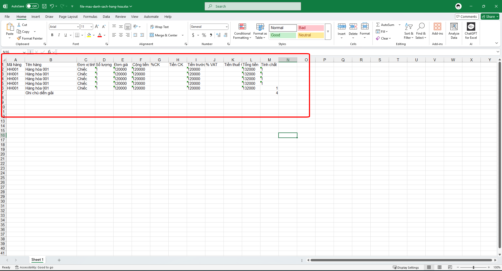
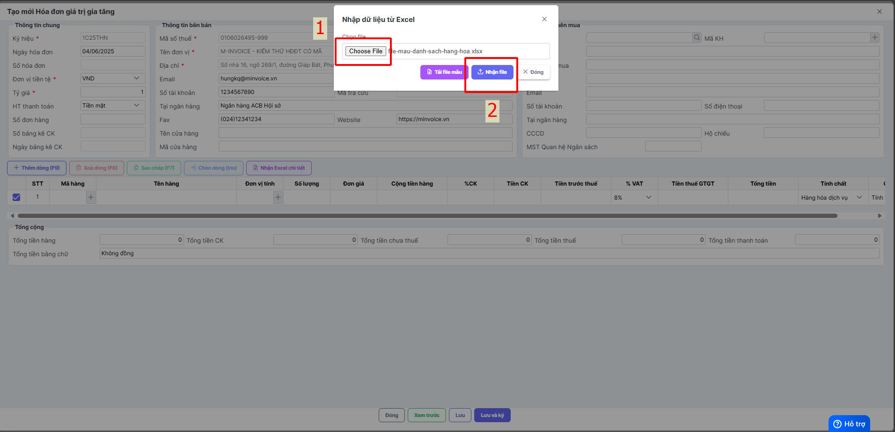

# **Nhập excel chi tiêt**

Dưới đây là những hướng dẫn thao tác cơ bản trên phần mềm hóa đơn điện tử M-Invoice ở phiên bản 2.0 vô cùng mạch lạc và dễ hiểu.

## **Hướng dẫn nhập excel hoá đơn**

???+ Note "Ghi chú"

    Tính năng này được sử dụng khi 1 hóa đơn có nhiều dòng hàng, mà NSD không muốn gõ tay từng dòng hàng trên PM mà muốn nhận thông qua file excel

???+ Warning "Lưu ý"

    Bạn có thể nhận excel chi tiết vào được cả các hóa đơn gốc, thay thế, điều chỉnh ở trạng thái chờ ký, và toàn bộ dữ liệu trước đó sẽ thay thế hoàn toàn bằng giá trị trong file excel

**Thao tác cài đặt và thực hiện như sau**

<iframe style="width: 43rem; height: 380px" src="https://www.youtube.com/embed/2BcxuQ1hWbY?si=pCdz31XtA089jPMd" title="YouTube video player" frameborder="0" allow="accelerometer; autoplay; clipboard-write; encrypted-media; gyroscope; picture-in-picture; web-share" referrerpolicy="strict-origin-when-cross-origin" allowfullscreen></iframe>

???+ Tip

    Quý khách lên xem video hướng dẫn nhập excel hang loạt để dễ hinh dung hơn

**Hướng dẫn sử dụng bằng hình ảnh nếu Quý khách không xem được video**

### Bước 1: Ở giao diện trang chủ chọn HOÁ ĐƠN ĐẦU RA nhấn Thêm để bắt đầu lập hóa đơn mới

### Bước 2: Điền đầy đủ thông tin người mua sau đó nhấn nhận excel chi tiết

### Bước 3: Chọn tải file mẫu

### Bước 4: Điền đầy đủ thông tin cần thiết vào file excel sau đó nhấn lưu lại

### Bước 5: Quay lại phần mềm nhấn Choose File để tải file mẫu lên, sau đó nhận Nhận File

???+ info "Xin chân thành cảm ơn quý khách hàng đã tin dùng sản phẩm của M-Invoice"

    Có bất kỳ vướng mắc nào trong quá trình sử dụng hãy liên hệ với M-Invoice tại mục Hỗ trợ kỹ thuật góc phải bên dưới màn hình hoặc gọi tổng đài kỹ thuật của M-Invoice (1900.955.557 Nhánh 1)

