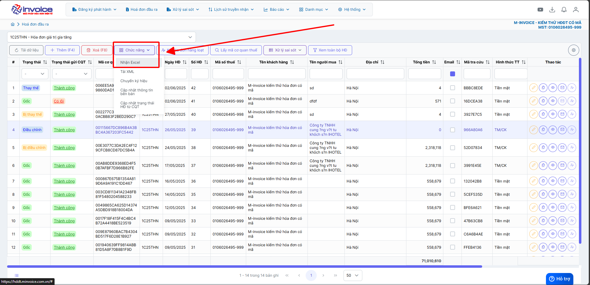
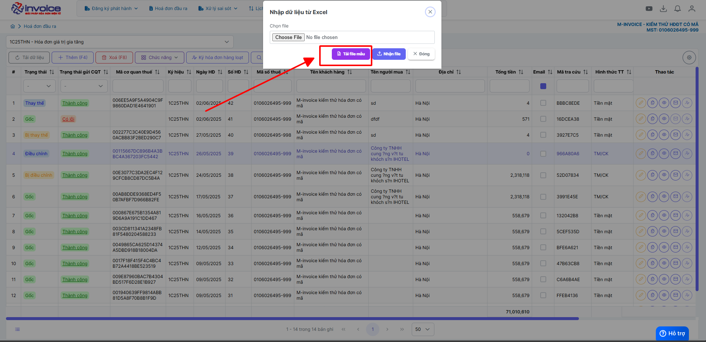
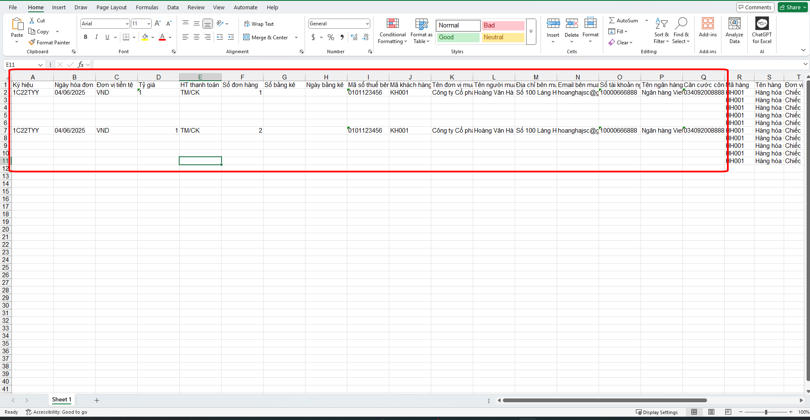

# **Nhập excel hàng loạt**

Dưới đây là những hướng dẫn thao tác cơ bản trên phần mềm hóa đơn điện tử M-Invoice ở phiên bản 2.0 vô cùng mạch lạc và dễ hiểu.

## **Hướng dẫn nhập excel hoá đơn**

???+ Note "Ghi chú"

    Trong quá trình sử dụng, bạn muốn tải một loạt hóa đơn lên phần mềm mà không biết làm cách nào, sau đây M-invoice sẽ hướng dẫn quy trình để nhận nhiều hóa đơn một lúc bằng file excel

???+ Warning "Lưu ý"

    Số hóa đơn nhận vào từ file excel sẽ là số hóa đơn kế tiếp trên ký hiệu mà quý khách đã chọn trên phần mềm hóa đơn

**Thao tác cài đặt và thực hiện như sau**

<iframe style="width: 43rem; height: 380px" src="https://www.youtube.com/embed/CQvhcHjlVMw?si=PzSYCP-afV1R5C_e" title="YouTube video player" frameborder="0" allow="accelerometer; autoplay; clipboard-write; encrypted-media; gyroscope; picture-in-picture; web-share" referrerpolicy="strict-origin-when-cross-origin" allowfullscreen></iframe>

???+ Tip

    Quý khách lên xem video hướng dẫn nhập excel hang loạt để dễ hinh dung hơn

**Hướng dẫn sử dụng bằng hình ảnh nếu Quý khách không xem được video**

### **Bước 1: Ở giao diện lập hóa đơn chọn mục Chức năng >> Nhận excel**

### **Bước 2: Sau đó tiến hành tải file mẫu excel về**

### **Bước 3: Nhập thông tin khách hàng tại excel**

!!! warning "Lưu ý"

    - **Ký hiệu:** NSD nhập đúng ký hiệu đang sử dụng và nhập như hình ảnh.
    - **Số đơn hàng:** NSD nhập 00000n.
    Nếu NSD muốn dòng hàng trên Excel vào chung 1 tờ hóa đơn thì NSD nhập chung 1 số đơn hàng tại các dòng đó.
    Nếu NSD muốn nhận nhiều hóa đơn thì NSD nhập số đơn hàng khác nhau tại mỗi dòng.
    - **Ngày hóa đơn:** NSD để đúng định dạng `'dd/MM/yyyy`.
    Nếu nhập sai sẽ báo lỗi và không nhận được.

### **Bước 4: Điền đầy đủ thông tin tại chi tiết**

!!! warning "Lưu ý"

    + Tính chất: NSD bắt buộc phải Nhập tính chất của dòng hàng.
    Với 1 là Hàng hóa dịch vụ, 2 là Khuyến Mại, 3 là Chiết khấu thương mại, 4 là Ghi chú, diễn giải.
    Bắt buộc phải nhập
    + Số thứ tự: NSD nhập số thứ tự tương ứng với dòng hàng để tránh khi nhận bị nhảy dòng không đúng
    + Phần trăm thuế: NSD nhập đúng phần trăm thuế là 5,10,7, -1 tương  với không chịu thuế và -2 tương ứng với không kê khai

???+ info "Xin chân thành cảm ơn quý khách hàng đã tin dùng sản phẩm của M-Invoice"

    Có bất kỳ vướng mắc nào trong quá trình sử dụng hãy liên hệ với M-Invoice tại mục Hỗ trợ kỹ thuật góc phải bên dưới màn hình hoặc gọi tổng đài kỹ thuật của M-Invoice (1900.955.557 Nhánh 1)

Last updated on <strong>Jun 5, 2025</strong> by <strong>nhatth</strong>

