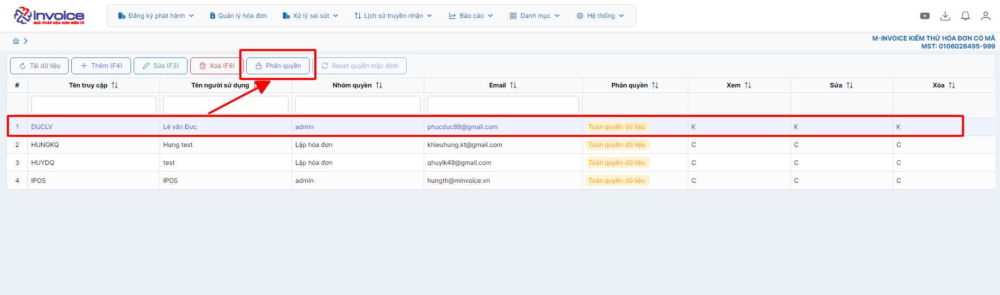
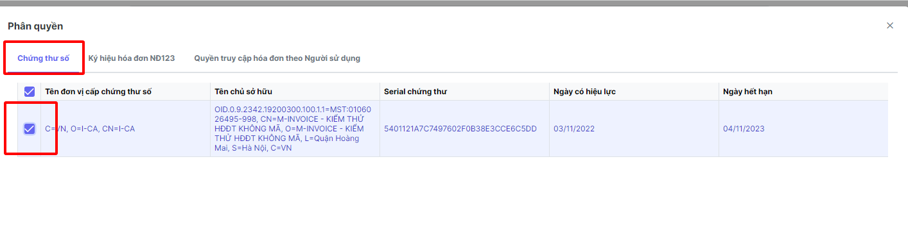
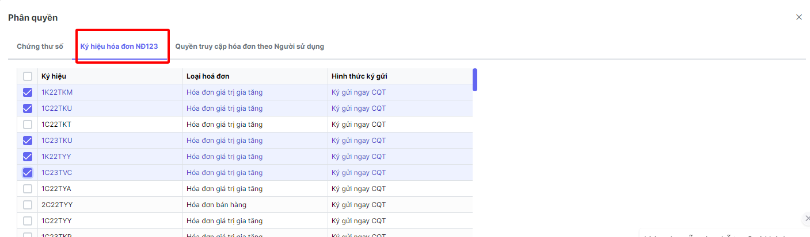
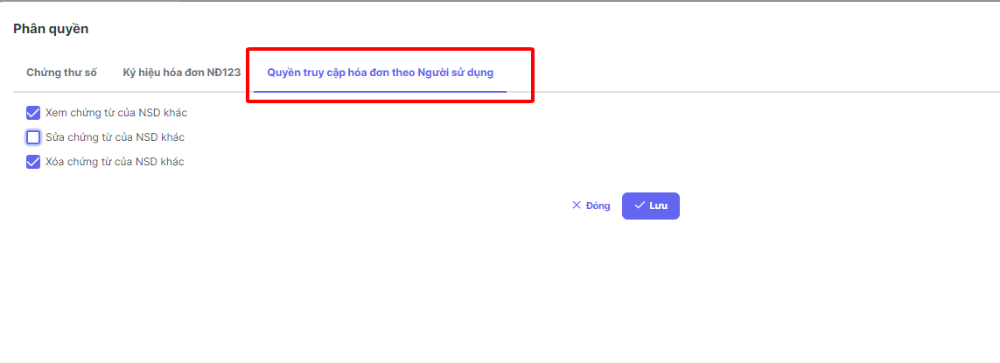

# **Phân quyền**

Dưới đây là những hướng dẫn thao tác cơ bản trên phần mềm hóa đơn điện tử M-Invoice ở phiên bản 2.0 vô cùng mạch lạc và dễ hiểu.

## **Cách phân quyền tài khoản người dùng**

???+ Note "Mục đích"

    Dùng để phân quyền tài khoản người dùng với quyền xem, sửa, xóa,ký các ký hiệu khác nhau cho từng tài khoản người dùng khác nhau

Hướng dẫn phân quyền chi tiết 

### **Bước 1: Hệ thống --> Quản lý người dùng --> Người sử dụng**

### **Bước 2: Chọn người dùng mà bạn muốn phần quyền chọn phân quyền**

### **Bước 3: Chọn Cks và phần ký hiệu hóa đơn, bạn muốn tài khoản được sử dụng**

!!! Note ""

    Với chức năng phân quyền này bạn có thể phân quyền cho người sử dụng được các chữ ký số đăng ký với phân mềm (Liên quan trực tiếp đến việc ký gửi hóa đơn )

!!! Note ""

    Phần phân quyền này liên quan đến việc phân quyền cho người sử dụng nào xem được các ký hiệu nào bằng cách tích chọn vào các ký hiệu mà bạn muốn người dùng muốn tài khoản đó được xem

### **Bước 4: Chọn quyền truy cập hóa đơn theo người sử dụng**

???+ Note "Ví dụ"

    Với cùng 1 ký hiệu và cả 2 tài khoản cùng được phân quyền trong 1 ký hiệu với số hóa đơn 1 do người A lập, số hóa đơn 2 do người B lập, chức năng này dùng để ngăn không cho tài khoản A xem được các hóa đơn tài khoản B và ngược lại

Sau đó nhấn lưu để hoàn thành

Như vậy bạn đã hoàn thành việc phân quyền người sử dụng

???+ info "Xin chân thành cảm ơn quý khách hàng đã tin dùng sản phẩm của M-Invoice"

    Có bất kỳ vướng mắc nào trong quá trình sử dụng hãy liên hệ với M-Invoice tại mục Hỗ trợ kỹ thuật góc phải bên dưới màn hình hoặc gọi tổng đài kỹ thuật của M-Invoice (1900.955.557 Nhánh 1)

