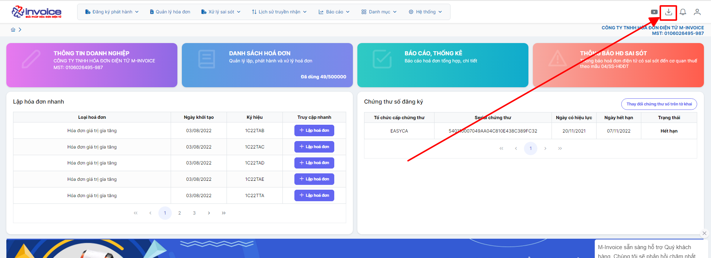
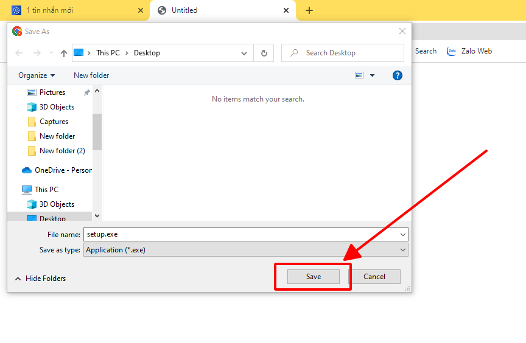
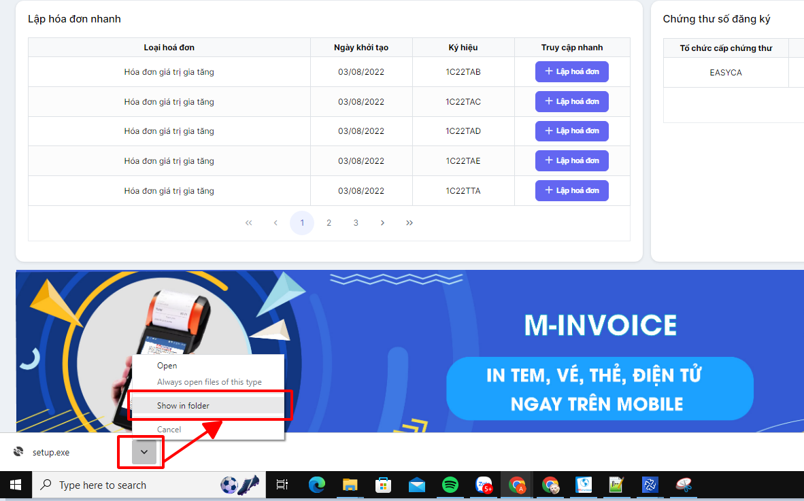
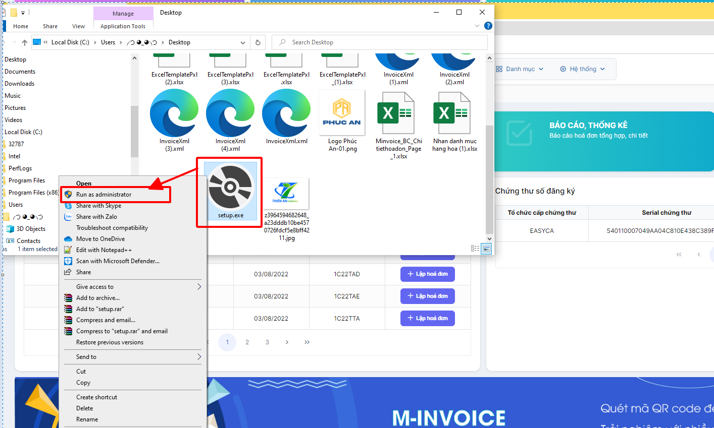
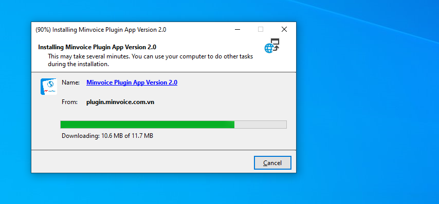
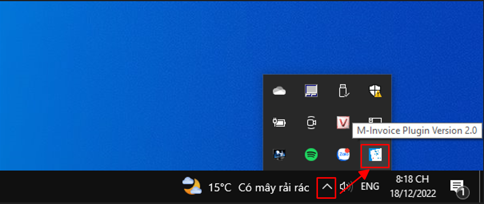

# **Tải cộng cụ ký M-invoice plugin 2.0**

Dưới đây là những hướng dẫn thao tác cơ bản trên phần mềm hóa đơn điện tử M-Invoice ở phiên bản 2.0 vô cùng mạch lạc và dễ hiểu.

## **Hướng dẫn tải cộng cụ ký M-invoice plugin 2.0**

???+ Note "Ghi chú"

    Quý khách cần cài đặt công cụ cho các trường hợp sau đây

    - Lần đầu tiền sử dụng hóa đơn điện tử

    - Thực hiện ký hóa đơn bằng USB trên các thiêt bị khác

    - Sau khi cài đặt lại windows máy tính

**Thao tác cài đặt và thực hiện như sau**

<iframe style="width: 43rem; height: 380px" src="https://www.youtube.com/embed/F6DglkasLP0?si=HyRlvORlPPJXWSJA" title="YouTube video player" frameborder="0" allow="accelerometer; autoplay; clipboard-write; encrypted-media; gyroscope; picture-in-picture; web-share" referrerpolicy="strict-origin-when-cross-origin" allowfullscreen></iframe>

**Hướng dẫn sử dụng bằng hình ảnh nếu Quý khách không xem được video**

### **Bước 1: Nhấn vào biểu tượng cài đặt trên trang chủ giao diện**

### **Bước 2: Nhấn Save để tải bộ cài về**

### **Bước 3 : Mở bộ cài và cài đặt**

Chọn vào biểu tượng Plugin bên góc trái màn hình chọn **Show in folder**

Để khi cài đặt Plugin luôn khởi động khi bật máy bạn chọn **Run as adminstrator**

Bạn chon **Install** để bắt đầu cài đặt

Bạn chờ cho bộ cài Dowload và tự động cài đặt là hoàn thành

### **Bước 4 : Kiểm tra bộ cài đã được cài đặt thành công hay chưa**

Kích chuột trái vào mũi tên góc phải màn hình, nếu có biểu tượng **M-invoice Plugin Version 2.0** như thế là công cụ ký plugin đã cài đặt thành công

???+ info "Xin chân thành cảm ơn quý khách hàng đã tin dùng sản phẩm của M-Invoice"

    Có bất kỳ vướng mắc nào trong quá trình sử dụng hãy liên hệ với M-Invoice tại mục Hỗ trợ kỹ thuật góc phải bên dưới màn hình hoặc gọi tổng đài kỹ thuật của M-Invoice (1900.955.557 Nhánh 1)

